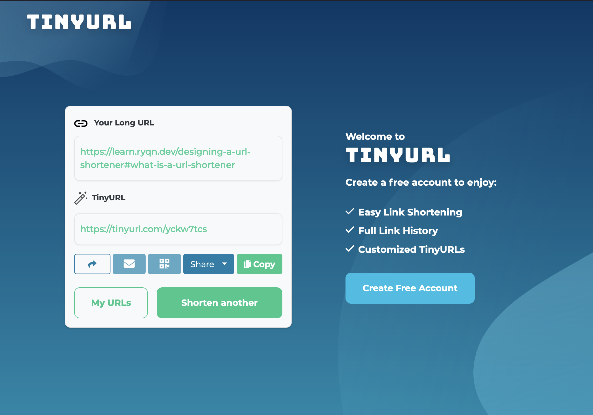

# Designing a URL shortener

```table-of-contents
* [Intro](#intro)
* [What is a URL shortener?](#what-is-a-url-shortener?)
* [Why would I use a URL shortener](#why-would-i-use-a-url-shortener?)
* [Examples of URL shorteners](#examples-of-url-shorteners)
* [Designing our system](#designing-our-system)
    1. [Core concept](#core-concept)
    2. [Data storage](#data-storage)
    3. [Implementing redirection](#implementing-redirection)
    4. [Response codes](#response-codes)
    5. [User Interface](#user-interface)
    6. [Design decisions](#design-decisions)
* [Putting it all together](#putting-it-all-together)

```

## Intro
This is a part of a series of design docs for different types of applications. Each of these design docs will (hopefully) have tutorials on how to implement them in various languages. The point of these are not to write a production-ready application but provide some direction on how to develop certain apps. This means that the best or most efficient solution may not always be provided - but rather, the one that gets the job done without significant drawbacks.

This design has 1 supported language, found here:
[Making a URL Shortener in Python (Flask)](https://learn.ryqn.dev/tutorial/making-a-url-shortener/python)

## What is a URL shortener?
A URL shortener is a service that converts your long URL into a shorter one. For example, the link to this article is [https://learn.ryqn.dev/designing-a-url-shortener#what-is-a-url-shortener?](https://learn.ryqn.dev/designing-a-url-shortener#what-is-a-url-shortener?) which is 72 characters. When I use a url shortening service, it becomes [https://tinyurl.com/yckw7tcs](https://tinyurl.com/yckw7tcs) - a total of 28 characters. 



## Why would I use a URL shortener?
Regardless of what device you're on, typing the second link listed above is infinitely faster than typing the first one. This is the main benefit of URL shorteners: **convenience**. This benefit is immediately apparent when someone needs to manually input your link. A good use case to have URL shorteners in this case are on physical mediums, like posters and magazines, and intangible digital mediums, like screenshared presentations and unhighlightable text (for whatever reason). 

Short links also benefit from being easier to design around (less space, more creative freedom) and also tend to look more professional.

Another hidden (no pun intended) benefit is that the actual link location is disguised behind the shortened URL. This is usually used for nefarious reasons but could potentially be helpful in some cases. For example, you could lead users to **verybadmaliciouswebsite.com** but all they'll see is https://tinyurl.com/yckw7ts.

URL shorteners today usually provide high-level insights and analytics that paid users can use to understand which of their links are providing the most value. For example, you can have 2 different shortened links that go to the same original link but one of them is placed on physical posters in Canada, and another one is placed on physical posters in Mexico. When you notice that the link based in Canada locations have more traction, you may want to invest more in that area. 

## Examples of URL shorteners

[Bit.ly](https://bit.ly) \
[TinyURL](https://tinyURL.com)

You can play around with some of these URL shorteners to see what they're supposed to do but this idea is pretty simple and most people probably don't need to read the first couple paragraphs if they've used the internet at least 4 times in their life.

## Designing our system
### Core concept
The core concept here is **redirection**. When someone accesses our short link, we need to redirect them to the original link. Since every alias has a corresponding long link, **we will need to store a mapping that maps `[alias -> long link]`**. A lot of these. 


### Data storage
**tl;dr for this section** Databases are important, but we can store in memory for purposes of making this tutorial short

When a need arises to store large amounts of structured data, it's usually a sign that your application will need to reach for a database. Database management is often an entire job all by itself and implementing a database is an additional system you would have to manage. With that in mind, we're going to hold off on adding a database and just store all of our data in memory - which is perfectly fine for developing a POC (proof-of-concept). 

If I wanted to implement a database anyways, I would first develop the system without it, make sure the core functionality works, and then swap out the data access and storage code with database code. That way, I can focus on just learning how databases work without having to debug the main system.

### Implementing redirection
**tl;dr for this section** We will use a webserver that responds with 3XX redirection http codes

Okay, assuming I figured out how to store my data, how do I do redirection? Well, we know that in order to use our service, users have to go to our shortened URL in the browser, which will then redirect them somewhere else. 

So does that mean I have to create a website? Let's explore how that would work. We would have a website at (let's imagine our website is hosted at https://short.com - this url is fake. pls don't use) `short.com`. When someone goes on a short link, for example https://short.com/yckw7ts, our website would have to take that unique id: `yckw7ts` and then send that data to our database to obtain the mapping, and then once it gets the data back, it'll redirect to the correct location.

This solution... works! It's a perfectly fine implementation of a url shortener service and this is what a time sequence diagram would look like:


This solution solves the problem through Client-Side Rendering (CSR) in which the client does all of the processing. Notice how after we make the initial request to `https://short.com/yckw7ts`, the browser has to extract the url, open a connection to the database, query the value, and then once it gets the data back, it'll redirect to the webpage. If we implement this solution, it'll get the job done but there's alot of extra steps being performed here - and the effects will be somewhat noticable to the end user.

We can, instead, upgrade our web server from a **static web server** to a **web application server**. The difference is that in addition to hosting and serving static assets (like HTML/CSS/JS/images), a web application server can also execute code and programming logic. More importantly, it can make use of the various HTTP response codes available. It'll look like this:


### Response codes
You can learn about HTTP response codes [here](https://developer.mozilla.org/en-US/docs/Web/HTTP/Redirections) but the gist of it is that when we send the browser a response with a 3XX code, it will redirect to the URL specified in that response.

### User Interface
**tl;dr for this section** we will need to create a website that has a text box and a submit button; after submitting their link, we will display to them the aliased link.

When we're talking about designing a user interface, we're asking how should users interact with our service. To answer this, we need to think of all the types of users we'll have, and for this application, we have 2. The first type is the user that will eventually click on the short link we generate. This type of user pretty much doesn't interact with our service at all. They type in our short link and we'll redirect them to the place they're supposed to go. They will only ever know about our service through the text in the link we provide.

The other type of user is a creator. This type of user is the one who will utilize our service to create a short link and for these people, we will need to design some type of user interface in which creators will be able to input their long link and submit it to us. Then, we need to display to them the generated short link.

Web development, like databases, is a part of a much larger ecosystem and should be learned separately. In all code implementations, I will provide to you the code for the website and try to explain *just* enough for you to get by so you don't have to worry about too much all at once.

### The actual algorithms
How do we generate short links and access the long link given the short link. We will generate a random alphanumeric string of length 6 (if the random string has already been used, we can loop until it finds a valid string) and append it to the end of our server url. As for data access, we can store our `<short link, long link>` pair in a map. Maps are an extremely important data structure in computer science as they allow you to get a value given a key in O(1) time. If that was still confusing to you (probably is), you're likely more familiar with the actual implementations of maps in various languages:

**Python**: dictionary \
**Javascript**: JSON objects \
**Java**: HashMap, TreeMap (not O(1) but same concept) \
**C++**: std::map 

### Design decisions
#### Choosing a length of random string
**tl;dr for this section** Need something short to type, but long to have enough combinations

First thing you might ask is how did I pick the magic number 6 seemingly out of nowhere for the length of the generated string? We need to keep in mind the point of our service: **to keep urls short**. This means that the random alias id we append to the end of our short url should be as short as possible. However, the shorter our generated id is, the less combinations possible, resulting in higher collisions and an upper limit to aliases we can make.

The way to find our magic number requires a little bit of math and good understanding of our random number algorithm. URL's are case sensitive - meaning that an uppercase 'A' is different from a lower case 'a'. This allows our alphanumeric string to have 62 different characters: [A-Z] + [a-z] + [0-9] (also known as Base62). Since every character has 62 options, we can calculate the total number of combinations like so:

Total Combinations = 62^(Length of string)

If our alias was only two characters long, our users would be very happy because they would only need to type out https://short.com/j5, but we would only support 4096 aliases. If our alias was 20 characters long, our users would have to type https://short.com/f7sj4fvm3js9fjlzpqru, but we could support 1.329228 * 10^36 different aliases. So, **we want to have the shortest alias possible - making it easy for users to type - while supporting enough aliases for our service to be useful**.

How do I pick a good number of aliases to support? Look at your use case. If you work for Youtube, for example, and you're generating unique ids for youtube links, you would probably want to look at the current number of Youtube videos and the rate at which Youtube videos get posted. Then you can plan for, say, 10 years of service and derive a safe number from that.

In our case, 6 characters gives us 68,719,476,736 different combinations - a safe number I think for our application while being short enough for users.

#### Random number generator infinite loop
**tl;dr for this section** Random number generation is problematic, but not worth using a more complex solution as it's not in scope of this article

How about our random string generator function? There exists a case where our random number generator gets unlucky or we have too many urls generated already where the loop iterates multiple times before finding a valid id. You may want to catch this case by returning an error after looping too many times, or maybe even replace the last accessed alias, etc. I chose not to address this edge case because of how complex a good solution may be and might detract from the main message here. I do think it would be good practice to implement your own system to check this error, though.

If your service doesn't guarantee permanence, you could maybe attach a timestamp value to the link_mappings that keeps track of the last time the alias was used, and after 5 loops - query the oldest timestamp value and replace that id. Just an idea and it's up to you to debate the pros and cons of this solution.


## Putting it all together
Phew! Yes I just said 'Phew' unironically. Fight me. Anyways, that was a lot of brainstorming and if you've made it to this point, we can finally start designing the system we want to implement. So, what do we need?

We need a web server that can respond to requests dynamically and return redirection responses. \
We also need the web server to serve websites that a user can use to send us data. \
We need to generate aliases and store the pair of links in our database (except our database will just be in memory and not use a dedicated system)

I'm sorry that I made you read all that just to say we need a web server.

## Picking how to implement this
At this time, there's only a Python implementation of this so [this](https://learn.ryqn.dev/tutorial/making-a-url-shortener/python) is your only option if you want to do this with me!
