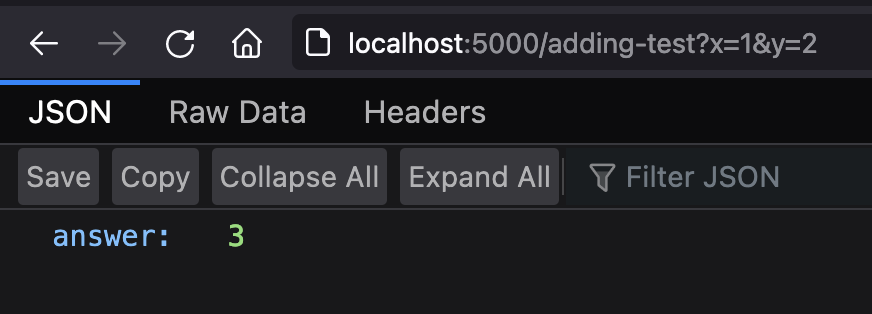

# Flask Hackathon Quickstart

*note* this is a setup cheatsheet for hackers who need Flask. This tutorial is specifically for setting up Flask as a backend server and assumes you have a separate codebase for your frontend. For those of you know what SSR is, this tutorial is for a client-side rendered (CSR) front-end that calls a Flask backend for data only as opposed to server-side rendered (SSR) Flask web server that serves templated html files. If you don't know what this means, don't worry! It's only for people who know what they're looking for.

```table-of-contents
* [Intro](#intro)
* [What is Flask?](#what-is-flask?)
* [How to use this doc?](#how-to-use-this-doc?)
    1. [Write basic Flask code](#write-basic-flask-code)
    2. [Run Flask server locally](#run-flask-server-locally)
    3. [use ngrok to tunnel your server to the internet](#use-ngrok-to-tunnel-your-server-to-the-internet)
    4. [Call your backend from your frontend](#call-your-backend-from-your-frontend)
* [Run Python in the browser](#run-python-in-the-browser)
    1. [You can't](#you-can't)
    2. [Flask flow chart](#flask-flow-chart)
    3. [Is this a good idea?](#is-this-a-good-idea?)
* [Wrap your already written Python code in Flask](#wrap-your-already-written-python-code-in-flask)
    1. [Quick Example](#quick-example)
* [Call an API](#call-an-api)
    1. [Brief intro to API's using Yelp as an example](#brief-intro-to-api's-using-yelp-as-an-example)
    2. [Why do I need a backend?](#why-do-i-need-a-backend?)
    3. [Yelp API example](#yelp-api-example)
    
```

## Intro

You were likely sent here because I told you to set up a Flask backend for a hackathon. The reasons leading up to that were likely because:

• [you want to "run" python in the browser](#run-python-in-the-browser)

• [you have a python program and want to attach it to a website](#wrap-your-already-written-python-code-in-flask)

• [you need to call an api that cannot be called from the front-end / browser (yelp api is one example)](#call-an-api)

• you need a backend

• there are others but these are the most common ones

Click on any of the above if you're curious *why* Flask is a good choice for this

## What is Flask?

Flask is a python library for setting up a webserver. It is *extremely* simple to use and is used by almost every big tech company. In the code samples below, you'll see how you can start a server in under 5 lines of code.

## How to use this doc?
This tutorial is for a hackathon only. It will not go over how to host your server - only how to self host it for demo and test purposes.

The basics of how to setup Flask and integrate it with your frontend are as follows:

1. [write basic flask code](#write-basic-flask-code)
2. [run flask server locally](#run-flask-server-locally)
3. [use ngrok to tunnel your server to the internet](#use-ngrok-to-tunnel-your-server-to-the-internet)
4. [call your backend from your frontend and display response](#call-your-backend-from-your-frontend)
6. [just show me the code dude](#just-show-me-the-code-dude)

## Write basic Flask code
Flask is a python library. This means we're going to need to have python installed on our computer. Also, we're going to need to install the some python libraries - including Flask.

To start off, let's create a new folder for our backend code and create a python file called `app.py` inside it.

```file-json
{
    "name": "basic-test",
    "contents": [
        {
            "name": "app.py", 
            "type": "python"
        }
    ]
}
```

```python app.py
from flask import Flask, jsonify
from flask_cors import CORS

app = Flask(__name__)
CORS(app)

@app.route('/')
def index():
    return jsonify({'message': 'Hey, everything works!!'})

```

If you notice in the code, we import 2 libraries: flask and flask_cors. In the next step, we'll install these libraries and then run our server.

## Run Flask server locally

Let's open up our Terminal (Mac) or Powershell/CMD (Windows) and navigate to the folder where our app.py file is located.

```shell Terminal(Mac) AND Powershell/CMD(Windows)
$~ pwd
/should/print/path/to/project/yelp-test

$~ ls
app.py 

$~ pip install flask flask-cors
Requirement already satisfied: flask in /usr/local/lib/python3.9/site-packages (2.0.2)
Requirement already satisfied: Werkzeug>=2.0 in /usr/local/lib/python3.9/site-packages (from flask) (2.0.2)
Requirement already satisfied: Jinja2>=3.0 in /usr/local/lib/python3.9/site-packages (from flask) (3.0.3)
...

# IMPORTANT NOTE: my terminal displays Requirement already satisfied. This is because I already have it installed, your terminal should show a bunch of things that are installing if you don't already have it

```

We then need to tell flask where our code is.

```shell Terminal(Mac) ONLY
$~ export FLASK_APP=app.py
```

```shell Powershell/CMD(Windows) ONLY
$~ set FLASK_APP=app.py
```

Then we run the command to start the server. There are 2 ways:
```shell Terminal(Mac) AND Powershell/CMD(Windows)
$~ flask run
(If the above command doesn't work, you can also try the next command)

$~ python -m flask run
* Environment: production
WARNING: This is a development server. Do not use it in a production deployment.
Use a production WSGI server instead.
* Debug mode: off
* Running on http://127.0.0.1:5000/ (Press CTRL+C to quit)

```

You can visit [http://localhost:5000](http://localhost:5000/) in your browser to verify that everything works.

## Use ngrok to tunnel your server to the internet

At the moment, our server is only running on localhost -- meaning that it's only accessible on your computer. How can make it so anyone on the internet can access our server? We can use a tool call [ngrok](https://ngrok.com/) which is a free service that allows us to tunnel our server to the internet.

Go ahead and install ngrok - which is an executable - and locate it in your terminal.

```shell Terminal(Mac) ONLY
$~ pwd
/should/print/path/to/ngrok/installation

$~ ls
ngrok

$~ ../ngrok http 5000

ngrok by @inconshreveable                                                                                      (Ctrl+C to quit)
                                                                                                                               
Session Status                online                                                                                           
Account                       ------                                                                           
Version                       2.3.40                                                                                           
Region                        United States (us)                                                                               
Web Interface                 http://127.0.0.1:4040                                                                            
Forwarding                    http://63cb-129-234-br-1332.ngrok.io -> http://localhost:5000                                     
Forwarding                    https://63cb-129-234-br-1332.ngrok.io -> http://localhost:5000                                    
                                                                                                                               
Connections                   ttl     opn     rt1     rt5     p50     p90                                                      
                              0       0       0.00    0.00    0.00    0.00                                     

```

```shell Powershell/CMD(Windows) ONLY
$~ pwd
/should/print/path/to/ngrok/installation

$~ dir
ngrok.exe

$~ ngrok.exe http 5000

ngrok by @inconshreveable                                                                                      (Ctrl+C to quit)
                                                                                                                               
Session Status                online                                                                                           
Account                       ------                                                                           
Version                       2.3.40                                                                                           
Region                        United States (us)                                                                               
Web Interface                 http://127.0.0.1:4040                                                                            
Forwarding                    http://63cb-129-234-br-1332.ngrok.io -> http://localhost:5000                                     
Forwarding                    https://63cb-129-234-br-1332.ngrok.io -> http://localhost:5000                                    
                                                                                                                               
Connections                   ttl     opn     rt1     rt5     p50     p90                                                      
                              0       0       0.00    0.00    0.00    0.00                                     

```

Keep this running in addition to your server. Notice on `Forwarding` section, you see 2 links that are tunneled to your localhost. Go ahead and copy the https link. This link is how people can access our server through the internet. You can test this by having anyone on your team on a different computer try going on that link.

## call your backend from your frontend
Now that we have our server link, we need to access the server from our front-end (website). Let's create a brand new folder somewhere (since our front-end will not share any code with the backend) and create a basic html file with javascript.

```file-json
{
    "name": "frontend-test",
    "contents": [
        { "name": "script.js", "type": "js" },
        { "name": "index.html", "type": "html" }
    ]
}
```

```html index.html
<!DOCTYPE html>
<html>
    <head>
        <title>Learning</title>
        <script src="./script.js"></script>
    </head>
    <body>
        <button onclick="callBackend()">click me!</button>
        <p id="display">Wait for it...</p>
    </body>
</html>

```

```javascript script.js
let serverUrl = 'https://paste-your-ngrok-link-here.ngrok.io';

function callBackend() {
    fetch(serverUrl)
        .then(res => res.json())
        .then(data => {
            document.getElementById('display').innerHTML = data.message
        })
}

```

## Use ngrok to tunnel your server to the internet
When we're running our Flask server using `flask run` or `python -m flask run`, you'll notice that the link it hosts is on localhost - which you can access through [http://localhost:5000](http://localhost:5000). This description isn't 100% accurate but you can think of it this way for now: localhost is kinda like a mini internet that runs on your computer. You can access localhost like it's the internet except its only applications that are hosted on your computer - which means it's not connected to the REAL internet. 

So since our server is running on the internet that only exists on our computer, we can't actually communicate with the server if we're on a different computer.

## just show me the code dude

[https://github.com/ryqndev/learn-ryqn-dev/tree/content-update/src/content/hackathon-flask/docs](https://github.com/ryqndev/learn-ryqn-dev/tree/content-update/src/content/hackathon-flask/docs)

## Run python in the browser

*"I know python so I want to use python but I also want to write a website"*

### You can't

**Long story short, you can't.** The browser can only understand HTML/CSS/JS. This is where a backend server comes in. A server is essentially another computer that sits on the internet listening for, and responding to, **http requests**. 

You can run your server in whatever language you want, but for hackathons I recommend Python/Flask. Python is the programming language and Flask is the Python library that makes it easy to run a server. Flask isn't the only option for Python, of course -  Django is another popular python library for webservers - but for hackathons, beginners, and prototypers, I *highly* recommend Flask.

### Flask flow chart

When you run a server, you're essentially putting your computer on the internet and it is always listening for **http requests**. When your server receives a request, it proceses it (i.e. runs a python function) and returns the result to the person or computer making the request in the form of an **http response**.

So, your website will send an **http request** to your Flask server and sending data about what it wants the server to do. The server will execute the corresponding Python function that was specified in the **http request**. The server will then return the result to the website as an **http response**.

In this case, you're not *technically* executing python in the browser -- you're really just telling another computer that *can* run python what to do through the internet. 

### Is this a good idea?

**Depends on the idea.**

If the code you want to run is simple or doable in javascript (90% of the time it is), then no you should write the logic in Javascript instead and not use a server altogether.

If you are using a specific Python library (ML and AI hacks usually fall into this category) and there is not Javascript equivalent, then you should use a Python server. After all, unless you're willing to rewrite the entire library in Javascript, use a backend. This logic is also applicable to "unofficial" libraries. For example, if you've already written a bunch of code in Python from a previous project or w/e, you can just import your old code and wrap the function calls in Flask endpoints.

So far, the reasons is: if your project relies on a bunch of python code, use a backend. The first question is just a language specific question.

*one caveat to the above:* if the reason you need python libraries is visual in nature, it depends... again. If you need matplotlib to generate a chart, you can use a backend server to create a chart, export it as an image, and return the image to the browser so they can display it. In this case, it's ok to use python for visual purposes but I would recommend looking into Javascript charting libraries like Airbnb's @visx that allow you to make charts interactive rather than just an image. However, if you're using pygame to create a visual game, this will not work. Libraries like pygame open up a window on the computer that's running python and draw on that. 

The second question is do you need a server? When someone goes on your website, their browser downloads the source code (html/css/js) and executes it in the browser. The variables, function calls, and all other data is stored on the website and it exists only on that one user's computer. So, if 10 people go on your website, there's no way for them to communicate with each other. **They are all running the code independently on their own computers.** 

If you are writing a game, social media platform, or *anything* that requires shared data between clients (users), then you need to have a server. A server, in this case, serves as a central hub for all the clients. Every person who connects to your website needs to send their data to a server (and usually, in these cases, the server will have a database so they can manage all the data more easily).

A quick example in case it's still not very clear: Take instagram/facebook/twitter for example. When a user connects to the website, they will send a request to the server asking for a list of posts to display on their news feed. When a user wants to post something, they will send that post data to the server. The server will then save that data and the next time someone asks for a list of posts, they will get an updated list of posts that include the most recent ones posted.

If you want more examples or are still confused, fear not, it's a hard concept to follow at first so go ahead and find me or send me a message and I'll happily explain it in person.

### Basic Flask server

```file-json
{
    "name": "basic-test",
    "contents": [
        { "name": "app.py", "type": "python" }
    ]
}
```

```python app.py
from flask import Flask, jsonify, request
from flask_cors import CORS

app = Flask(__name__)
CORS(app)

# Access this endpoint through: http://localhost:5000/
@app.route('/')
def index():
    return jsonify({'message': 'Hey, everything works!!'})

"""
Access this endpoint through: http://localhost:5000/adding-test?x=1&y=2

Takes two numbers, adds them together, and returns the value. 
Not a very good case for setting up and hosting an entire backend
server but this example shows a proof of concept of how it works.

For a simple example like this, you're better of just writing this 
in javascript.
"""
@app.route('/adding-test')
def add():
    sum_result = int(request.args.get('x')) + int(request.args.get('y'))

    return jsonify({
        "answer": sum_result
    })

```

When we run it, we can test our server to see how it works:


## Wrap your already written Python code in Flask

Read the concepts listed above. The only difference between the above and below is that we will import our files and wrap them in Flask endpoints. If you know how do basic imports in Python, then this part is self-explanatory.

### Quick example

```file-json
{
    "name": "yelp-test",
    "contents": [
        { "name": "your_code.py", "type": "python" },
        { "name": "app.py", "type": "python" }
    ]
}
```

```python your_code.py
def really_complex_function():
    # imagine you wrote this function last quarter in one of your CS 
    # classes and you want to use it in this project.
    ml_ai_blockchain_vr_ar_big_result = 3
    # Boom. imagine i just did a bunch of stuff and ended up at the result 3
    return ml_ai_blockchain_vr_ar_big_result
```

```python app.py
from flask import Flask, jsonify, request
from flask_cors import CORS

from your_code import really_complex_function

app = Flask(__name__)
CORS(app)

# Access this endpoint through: http://localhost:5000/
@app.route('/')
def index():
    return jsonify({'message': 'Hey, everything works!!'})

# Access this endpoint through: http://localhost:5000/complex-test
@app.route('/complex-test')
def yelp_default_test():
    return jsonify({"result": really_complex_function()})

```

## Call an API 


### Brief intro to API's using Yelp as an example

We can think of API's (in a hackathon sense atleast) as a way to utilize another program's functionality. As an example, we can take a look at the Yelp API. Yelp, if you're not familiar, is a platform for users to review businesses. Because of this, Yelp actually has a very, very big and comprehensive database of restaurants and businesses and they offer this service to developers for free (as of 2022 - we don't expect this to change). And so, Yelp offers something called an API (Application Programming Interface) - i.e. an interface, or bridge, that connects your service to theirs - detailing how anyone can make use of this service.

So, as a quick example, if your hackathon idea is an app that displays a list of nearby boba stores near you, you could use the Yelp API's business search functionality to query a list of restaurants categorized as "bubbletea" using a lattitude and longitude taken from the user's location.

One thing to note is that to call the Yelp API, you need to have a Yelp API key. This is a secret key that is used to authenticate your application given to you when you sign up for the Yelp API - which is used to rate limit your calls to ensure you're not abusing the Yelp API.


### Why do I need a backend?

You can call API's directly from the website. In fact, when your front-end makes a request to your backend, that's an example of an API call. So then the question is, why would I need to setup and run a backend server to make Yelp API calls when I could just do it from the front-end and bypass a backend altogether? This is because the Yelp API actually doesn't allow their service to be reached from a browser/website (unless it's the actual Yelp website). 

Not every API service has this restriction but if you make an API call and you get a CORS error of some sort, it's probably because they have this filter set up. The reason why they do this is because if you make a call from the front-end, you expose your API key which should be kept secret.

Conceptually, the workflow of this entire app is as follows:

Website gets user location -> 

Website sends the user location and other api call data to backend through an **http request** -> 

backend will call the Yelp API through its own **http request** -> 

Yelp will return an **http response** to the backend -> 

backend will return contents of that **http response** to the website -> website will transform the raw JSON data into meaningful visual HTML components that users can understand easily.

### Yelp API example

```file-json
{
    "name": "yelp-test",
    "contents": [
        { "name": "app.py", "type": "python" }
    ]
}
```

```python app.py
from flask import Flask, jsonify, request
from flask_cors import CORS
import requests

from your_code import really_complex_function

app = Flask(__name__)
CORS(app)

YELP_AUTH_TOKEN = 'some-key-i-got-from-yelp'

# Access this endpoint through: http://localhost:5000/
@app.route('/')
def index():
    return jsonify({'message': 'Hey, everything works!!'})

# Access this endpoint through: http://localhost:5000/yelp-test
@app.route('/yelp-test')
def yelp_default_test():
    url = "https://api.yelp.com/v3/businesses/search"

    querystring = {"location": "Irvine, CA", "categories": "bubbletea"}

    headers = {"Authorization": "Bearer " + YELP_AUTH_TOKEN}

    response = requests.request(
        "GET", url, headers=headers, params=querystring)

    return jsonify(response.json())

```

Don't forget to replace **line 10** with your own yelp api key above.

Assuming you have Python3 / pip and can access it through Terminal(Mac) or Command Line/Powershell(Windows), you can get started by running these commands in the directory of the project

```shell Terminal (Mac)
$~ pwd
/should/print/path/to/project/yelp-test

$~ ls
app.py 

$~ pip install flask flask-cors requests
Requirement already satisfied: flask in /usr/local/lib/python3.9/site-packages (2.0.2)
Requirement already satisfied: Werkzeug>=2.0 in /usr/local/lib/python3.9/site-packages (from flask) (2.0.2)
Requirement already satisfied: Jinja2>=3.0 in /usr/local/lib/python3.9/site-packages (from flask) (3.0.3)
...

IMPORTANT NOTE: my terminal displays Requirement already satisfied. This is because I already have it installed, your terminal should show a bunch of things that are installing if you don't already have it

$~ export FLASK_APP=app.py

$~ flask run
(If the above command doesn't work, you can also try the next command)

$~ python -m flask run
* Environment: production
WARNING: This is a development server. Do not use it in a production deployment.
Use a production WSGI server instead.
* Debug mode: off
* Running on http://127.0.0.1:5000/ (Press CTRL+C to quit)
```


```shell Powershell/Command Line (Windows)
$~ pwd
/should/print/path/to/project/yelp-test

$~ dir
app.py 

$~ pip install flask flask-cors requests
Requirement already satisfied: flask in /usr/local/lib/python3.9/site-packages (2.0.2)
Requirement already satisfied: Werkzeug>=2.0 in /usr/local/lib/python3.9/site-packages (from flask) (2.0.2)
Requirement already satisfied: Jinja2>=3.0 in /usr/local/lib/python3.9/site-packages (from flask) (3.0.3)
...

IMPORTANT NOTE: my terminal displays Requirement already satisfied. This is because I already have it installed, your terminal should show a bunch of things that are installing if you don't already have it

$~ set FLASK_APP=app.py

$~ flask run
(If the above command doesn't work, you can also try the next command)

$~ python -m flask run
* Environment: production
WARNING: This is a development server. Do not use it in a production deployment.
Use a production WSGI server instead.
* Debug mode: off
* Running on http://127.0.0.1:5000/ (Press CTRL+C to quit)
```

Then, once your server is running, you can go on http://localhost:5000/yelp-test in the browser and it should show you a list of boba stores near Irvine, CA. Now that we have verified that the backend is up and running, we need to link our front-end to our backend.

