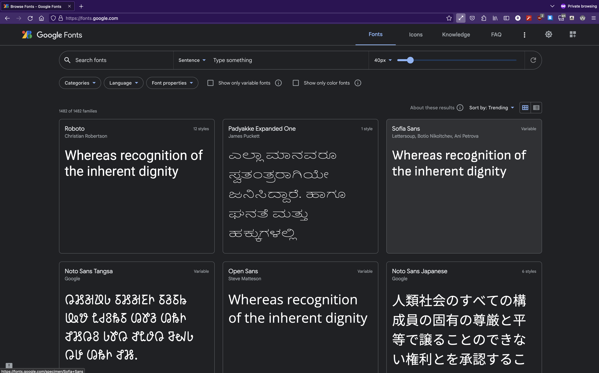
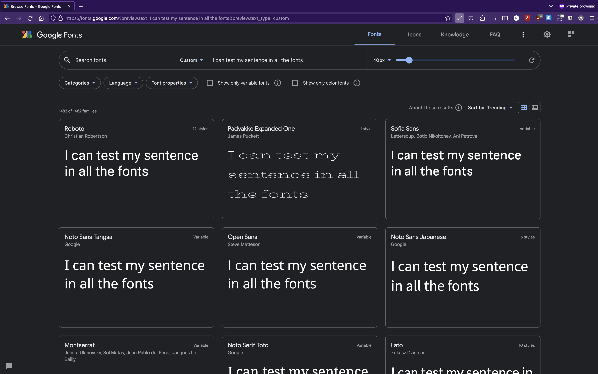
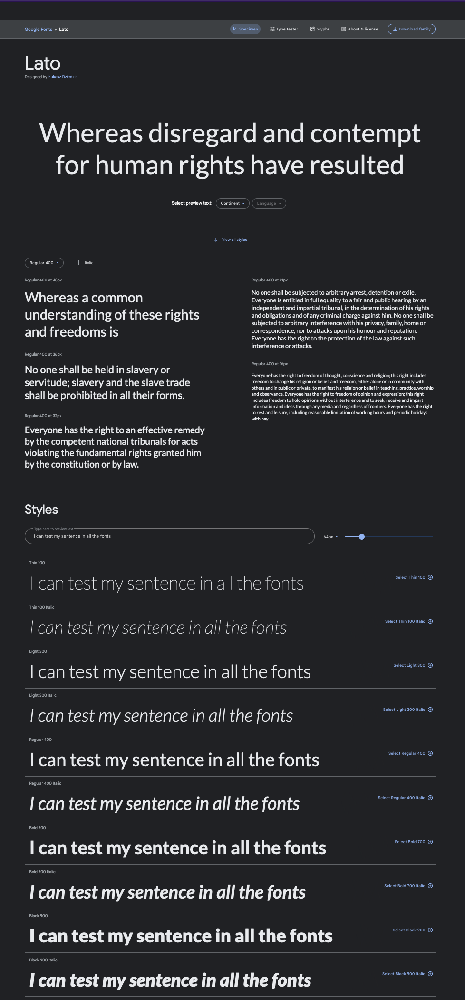
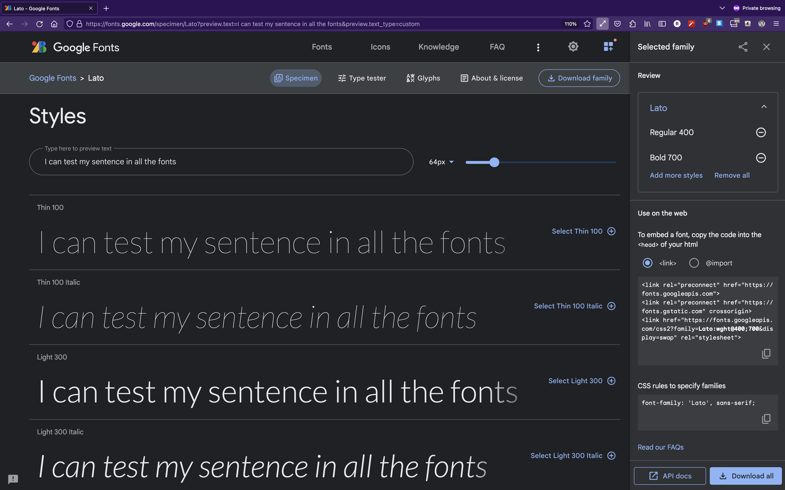
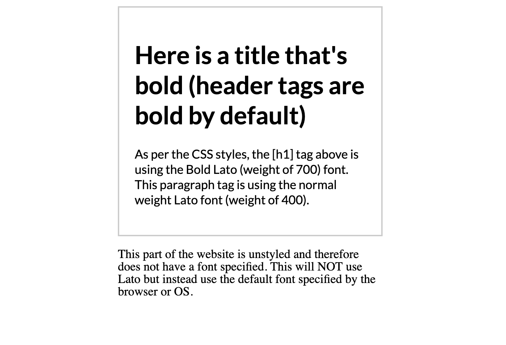

# How to use Fonts

```table-of-contents

* [Overview](#overview)
* [Good, free fonts quick](#good-free-fonts-quick)
    1. [Go on Google Fonts](#go-on-google-fonts)
    1. [Find a font you want to use](#find-a-font-you-want-to-use)
    1. [Embedding your fonts](#embedding-your-fonts)
* [Basic HTML example](#basic-html-example)

```

## Overview

We'll go over how you can pick and choose fonts (on Google Fonts), and then embed them in your web app. First section will be the quick nitty-gritty how to copy and paste stuff to success and then I'll dive in a bit deeper into the other stuff you can do with fonts so if you're looking at a quick how-to, you can stop reading this and go striaght to the [next section](#good-free-fonts-quick).


## Good, free fonts quick

For the past couple years, [Google Fonts](https://fonts.google.com/) has been the simplest way to get bootstrapped with finding a font and then plugging it into your site. It has a huge collection of free fonts and allows you to type in your words and see how it looks in every font. Let's find out how to use it.

### Go on Google Fonts

First we need to visit the website here: [https://fonts.google.com/](https://fonts.google.com/). The UI changes every so often but it should look something like this:



### Find a font you want to use

Search through their gigantic catalogue of fonts to find one you like. If you know what the sample text is, you can type it into the `sentence` bar on the top to see how it would look in all the other fonts.



There are other search filters you can utilize but at the end of the day, find a font you would like to use and select it. Once you select it, you should be navigated to the font page. Let's say I want to use the `Lato` font from the screenshot above (bottom right), it will bring me to the font page.

I've zoomed out in the screenshot below so you can see how the entire page but the relevant section is the `Styles` section on the bottom half. **note** you might need to scroll down to see it.



Depending on the font family you choose, you might have just 1 style or a bunch. For 90% of use cases, you're just going to want to select the `Regular 400` but you can select as many of them as you want. 

If you select something like `Black 900` or `Bold 700`, you'll likely see this font when you add a CSS property like `font-weight: bold;` and similarly with italics. 

### Embedding your fonts

Once you've selected the styles you want (by clicking the `[Select <style name> ⊕]` button on the side - in the screenshot below, I select two), you should see a popout on the right side.



To embed them into our web code, simply copy and paste the `<link>` section and embed it in the `<head>` tags of our HTML.

This allows us to use the linked font anywhere in our website. To actually use the font, we need to set the CSS style for section of our website we want to have that font.

If you want to set the entire site to have a particular font, you can set the `<body>` font-family like so:

```css styles.css
body {
    font-family: 'Lato', sans-serif;
}
```

## Basic HTML example

Here's a basic example of how you would import the `Lato` font shown above if you were writing a vanilla HTML app.

```html index.html
<!DOCTYPE html>
<html lang="en">

<head>
    <meta charset="UTF-8">
    <meta http-equiv="X-UA-Compatible" content="IE=edge">
    <meta name="viewport" content="width=device-width, initial-scale=1.0">
    <title>Lato Font Example</title>

    <!-- I like to embed my fonts at the bottom of the head tag but it doesn't really matter where you put it -->

    <!-- The selection below is copied straight from: https://fonts.google.com/specimen/Lato -->
    <link rel="preconnect" href="https://fonts.googleapis.com">
    <link rel="preconnect" href="https://fonts.gstatic.com" crossorigin>
    <link href="https://fonts.googleapis.com/css2?family=Lato:wght@400;700&display=swap" rel="stylesheet">
    <!-- Now that I have the font assets imported, I can use this font wherever -->

    <style>
        body {
            display: grid;
            place-content: center;
        }
        
        .container {
            width: 300px;
            padding: 20px;
            border: 2px solid #ccc;
        }

        .container {
            font-family: 'Lato', sans-serif;
        } 

        p {
            max-width: 340px;
        }
    </style>
</head>

<body>
    <div class="container">
        <h1>Here is a title that's bold (header tags are bold by default)</h1>
        <p>
            As per the CSS styles, the [h1] tag above is using the Bold Lato (weight of 700) font. This paragraph tag is
                using the normal weight Lato font (weight of 400).
        </p>
    </div>

    <p>
        This part of the website is unstyled and therefore does not have a font specified. This will NOT use Lato but
        instead use the default font specified by the browser or OS.
    </p>
</body>

</html>

```

Which looks like this:



It's not the sexiest example, but it shows how to use fonts

## Quick notes

Before I dive deeper into using fonts in web projects, there are some small things to note.

### If you're using React

If you're using React bootstrapped with `create-react-app`, you are going to want to copy the font `<link>` into `src/public/index.html`. This is the HTML file that eventually gets compiled into the build folder.

### If you're using SSG 

This is for those using something like Next.js or Gatsby. You're probably using something like `react-helmet` to dynamically change your `<head>` tags - that's where you're going to be putting the font `<link>`.

### Users have custom software

If your user has a custom font extension installed in their web browser or their device, it'll likely override your custom font. (if you've ever seen those people with phones that have *every* letter in italics or something like that).
