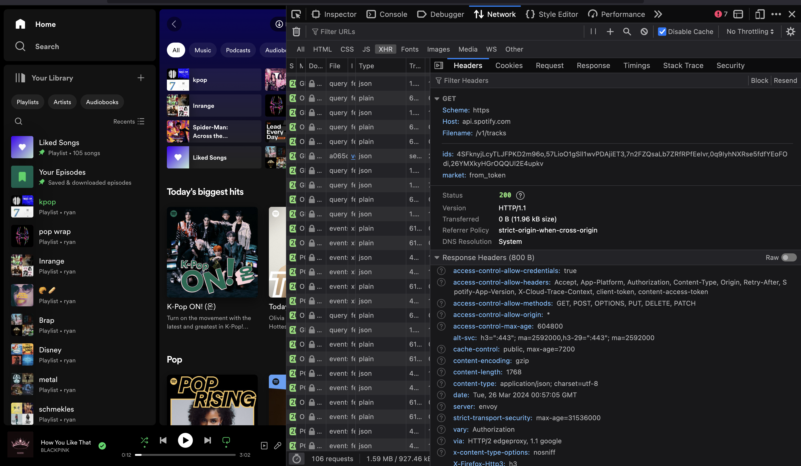
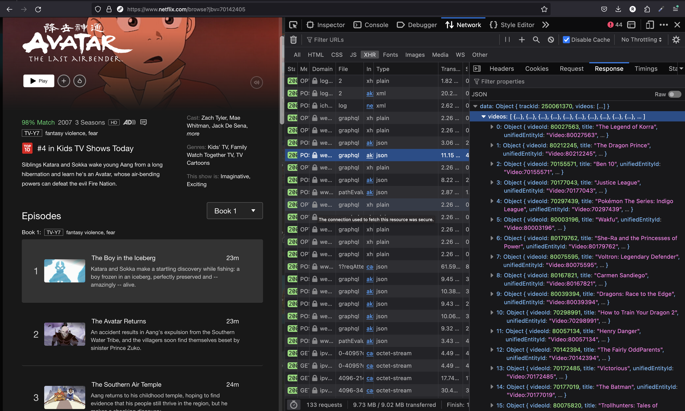

# Introduction to APIs

_Note: This was originally content that was made as a reference sheet for a workshop which includes a live demo. If I can find the live demo, I'll go ahead and attach it here but for now, this is just some random content I added here since I thought the content might be interesting to someone. Hopefully, I'll get around to rewriting this section so it's a complete read_

```table-of-contents

* [Intro](#intro)
* [API - Application Programming Interface](#api-/-application-programming-interface)
* [Terminology](#terminology)
    1. [Public vs Private](#public-vs-private)
* [Accessing an API](#accessing-an-api)
* [Next steps](#next-steps)


```

## Overview

We'll go over conceptually what an API is, what an API call is, and how we can use them in our projects.

## API / Application Programming Interface

API stands for Application Programming Interface... what the heck is that? I know it probably sounds scary but surprisingly, this is actually one of the better acronyms in computer science - let's break it down.

The first keyword here is `interface`. An interface is defined as a place where two systems interact. Carplay, for example, is an `interface` that connects a driver to their car. A self-ordering kiosk is an `interface` that connects a customer to the kitchen of a restaurant.

The second keyword is `application`. An application, in this context, can mean any existing service and it's not limited to just software, it can be hardware as well:

-   Yelp, is an application that has an extensive database of restaurants, businesses, and reviews
-   Spotify, is an application that has an extensive database of songs and user created playlists
-   ChatGPT, is an application that can provide powerful AI responses given a generic prompt
-   A physical phone usually has a camera - that can be used to get image and video data

Finally, `programming` simply means accessible through code. So, put it all together and...

> **An `Application Programming Interface (API)` is an interface that connects your code to the application's services**

How is this used? Let's say you wanted to create an app that finds the nearest boba shop to you. All you would have to do is call the Yelp API with the "boba" keyword and pass in a location and Yelp would give you a list of boba places back. Using the correct API for your project can supercharge your project, or, at the very least massively simplify the work needed.

In this example, you never had to go out and manually record boba locations and feed it into your database. You never had to build a search mechanism to allow searching your database by location. Not only did you save a TON of time in development, but you also get the reliability that Yelp provides (the Yelp API will only go down if Yelp goes down.. and Yelp has considerably more resources than you).

## Terminology

Let's also make sure we get our terminology correct. The way we say if an API exists is to say: `[application name] *offers* an API.` An example would be: "Yelp _offers_ an API" or "Netflix _does not offer_ an API".

This "offers" word is a big distinction because an API is not something that is always given - it is up to the application itself whether or not they want to put in the effort to support, or allow, a public API.

### Public vs Private

I mentioned that a company or service will only offer an API if they choose to do so, but that does not mean an API doesn't exist. In fact, almost _every single application_ will have an API - but it's usually gated with security mechanisms. In fact, API's are used by the very same application that provides them.

Take a look at the web spotify player screenshot below. I can open up the network tab in my chrome browser dev tools and see that the official spotify app is sending requests to the official spotify API. This is because API's are not just used by third party developers looking to hook into the application, but API's are also used by the application itself to connect their frontend UI to their backend data.



> It'll be hard to read exactly what's going on here if you don't know what you're looking for but what I want to highlight here is that it's hitting the `api.spotify.com` application and calling their `/v1/tracks` endpoint, which essentially returns a bunch of data for a couple of songs specified by that ID field

Now, let's take a look at Netflix. Netflix does **not** offer a public API - that is, they don't allow other people who aren't Netflix to create apps using Netflix data; However, if you look at the network requests in the web Netflix browser, you'll see that it's hitting an internal, private API to get the list of episodes in the original Avatar series:



> In every API request, you have a request and a response. The request has information on _what_ data we want to get, and the response will return the data we've requested - usually in JSON format. In this screenshot, you can see that the Netflix API has "responded" with a huge array of data on the episodes for the Avatar series

In the two above examples, the Spotify API is public and you can [follow their quickstart](https://developer.spotify.com/documentation/web-api/tutorials/getting-started) to find out how you can use it. The Netflix API, however, is not and there is no way to access their API without significant hacks being done.

## Accessing an API

Now, most of the examples I've listed above are software-based API's that go through the internet. An example of a different type of API is the camera sensor on a phone I mentioned earlier.

In this case, the "application" is not a service or a company, but rather a sensor on a phone. When you're writing a mobile or web app, you can easily use the device's Camera API to have access to the camera itself. An application like Snapchat or Bereal, for example, would heavily utilize the Camera API since they integrate the phone's camera sensor into their application.

## Next steps

So, how can we use an API? Take a look at the resources below to figure out how you may want to call an API:

-   [Learning about HTTP requests](../learning-about-http-requests/)
-   [Quick reference on making an API call](../quick-api-call-lesson)
