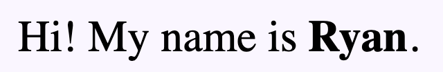
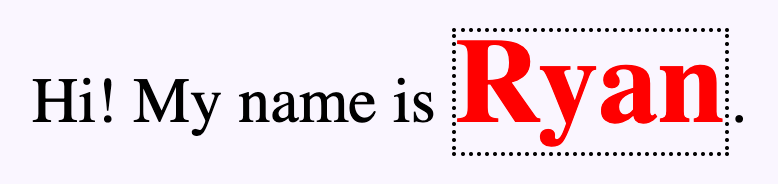
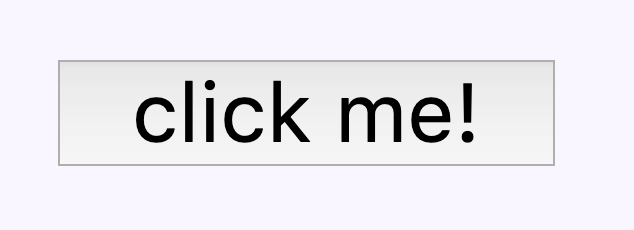
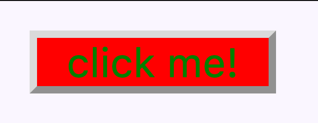
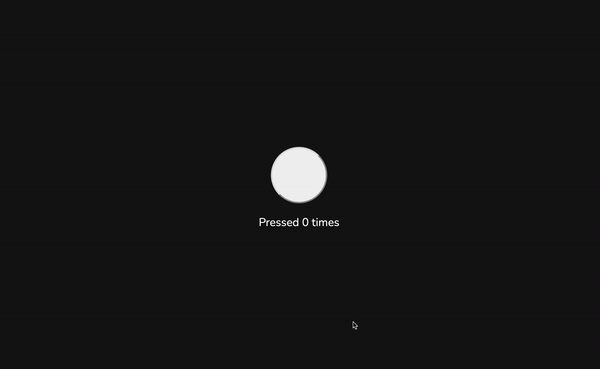

# Intro to web dev

## Table of Contents

* [Intro](#intro)
* [HTML](#html)
* [CSS](#css)
* [Javascript](#javascript)
* [Tying it all together](#tying-it-all-together)
    1. [Website Strucutre](#website-structure)
* [Learn More](#learn-more)

## Intro

Web development is done with 3 main languages: `HTML (HyperText Markup Language)`, `CSS (Cascading Style Sheets)`, and `JS (Javascript)`. We use these languages in conjunction to render beautiful webpages and program meaningful interactions through these sites. So, why do we split it into 3 separate languages? After all, when we do other programming like Python, C++, or Java, we only use that one language exclusively. This is because each of these languages are meant to tackle a different problem - which we'll investigate in a bit - but also because the web has significantly evolved since it's inception. 

When Sir Tim Berners-Lee first submitted his proposal for the world wide web in 1989, he envisioned an information sharing system where people could connect their computers to something called the internet and access documents hosted by other people. These documents (what we now call websites), in addition to the informational content, would contain something he called a "hyperlink" which would link to another document also hosted on the internet. Eventually, a system would arise that would compose of documents that all linked to each other - forming a ... web. 

That proposal spurred the development of the biggest information sharing system in history. Today, the internet holds an estimated 44 Zettabytes of data (1,125,899,910,000,000 megabytes) and continues to grow. However, in 1989, no one could've possibly predicted the growth of technology. What Berners-Lee originally proposed was targeted for computers that barely had a single megabyte of RAM and was fairly limited in functionality (compared to what we have today) and so early webpages were only capable of holding text content. To make the documents look more organized, an early version of HTML was invented that formatted text. HTML today has that same functionality although it's much more powerful.

Later on, CSS would be proposed several years later as well as Javascript as people realized that websites could become more than just text documents.

Onto the code...

## HTML

HTML - HyperText Markup Language - is not a programming language but a markup language. What does that mean? Markup languages are used to annotate and format text (similar to how editors "mark up" documents). There's no logic, no if-statements or loops. Take for example this snippet of HTML:

```html index.html
Hi! My name is <b>Ryan</b>.
```

HTML is organized using something called "tags". An example of a set of tags are the `<b>` and `</b>` tags above. Most tags have an opening tag (`<>`) and a closing tag (`</>`) and the content that rests between the opening and closing tags are "marked up" with that tag. In HTML, the `b` tag denotes bold text and so the result in the browser looks like this:



Notice that HTML consists of only text content and HTML tags and so when I describe HTML, I like to say that `HTML denotes the content and the structure of the webpage`. That's all it does. Next, let's take a look at CSS to understand how it ties in with HTML.

## CSS

CSS - Cascading Style Sheets - is Style Sheet Language and works in conjunction with HTML to make things look pretty. A quick way to describe it is a set of rules that the browser will follow in terms of displaying something. For example, if you wanted bolded text to be red instead of the default black, you can specify in your CSS file:

```css styles.css
b {
    color: red;
}
```

These 3 lines will make all text inside `<b>` tags red in your entire HTML document. The syntax for this language is fairly simple and consists of 3 parts. The first, a selector. In this case, the selector is the `b` tag that comes before the set of brackets and says if an element in the HTML document matches my selector, it will apply all of the styles specified between the curly brackets (`{ }`). Inside the curly brackets are a set of properties and values. These are the actual values of the styles that will be applied. In this case, the property is `color` - meaning text color - and the value is `red`. The format will always be like this: 

```css styles.css
selector {
    property1: value1;
    property2: value2;
    /* ... it goes on */
}
```

Using our HTML example from above, we can transform this:

```html index.html
Hi! My name is <b>Ryan</b>.
```

into this:

```html index.html
Hi! My name is <b>Ryan</b>.

<style>
  b {
    color: red;
    font-size: 30px;
    border: 1px dotted black;
  }
</style>
```


We can specify CSS inside our HTML file by embedding it in `<style>` tags. Later on, we'll link CSS files separately rather than embedding it directing into the HTML but to demonstrate CSS this will do just fine. 

## Javascript

JS - Javascript - *is* a programming language. Because it's a programming language, Javascript is how we bring most of the interactivity to our website. Using Javascript, we can dynamically add, delete, and edit HTML elements. We can make requests to outside resources, send data to databases, and make API calls. Unlike HTML, when we type `2 + 2` in JS, we get `4` rather than printing out `2 + 2`. JS is event-driven, which means most of our Javascript code will be executed in response to an event. For example, pressing a button, or typing in a form, or even just loading the page. In this example, I will be embedding Javascript inside the HTML using `<script>` tags but similar to CSS, we will eventually link it as a separate file. Let's take a look at the example below:


```html index.html
<button onclick="buttonClicked();" id="special-button">click me!</button>
<script> 
function buttonClicked(){
    document.getElementById('special-button').style.backgroundColor = 'red';
    document.getElementById('special-button').style.color = 'green';
}
</script>
```

which displays:



and after clicking the button:



## Tying it all together

Now let's go ahead and put the three languages together. Here is a simple site that has a button and keeps track of the number of time it's been pressed.

```file
└── counter-example
    ├── index.html
    ├── styles.css
    └── script.js
```

```html index.html
<!DOCTYPE html>
<html>
  <head>
    <title>Learning</title>
    <link rel="stylesheet" type="text/css" href="./styles.css" />
    <script src="./scripts.js"></script>
    <link href="https://fonts.googleapis.com/css2?family=Nunito&display=swap" rel="stylesheet" /> 
  </head>
  <body>
    <button onclick="incrementCounter()"></button>
    <p id="display">Pressed 0 times</p>
  </body>
</html>

```
Line 1-4: Check [below](#website-structure) to understand the basic template for HTML code

Line 5: We import a separate CSS file instead of inlining it with `<style>` tags. This helps us separate our code and not pollute our HTML file.

Line 6: We import a separate JS file instead of inlining it with `<script>` tags. This helps us separate our code and not pollute our HTML file.

Line 7: This is a font imported from [Google Fonts](https://fonts.google.com/) that we specify for use in our CSS later

Line 10: A button HTML element without text inside it and an onclick handler attached. When this button is clicked, it will execute the code inside the double quotes as Javascript. In this case, it's calling a function that we defined in our external Javascript file we imported on Line 6.

Line 11: We attach an `id` attribute to our `<p>` paragraph tag which allows us to target this element with Javascript later on.

```css styles.css
body {
    height: 100vh;
    width: 100vw;
    margin: 0;
    display: grid;
    place-content: center;
    background-color: #151515;
}

button { 
    height: 80px;
    width: 80px;
    border-radius: 50%;
    margin: 0 auto;
}

#display {
    color: white;
    font-family: 'Nunito', sans-serif;
}
```

In our body selector, we make it `100vw` (view width) and `100vh` (view height) which means 100% of the height and width of the screen. Then we set the display type to `grid` which allows us to do `place-content: center;` and vertically & horizontally centers the content. Here, the content is the button and text. We also set the background color to a dark grey.

We make the button `80px` (pixels) height and width and then set the border-radius to 50%, rounding the corners into a circle. `margin: 0 auto;` centers the button.

Finally, we target the paragraph tag with the id 'display' which is denoted by prefixing the selector with a `#` where we set the text color to white and the font to be the one we imported earlier.

```javascript script.js
let counter = 0; // variable of Number type that keeps track of # of times button is pressed

function incrementCounter(){
    counter = counter + 1;
    let displayText = 'Pressed ' + counter;
    
    if(counter === 1){
        displayText = displayText + ' time';
    }else {
        displayText = displayText + ' times';
    }
    document.getElementById('display').innerHTML = displayText;
}

```

In our Javascript, we have a variable called `counter` that we increment everytime the function `incrementCounter` gets called. We create a string variable which we will use later to set the text to. We also have an if-statement where if the number of times the button was pressed was only once, we make sure we follow proper grammar rules and finally set the paragraph text to reflect the counter variable accordingly.

This code will result in a site that looks and operates like this:



#### Website Structure

There is a certain structure that all HTML files need to have which looks like this

```html index.html
<!DOCTYPE html>
<html>
  <head>
    <title>Document</title>
  </head>
  <body>
    <!-- Actual website -->
  </body>
</html>
```

Let's go over this line by line.
Line 1: `<!DOCTYPE html>` specifies which verison of HTML we're using and what the browser should expect. This line represents that we're using HTML5 - the most recent spec and will allow you to use tags like `<video>` and `<canvas>`. HTML5 was released on 2014 so pretty much expect every website you see and write to have this.

Line 2: `<html>` HTML represents the root of the document and all your HTML code should go inside here 

Line 3 & 6: Every HTML document is split into 2 parts: `<head>` and `<body>`. The HEAD is meant for metadata. Inside the HEAD is where we link to external Javascript and CSS files and other libraries and fonts you may want to use. You would also put `<meta>` tags here that search engines can use to display a description of your website or social media sites to get images for link previews. Notice how all of these things are not content that is immediately displayed on the website but rather information ABOUT your website. The BODY will contain the contents of the actual website.

Line 4: `<title>` tag is the text that goes into the tab in your browser. It goes in the HEAD because it's not actually information is displayed inside your website - just the tab.

Line 7: This is where your actual HTML code for your website goes.

This is the general structure you'll see every website have and you should follow it too.

## Learn More

I have a semi-related write up that I did for workshop demo that goes a little more in detail about each of the languages and their syntax that you can find here: [https://github.com/ryqndev/Intro-To-Web-Dev/tree/master/final-commented](https://github.com/ryqndev/Intro-To-Web-Dev/tree/master/final-commented)