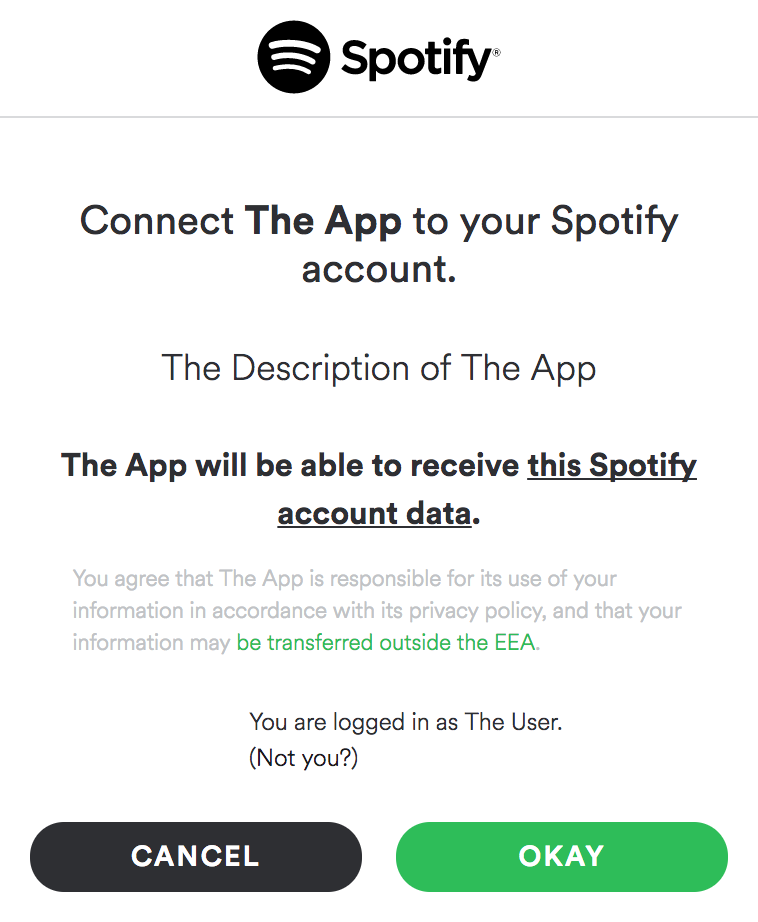
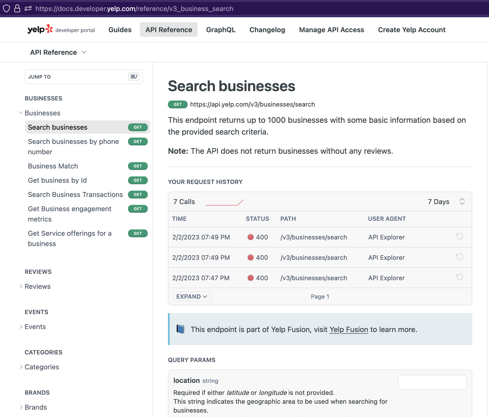
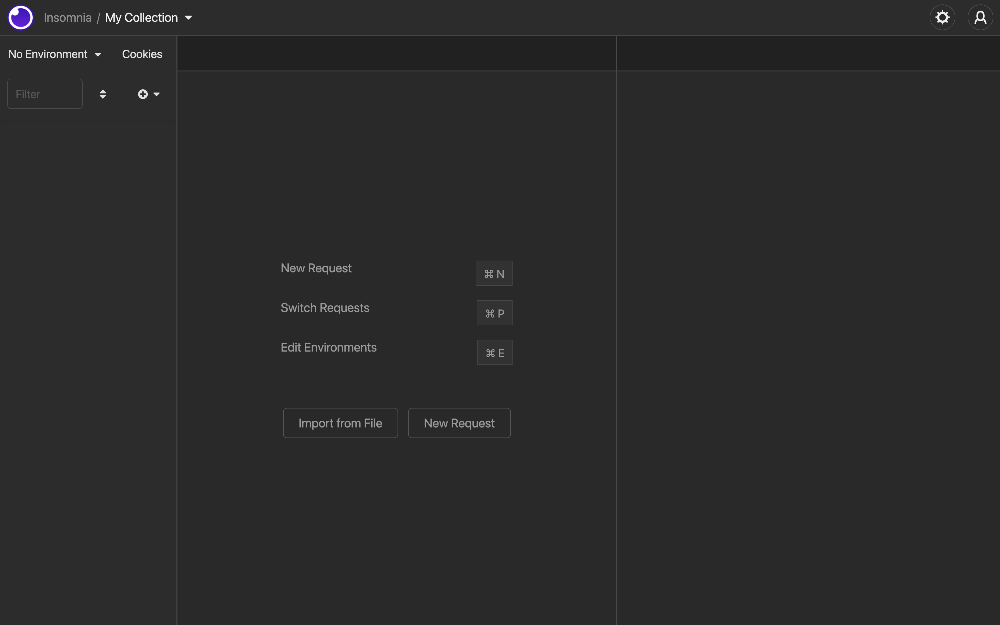
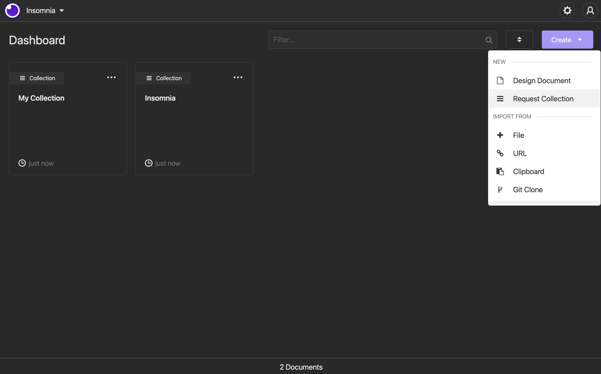
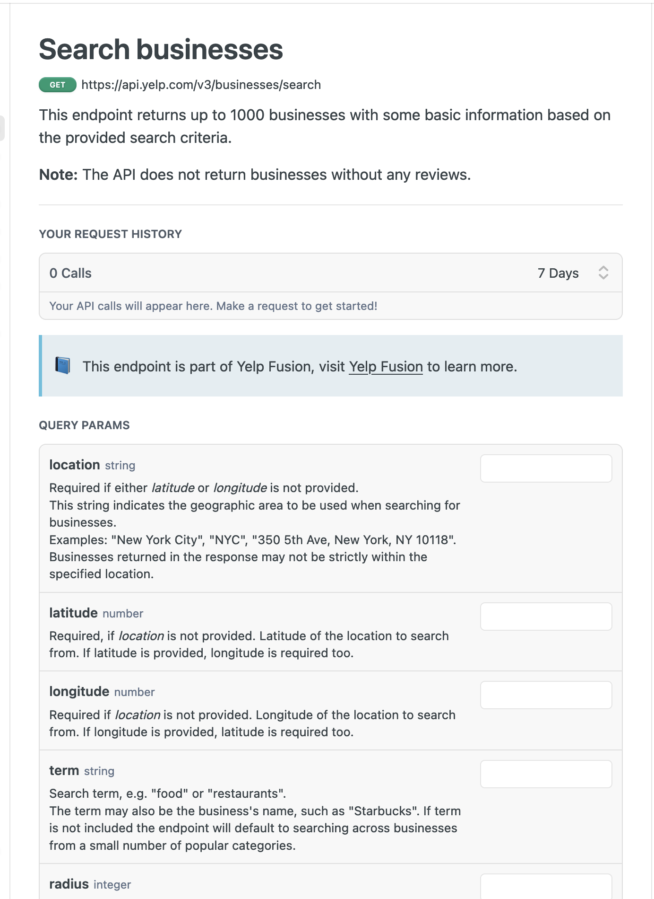
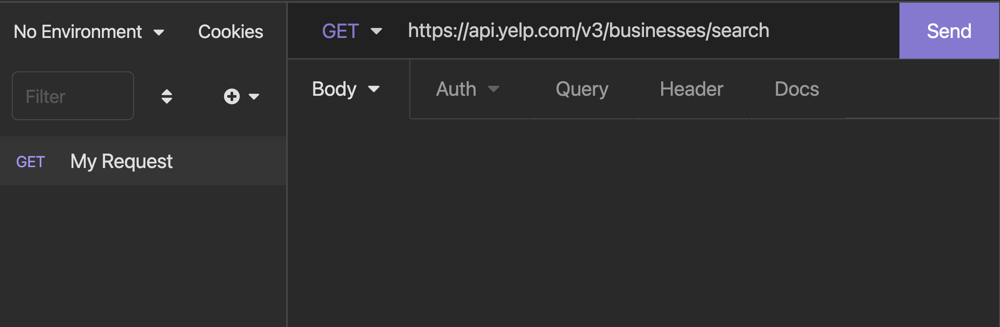
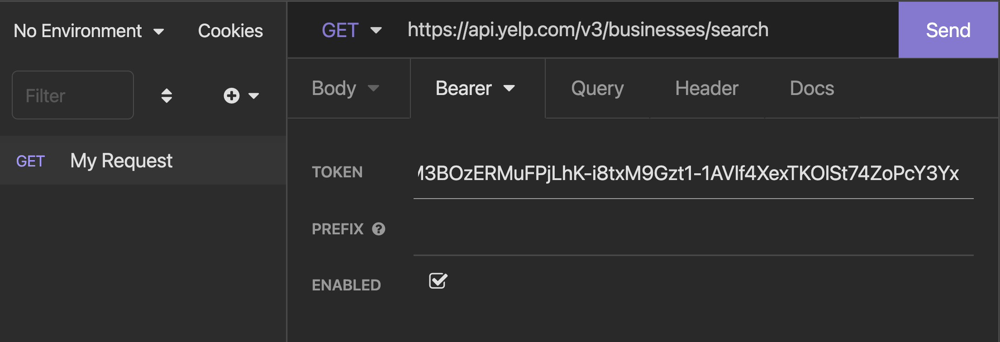
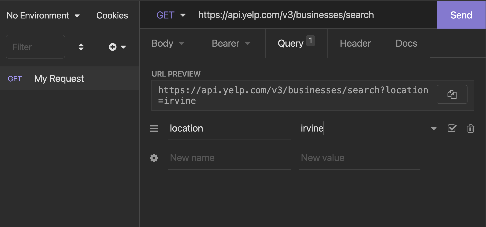
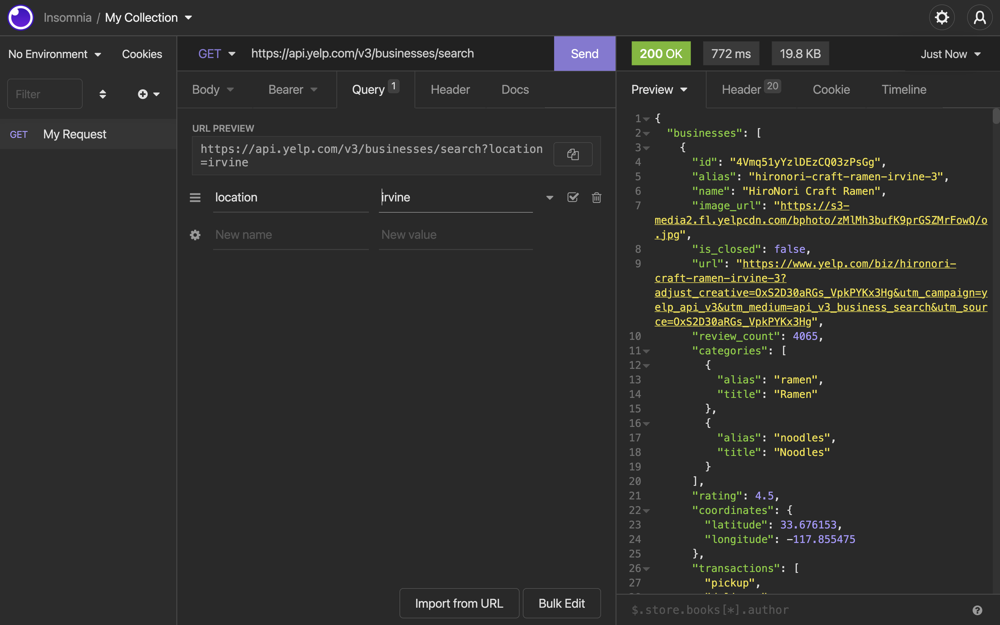
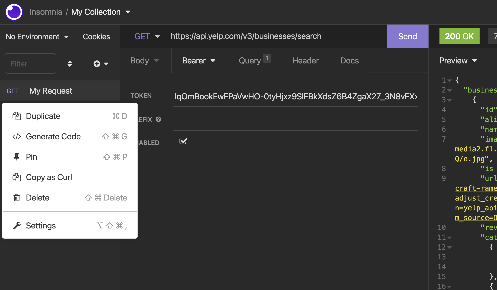

# Quick API Call Lesson

```table-of-contents
* [Overview](#overview)
* [Pick an API](#pick-an-api)
* [Pick an endpoint](#pick-an-endpoint)
* [Download Insomnia](#download-insomnia)
* [Fill out the fields](#fill-out-the-fields)
    1. [Endpoint](#endpoint)
    2. [Auth](#auth)
    3. [Query Params](#query-params)
    4. [Results](#results)
* [Taking this to code](#taking-this-to-code)
* [Final](#final)

```

## Overview
We're going to learn how to read API documentation, mock API calls, and then finally, embed them into your app.

This article is written for a hackathon - which means you're running out of time already - so it'll be less explaining than usual and more of how to do it.


## Pick an API

First, we pick an API. Here, I'm going to use a simpler API as an example where I just make a single call and I'll get data back immediately. In this case, it's going to be the Yelp API. To use the Yelp API, I simply just ask them for a list of restaurants, and they'll return back a list of restaurant data. 

That's the simplest one. There's a more complicated one called OAuth which revolves around user authentication. An example here is Spotify. Let's say you want to integrate Spotify's API so that you can get a random playlist created by a user. Well, the user has to first *authorize* your application to get their data. Have you ever seen something like this?



This is part of the OAuth flow. A user will sign into your app, you will redirect them to Spotify to sign in, and then spotify will then return to your app with the access token. OAuth is slightly more complex but still pretty simple if you follow the instructions. 

We'll worry about OAuth in a different article - for now, we're just focusing on the most basic API call.

## Pick an endpoint

Most API's will expose multiple functionalities. In the Yelp Fusion API, we can see a list of various functionalities on the right.



These various functionalities are known as endpoints. When you **hit** different endpoints, you're essentially calling different functions of the API. 

In our example, we're going to be using the main endpoint: business search. 

## Download Insomnia

We're going to use a tool here called [Insomnia](https://insomnia.rest/) (if you've heard of [Postman](https://www.postman.com/), this is very similar). Go ahead and download it and open it up.

You should see something like this:



and you can click that `(+)` plus button and create a `New Request`.



If you see something like this, then on the top right, click `Create` and then select `Request Collection`. Then continue with creating a New Request.


## Fill out the fields

Now, we just need to fill out the fields in Insomnia to mock our API call. Let's take a look at the documentation on the Yelp website to see how to use it:



### Endpoint

First thing, we note the type of request, and the endpoint. The green button says `GET` request and the endpoint, so let's fill that out in Insomnia.



### Auth
Most API's require authentication. This is so they make sure people don't abuse the API, or accidentally write an infinite loop and ends up DDOS'ing their servers. Some API's make the API key a query param (we'll do that next) but for Yelp, they use an Auth protocol called Bearer Tokens. We go to the `Auth` dropdown and select `Bearer`.



### Query Params
Finally, looking back at the Yelp docs, we'll see that this API allows you to provide a bunch of query params. These are essentially just parameters (like a normal function) that you pass into the API. There are a bunch of them (you'll see some marked as **required** or **optional**) - to make this quick, we'll just use the location string.



### Results

Click `Send` and we'll see the results.



## Taking this to code

The beauty of Insomnia (and Postman as well) is that you can rapidly prototype making API calls and once you're happy with it, you can immediately generate the code for it.

Hover over your request on the right and you should see a tiny triangle pop up. Click on that and you should see this menu:



Generate the code in the language you want and go wild with it!

## Final

So why use Insomnia? You'll find yourself constantly iterating with the API's and this is a way for you rapidly prototype. Not only that, when you write a backend service yourself, you're essentially creating your own API. You can easily use Insomnia to test your own backend server.
