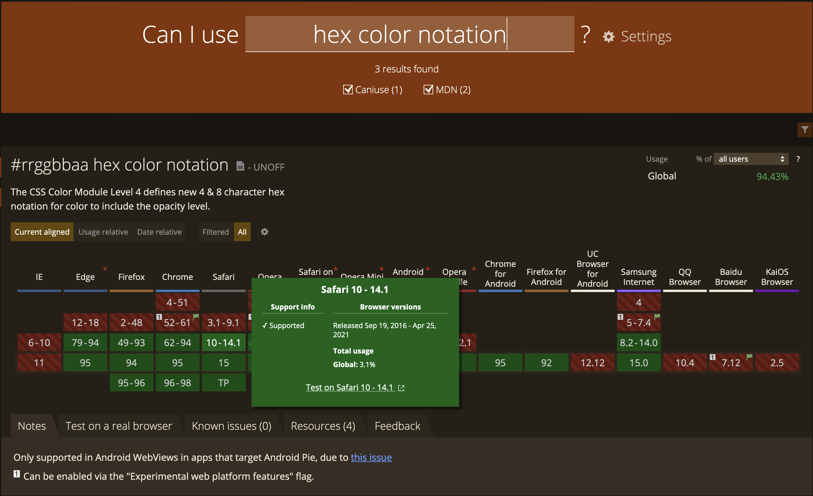

# Setting up React

## Table of Contents

* [Very short intro about React](#very-short-intro-about-react)
* [Installation and Setup](#installation-and-setup)
    1. [Text Editor / IDE](#text-editor-/-ide)
    2. [Browser](#browser)
    3. [Node, NPM, and React](#node,-npm,-and-react)
* [Test Setup](#test-setup)
* [Hack at UCI React Workshop](#hack-at-uci-react-workshop)
    
## Very short intro about React

React (React.js) is a Javascript library that makes building web interfaces easier for developers. It is one of the most popular web frameworks and is developed by Facebook. 

If you're using the new (sorta) Facebook / meta??? redesign, that's mostly all written in React. 

Web dev was traditionally all done in plain `HTML/CSS/JS` but as computers got faster, websites could do more things, and that means needing a better way to code dynamic webapps.


## Installation and Setup

We're gonna need 3 things: a place to write code (IDE), a place to run code (Browser), and the React library itself (plus the development environment that comes with it).

### Text Editor / IDE
Just like regular vanilla web development, we're going to need a text editor of some sort. My IDE of choice is [VSCode](https://code.visualstudio.com/), as is for many web developers. I highly, highly, highly recommend VSCode.

### Browser
As mentioned earlier, you will need a browser (likely something you already have) but preferably [Chrome](https://www.google.com/chrome/) or [Firefox](https://www.mozilla.org/en-US/firefox/new/). Sorry Safari and Internet Explorer lovers. Since we're pretty much developing websites for the browser, we'll need a browser to see what we made. Chrome and Firefox not only have the best debugging experience (personal preference) but also have the most support (fax, no printer). Different browsers have different interpreters and have different support. You can see if a certain feature is supported on a certain browser through [caniuse.com](https://caniuse.com).

Here's an example for writing CSS colors in hex color notation:

You can see that in Safari, it's only supported starting version 10 - which was released in Sept. 26, 2016. This is an example of a pretty well-supported feature but not all features have good compatability. For the purposes of a hackathon or learning web development, testing for browser compatability isn't important but being aware of it is.

### Node, NPM, and React

Lastly, you're going to need React but more specifically, the developer environment that can install it easily (as well as other packages you will need). We will need to [install Node and the package manager](https://docs.npmjs.com/downloading-and-installing-node-js-and-npm) it comes with - NPM (which funnily enough, does not actually stand for Node Package Manager)

Ensure that the versions you have installed are correct: [Node >= 14.0.0 and npm >= 5.6]

You can type these commands in a standalone terminal or in the [integrated terminal built into VSCode](https://code.visualstudio.com/docs/editor/integrated-terminal) to see if you've installed them correctly.

```bash terminal
$ node -v
v16.13.0

$ npm -v
8.1.0
```

## Test Setup

Once you've have all of these: VSCode, Browser, and Node/NPM, you're ready to get started on coding React! If you're here for a workshop, read below first. Otherwise, let's first [run through setting up our first React project](https://learn.ryqn.dev/article/creating-your-first-react-project).

### Hack at UCI React Workshop
November 18, 2021 @DBH

If you're here to just install and setup React for a workshop I'm doing, then you can pretty much stop right here. I'll be skimming through this write up at the start to make sure everyone has this stuff ready if they want to follow along and live code with me. 

If you want to test everything to make sure that you have everything working (completely optional), you can read [the next section](https://learn.ryqn.dev/article/creating-your-first-react-project) to start a quick project. I'll be doing that exact process live during the workshop but if you want to test everything works first, you can check it out. We will also be building from that boilerplate code so it'll be a small headstart if you have it done.