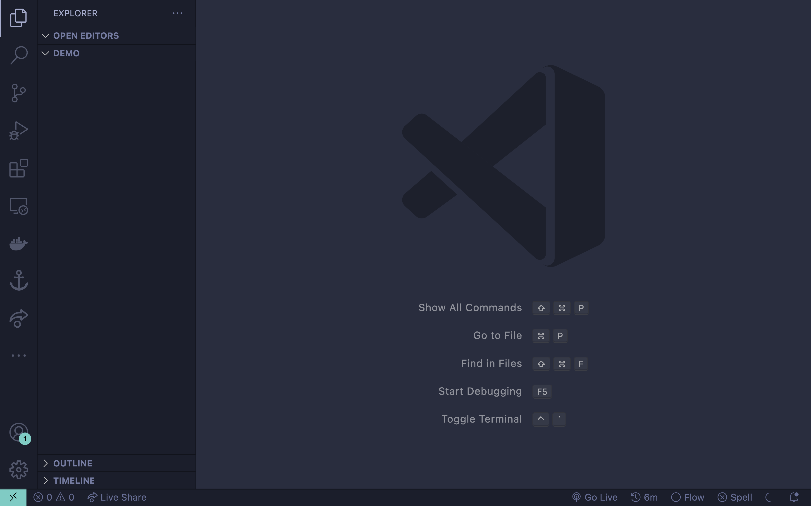
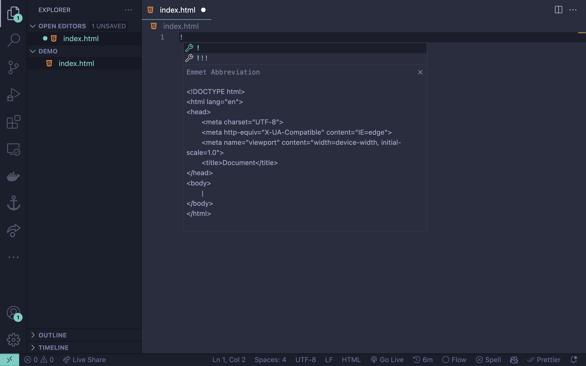
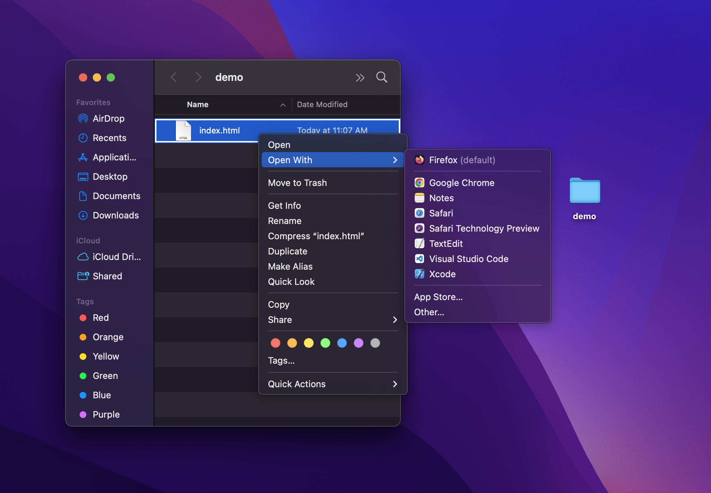
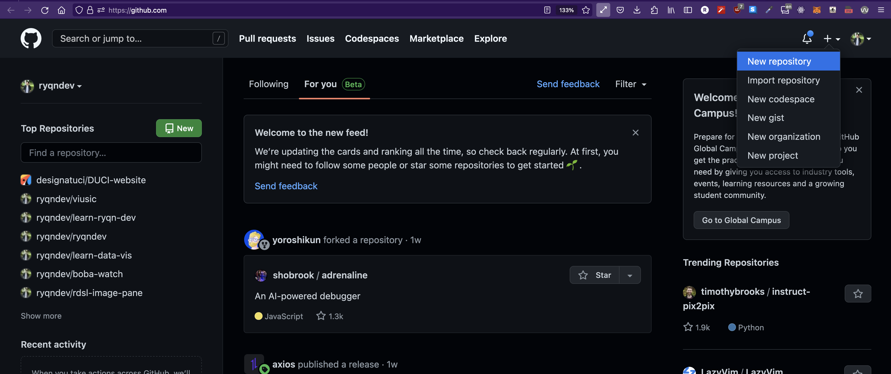
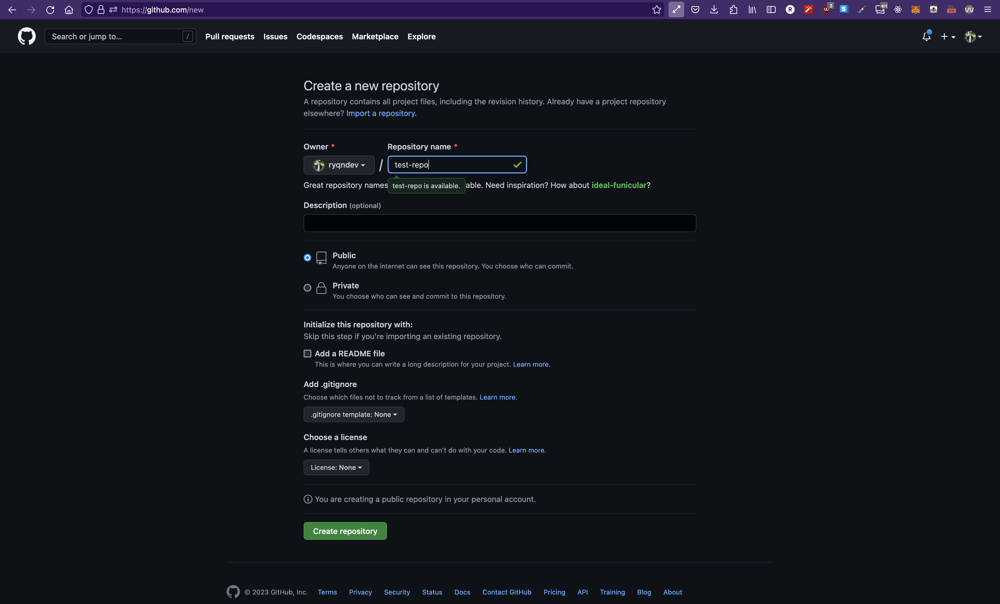
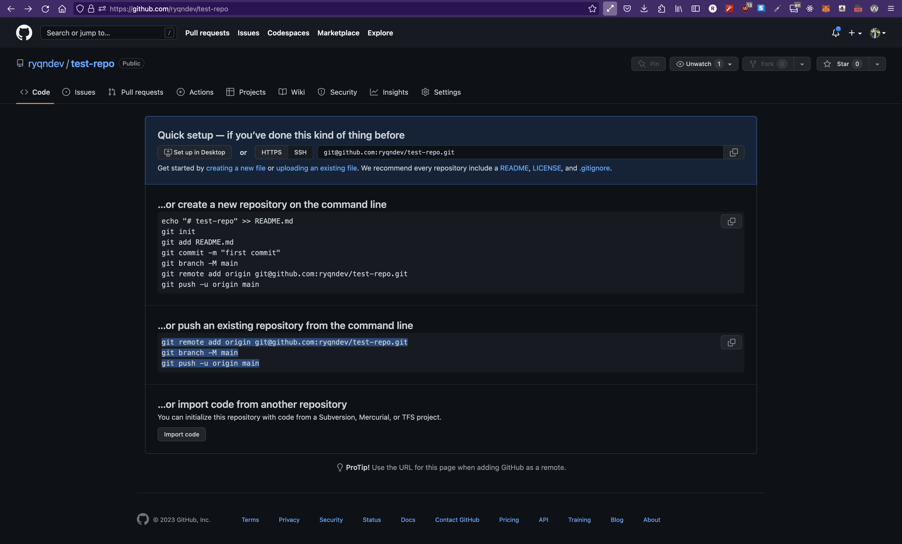
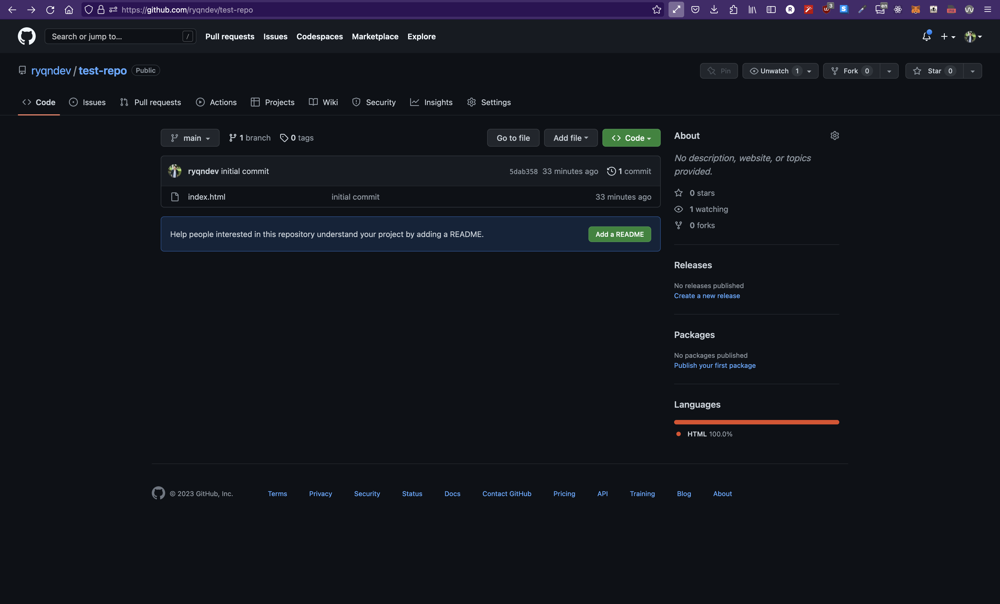
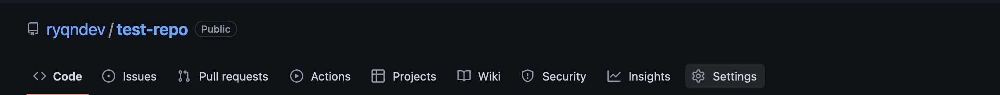
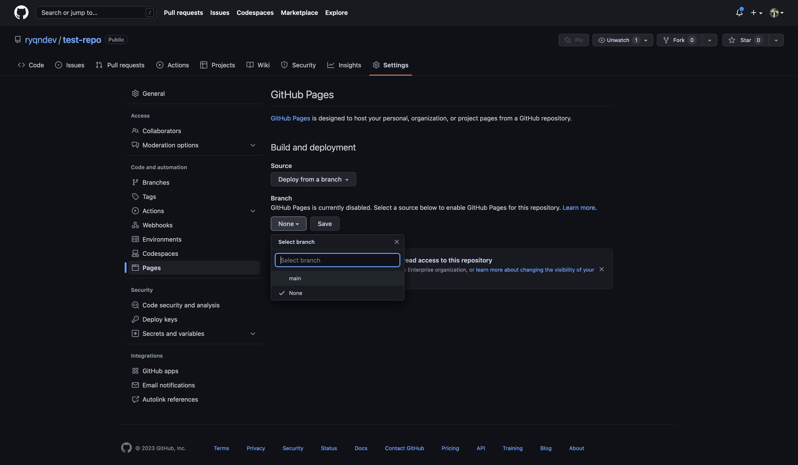
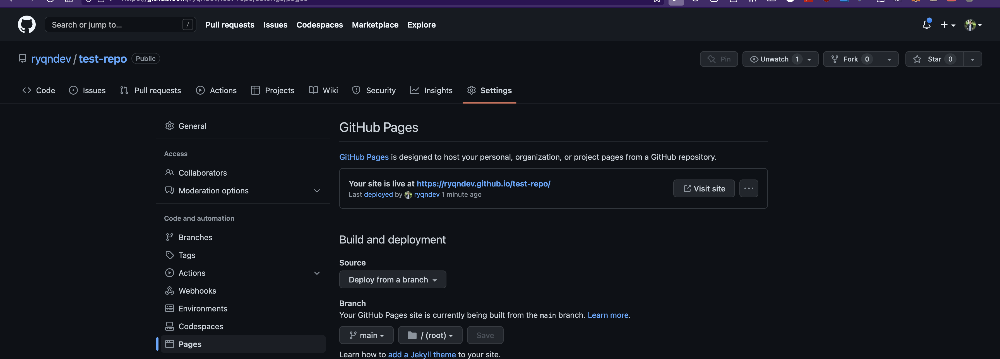

# Write and host your own website

```table-of-contents

* [Overview](#overview)
* [Prerequisites](#prerequisites)
* [Steps](#steps)
    1. [Create an HTML file](#create-an-html-file)
    2. [Add content to our website](#add-content-to-our-website)
    3. [Run our website](#run-our-website)
    4. [Uploading our website](#uploading-our-website)
    5. [Setup GH Pages](#setup-gh-pages)
* [Final](#final) 
```

## Overview

This is a quick tutorial on how to write and host a website. This is meant for beginners who might not even know how to write basic HTML. This is to show how you can spin up a website on the internet quickly and for free.

## Prerequisites

You're going to need three things here: an IDE (code editor - [VSCode](https://code.visualstudio.com/) is best here), Git, and a Github account. We'll be using Github to host our website for free and use Git commands to help us initialize a Github project.

## Steps

### Create an HTML file

First, we need to write a website so we have something to host. We won't do anything too fancy (save learning web-dev for later) and just type some basic stuff. Let's create a new folder somewhere on our computer (can be anywhere) and open it up in our favorite code editor. If you're using [VSCode](https://code.visualstudio.com/), you should see something like this: (I created a new folder called `demo` on my desktop and opened it with VSCode)



All websites are written in HTML, so let's create a file called `index.html` in our folder and open it up. Next, (if you're using VSCode), you can simply type `!` and then press enter. This is called an emmett tag and is built into VSCode by default. It allows you to type HTML code quickly.



If that doesn't work though, feel free to just copy and paste the snippet I've added below.

```html index.html
<!DOCTYPE html>
<html lang="en">
<head>
    <meta charset="UTF-8">
    <meta http-equiv="X-UA-Compatible" content="IE=edge">
    <meta name="viewport" content="width=device-width, initial-scale=1.0">
    <title>Document</title>
</head>
<body>
    
</body>
</html>
```
### Add content to our website

Right now, our website is empty - I'll go over how to run it in a second - so let's go ahead and add a line that says something unique and also style it a little. You can copy this line 
```html basic text
<p style="background-color: #4c00b0; color: white;">Hey! this is some stuff I'm writing to prove this all works</p>
```
and paste it in between your `<body>` tags. Your code should look some thing like this:

```html index.html
<!DOCTYPE html>
<html lang="en">
<head>
    <meta charset="UTF-8">
    <meta http-equiv="X-UA-Compatible" content="IE=edge">
    <meta name="viewport" content="width=device-width, initial-scale=1.0">
    <title>Document</title>
</head>
<body>
    <p style="background-color: #4c00b0; color: white;">Hey! this is some stuff I'm writing to prove this all works</p>
</body>
</html>
```

### Run our website

Before anything else, we should run our website locally to make sure it all works. We can do this by opening up the file you just edited with a browser. Make sure you use the `Open with..` option. I've pasted a screenshot of how I would do this on a Mac - windows/linux is roughly same.



tl;dr: if you open the file with a text/code editor, you'll see the raw HTML that you can edit. If you open the file with a browser (Chrome,Firefox, Edge, etc.), you'll see the rendered website.

If you're familiar with other programming languages, you can essentially think of the browser as a "compiler" that compiles and executes your HTML code. (not 100% exactly how it works but you can think of it this way)

Once you open it up, you should see something like this:


If you have text exactly like what you wrote, then your HTML is running perfectly. If the background of the `<p>` tag is some sort of purple with a text color of white, then that's your CSS running as intended.

### Uploading our website

Now that we have our website code, we need to upload it on Github so they can host our website. This gets a little tricky because we're dealing with Git commands now. Follow what I have here in the exact order and everything should work out just fine. ;)

First, we login into [Github](https://github.com) and select the [+] button on the top right and click `New Repository`. Essentially, that looks like this: (My github homepage will look slightly different than yours - the [+] button should be exactly there though)



Once you click that, it should redirect you to this page:



Fill out the repo-name - it can be anything you want - and click `Create Repository` on the bottom. Then, it will redirect you to this page:



**See that text I have highlighted?** Keep that handy because we're going to paste that into our terminal later.

Before we can upload our code onto Github, we have to `initialize` it into a way that Github will understand. This means we need Git. Mac should, by default, have Git but search online on how to install it if you don't. On Windows, if you're new to Git, go ahead and install [Git Bash](https://gitforwindows.org/) and follow [these instructions to get it in VSCode](https://stackoverflow.com/questions/42606837/how-do-i-use-bash-on-windows-from-the-visual-studio-code-integrated-terminal)

Going back to our VSCode, you can press `` Control + ` `` to pop open an integrated terminal in our current workspace. Typing `ls` should show that we have an `index.html` file in our folder.

Now, we're going to type these commands in this exact order:
1. `git init .`
2. `git add .`
3. `git commit -m "initial commit"`
4. Paste the selection from Github


I pasted a snippet above of me running those commands. You'll see that after I pasted the code from Github, I got an error:

```terminal error message
git@github.com: Permission denied (publickey).
fatal: Could not read from remote repository.

Please make sure you have the correct access rights
and the repository exists.
```

This means that I didn't have SSH configured on my computer. What that means is, essentially, to allow uploading code to Github (or editing any code repository), you need to have permission. Since I've never done anything to authorize my computer to access my Github account, I need to set up SSH. You should be able to follow [this link to figure out how to setup SSH](https://docs.github.com/en/authentication/connecting-to-github-with-ssh/generating-a-new-ssh-key-and-adding-it-to-the-ssh-agent).

Once I've done so, I rerun the Github code snippet and get this:
```terminal success
❯ git remote add origin git@github.com:ryqndev/test-repo.git
git branch -M main
git push -u origin main

error: remote origin already exists.
Enumerating objects: 3, done.
Counting objects: 100% (3/3), done.
Delta compression using up to 8 threads
Compressing objects: 100% (2/2), done.
Writing objects: 100% (3/3), 476 bytes | 476.00 KiB/s, done.
Total 3 (delta 0), reused 0 (delta 0), pack-reused 0
To github.com:ryqndev/test-repo.git
 * [new branch]      main -> main
Branch 'main' set up to track remote branch 'main' from 'origin'.
```

After that, you should be able to refresh the page of your repo and you'll see:



### Setup GH Pages

The Github service we'll be using here is called Github Pages. To set it up, all we need to do is navigate to the settings icon located here:



Click on the settings and navigate to the `Pages` tab. Under the `Branch` section, select the `main` branch that we just pushed to and click save.



After a couple seconds (or minutes - it takes a while), refresh the page and you should see that at the top, they've generated a link to your site and you can click on that to see the website. 




Congratulations!!! You now have a public website. Don't believe me? Check on your phone or another computer.

## Final 

This is just to show how you can write and host your website quickly (probably takes under and hour your first time, and if you're experienced with this, probably less than 5 minutes).

You might want to have a custom domain - after all that link is a little "ugly". For that, you can read this article - [Setting up a Custom Domain](https://docs.github.com/en/pages/configuring-a-custom-domain-for-your-github-pages-site).

If you're ready to dive more into web development and make some more advanced stuff, go ahead and check out  [Intro to Web Dev](./article/intro-to-web-dev)


