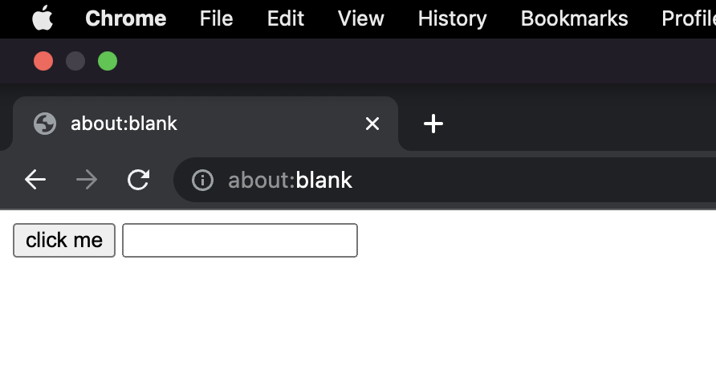
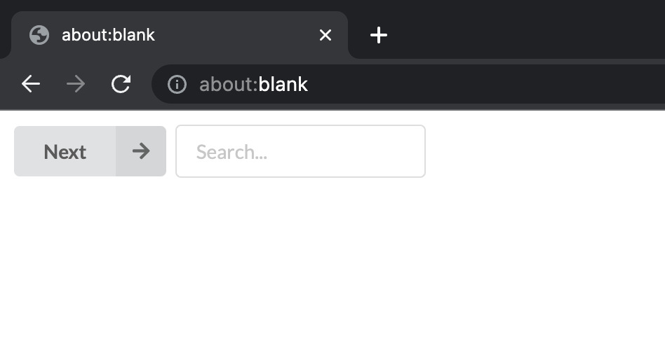
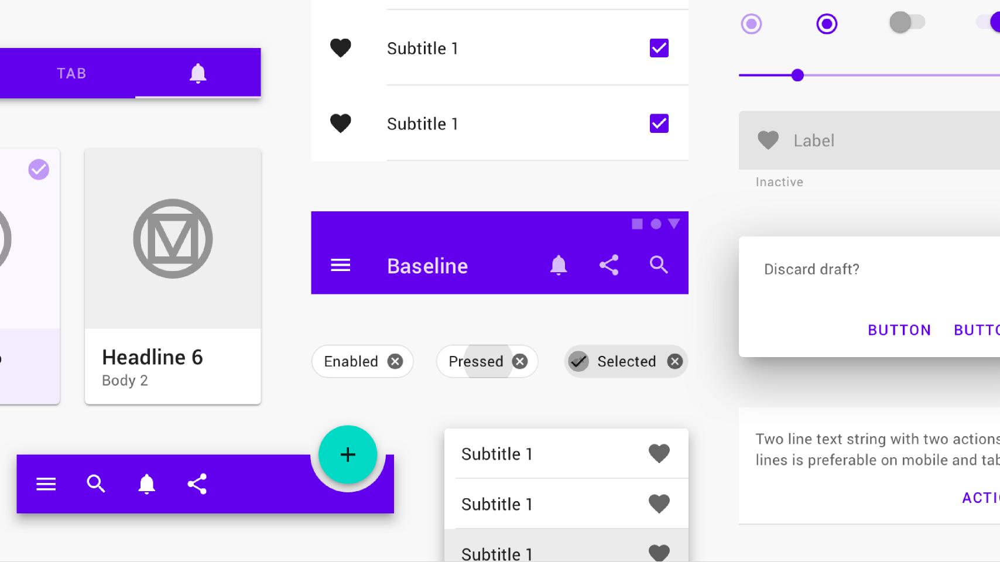
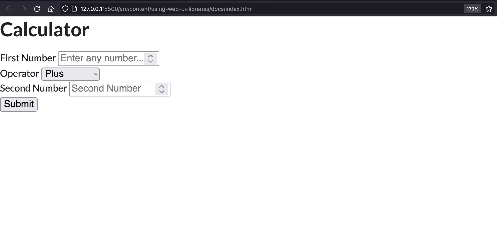
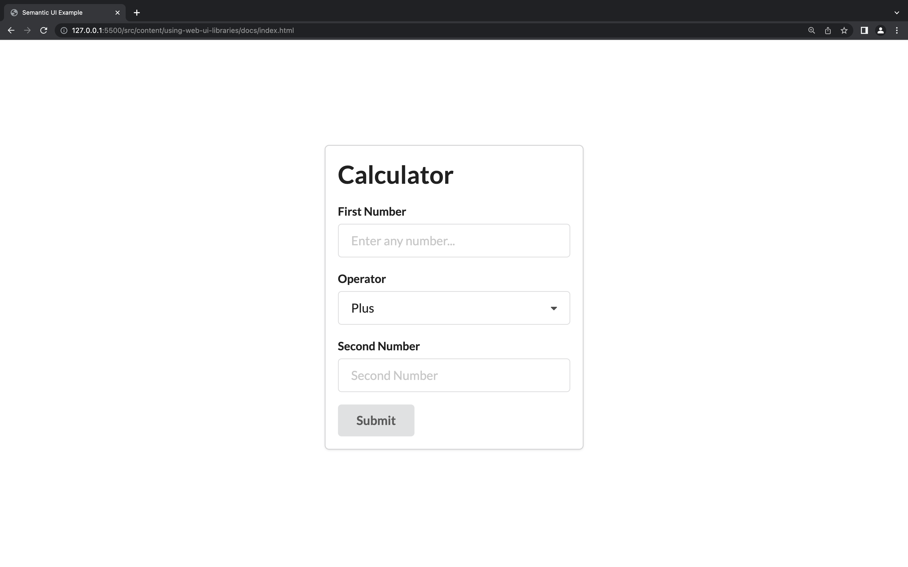

# Using Web UI Libraries

## Table of Contents

* [Intro](#intro)
* [What are UI component libraries?](#what-are-ui-component-libraries?)
* [Why use UI component libraries](#why-use-ui-component-libraries?)
* [What's different among web UI libraries?](#what's-different-among-web-ui-libraries?)
* [Other Libraries](#other-libraries)
* [Code Demo](#code-demo)
    1. [Boilerplate Code](#boilerplate-code)
    2. [Import the library](#import-the-library)
    3. [Starter Code](#starter-code)
    
## Intro
Let's explore how we can utilize UI component libraries built for web technologies - HTML/CSS/JS. Specifically, we'll be looking into these web UI libraries built for vanilla JS (i.e. not React, Vue, Angular, etc.). **The goal here is to learn how we can implement and use UI libraries to help us develop our webapps.** Before I dive into *how* to use these libraries, let's look at exactly what they are, what they do, and why we should use them.

## What are UI component libraries?
UI component libraries are, in essence, a collection of prebuilt components that are used to help speed up development. When developing for the web, the browser gives us the most basic, bare-bone tools to do anything we want but stays unopinionated when it comes to design. This is why, when we use a standard HTML button and HTML form input, they look... empty.



The W3C (organization in charge of deciding the syntax for web code) isn't trying to be difficult here by making the built-in components look so boring. It's unopiniated by design so that developers always start off with a blank canvas. The way I see it, web development is an art form where our medium is code.

However, when we're starting out learning how to code or just want to rapidly prototype a product, we don't always want to design an entire button from scratch. We can hook into a UI library that has already pre-built the styles for common components and with very little extra code, can convert that plain button and input form into this:



## Why use UI component libraries?

I briefly mentioned a reason or two about why we should use UI component libraries in that last section but I want to get into some more detail. The part about web code being a blank canvas is a good thing. It means that any website that gets designed is designed that way explicitly. It allows each site to create their own branding and feel - but this takes time. It takes experience, time, and effort to design something cohesive and in many cases, we either don't have the luxury to develop our own branding, or don't need to.

For example, if you just came up with an idea and want to mock a proof of concept (PoC) of a workflow or are on a timecrunch like a hackathon, these are perfect use cases to just run with a UI library.

## What's different among web UI libraries?

There are a **ton** of web UI libraries and so it's easy to get lost in them. I wanted to provide a couple popular libraries that you might want to check out but for the purposes of this lesson, we'll be exploring one specific library in depth. 

What's the main difference between these libraries? The look. Every UI library is designed with a certain design theme in mind and they'll vary in the way they look. 

One example is [Material Design](https://m3.material.io/). Material Design is a design language that Google has developed that's based on paper.

When you look at a website developed with Material, you might feel like it's... Google-esque and that's because it is! Take a look at some of their components for yourself:



Even though you can change the colors and themes of the components, their shape, spacing, and iconography will still emanate that Google look.

### Other libraries

Here are some UI libraries that I wanted to introduce you to if you're curious about them:

- [Semantic UI](https://semantic-ui.com/) - I'll be demoing this library specifically
- [MaterializeCSS](https://materializecss.com/) - This is the actual library implementation for the Material Design sytem.
- [Bootstrap](https://getbootstrap.com/) - Bootstrap is one of the oldest UI libraries. Originally developed by Twitter, this was extremely popular at one point but I think it's starting to look a little dated.
- [Bulma](https://bulma.io/) - Got popular at the same time as Semantic but feels less feature-rich
- [Tailwind](https://tailwindcss.com/) - Extremely popular. I'm personally not a fan of Tailwind because I think it's verbose and requires investment in the library but regardless of what I think, it's a very popular library and deserves recognition.

There are a ton more but these are the immediate ones off the top of my head. One important thing to note is that these are UI libraries for vanilla web development. If you see a library that you like but it's only for React, you have to take that into account. And example of this is Ant Design - the design library used by Alibaba and Tencent. It's only available in React so if you want to use that look, you're going to have to develop your app in React instead of vanilla web dev.

Similarily, Material Design has a version written for almost every major framework. There's MaterializeCSS for vanilla but also [MaterialUI](https://mui.com/) for React, [Vuetify](https://vuetifyjs.com/en/) for Vue, and so on.

## Code Demo

Let's see how we can use Semantic UI in a fresh web app. To not get too bogged down in the logic, I'm going to reuse most of the code from the VanillaJS workshop and focus on adding in the UI library from scratch. Then, I'll run through a more advanced demo sample of how you can stitch everything together.

### Starter Code 

Let's start out with a blank website with just the boilerplate code. If you need a refresher on basic web dev, you can check out [Intro To Web Dev](../intro-to-web-dev). Something like this:

```file
└── using-web-ui-libraries
    ├── index.html
    ├── styles.css
    └── script.js
```

```html index.html
<!DOCTYPE html>
<html>
  <head>
    <title>Learning</title>
    <link rel="stylesheet" type="text/css" href="./styles.css" />
    <script src="./scripts.js"></script>
  </head>
  <body>
    Hello
  </body>
</html>
```

```css styles.css
/* empty for now */
```

```js script.js
// empty for now
```

### Import the library

When we use an external library like Semantic, we need to first add it to our site. We can do this in a few ways - the Semantic UI getting started code will show you a way to build the library files yourself to link but we can simplify this by just using a [CDN](https://cdnjs.com/libraries/semantic-ui).

UI libraries will usually consist of a CSS AND a Javscript file so don't forget to import both. Furthermore, Semantic UI also has a dependency on JQuery so we will need that as well.

```html index.html
<!DOCTYPE html>
<html>
  <head>
    <title>Learning</title>

    <!-- JQuery dependency -->
    <script src="https://code.jquery.com/jquery-3.6.1.min.js"
    integrity="sha256-o88AwQnZB+VDvE9tvIXrMQaPlFFSUTR+nldQm1LuPXQ=" crossorigin="anonymous"></script>

    <!-- ADD SEMANTIC UI LIBRARY SOURCE CODE -->
    <script src="https://cdnjs.cloudflare.com/ajax/libs/semantic-ui/2.5.0/semantic.min.js"
        integrity="sha512-Xo0Jh8MsOn72LGV8kU5LsclG7SUzJsWGhXbWcYs2MAmChkQzwiW/yTQwdJ8w6UA9C6EVG18GHb/TrYpYCjyAQw=="
        crossorigin="anonymous" referrerpolicy="no-referrer"></script>
    <link rel="stylesheet" href="https://cdnjs.cloudflare.com/ajax/libs/semantic-ui/2.5.0/semantic.min.css"
        integrity="sha512-KXol4x3sVoO+8ZsWPFI/r5KBVB/ssCGB5tsv2nVOKwLg33wTFP3fmnXa47FdSVIshVTgsYk/1734xSk9aFIa4A=="
        crossorigin="anonymous" referrerpolicy="no-referrer" />

    <link rel="stylesheet" type="text/css" href="./styles.css" />
    <script src="./script.js"></script>

  </head>
  <body>
    Hello
  </body>
</html>
```

We just added line 10, 11, and 14 to import the library through the use of a CDN. If you look at the imports closely, you'll notice that they're just links and if you access those links, you'll see that it's just regular Javascript and CSS code. After all, these libraries are just prebuild CSS and Javascript code. Now, let's look at how we can use these in our project.

**Important Note** The order of the javascript imports matter! Our code will be utilizing the Semantic UI library so those variables and constants need to be instantiated first. Semantic UI, also depends on JQuery so that has to be imported before that. So finally, we have this import order of JQuery > SemanticUI > our custom JS. If you get an error that says something like "SemanticUI is not defined", it's probably because you imported the library in the wrong order. 


### Starter Code

This a slight variation of the starter code from the VanillaJS workshop. Most of the HTML is the same and there's a slight difference in the javascript but mostly, I've stripped out the CSS.

```html index.html
<!DOCTYPE html>
<html lang="en">

<head>
    <meta charset="UTF-8">
    <meta http-equiv="X-UA-Compatible" content="IE=edge">
    <meta name="viewport" content="width=device-width, initial-scale=1.0">
    <title>Semantic UI Example</title>

    <!-- JQuery dependency -->
    <script src="https://code.jquery.com/jquery-3.6.1.min.js"
        integrity="sha256-o88AwQnZB+VDvE9tvIXrMQaPlFFSUTR+nldQm1LuPXQ=" crossorigin="anonymous"></script>

    <!-- ADD SEMANTIC UI LIBRARY SOURCE CODE -->
    <script src="https://cdnjs.cloudflare.com/ajax/libs/semantic-ui/2.5.0/semantic.min.js"
        integrity="sha512-Xo0Jh8MsOn72LGV8kU5LsclG7SUzJsWGhXbWcYs2MAmChkQzwiW/yTQwdJ8w6UA9C6EVG18GHb/TrYpYCjyAQw=="
        crossorigin="anonymous" referrerpolicy="no-referrer"></script>
    <link rel="stylesheet" href="https://cdnjs.cloudflare.com/ajax/libs/semantic-ui/2.5.0/semantic.min.css"
        integrity="sha512-KXol4x3sVoO+8ZsWPFI/r5KBVB/ssCGB5tsv2nVOKwLg33wTFP3fmnXa47FdSVIshVTgsYk/1734xSk9aFIa4A=="
        crossorigin="anonymous" referrerpolicy="no-referrer" />

    <link rel="stylesheet" type="text/css" href="./styles.css" />
    <script src="./script.js"></script>
</head>

<body>
  <div>
      <h1>Calculator</h1>

      <form id="calculator" onsubmit="calculate(event)">
          <div>
              <label>First Number</label>
              <input type="number" placeholder="Enter any number..." />
          </div>
          <div>
              <label>Operator</label>
              <select name="operation">
                  <option value="+">Plus</option>
                  <option value="-">Minus</option>
                  <option value="*">Times</option>
                  <option value="/">Divided by</option>
              </select>
          </div>
          <div>
              <label>Second Number</label>
              <input type="number" placeholder="Second Number" />
          </div>
          <button>Submit</button>
      </form>
  </div>
</body>

</html>
```

```css styles.css
/* empty */
```

```javascript script.js
function calculate(event) {
    event.preventDefault();

    const answer = eval(`${event.target[0].value }${event.target[1].value}${event.target[2].value}`)

    document.getElementById('answer').innerHTML 
        = event.target[0].value 
        + event.target[1].value
        + event.target[2].value
        + '='
        + answer;
}
```

Which results in this: 



Still looks pretty uninspiring right? Well, there's no CSS styling to spice this web app up. If we're writing our own web app from scratch, before we can even start writing the CSS code, we have to design the components first and mock up how we want it to look. However, since we're using a UI library, we just need to add the CSS clases from the library to the various components we have out.

### Semantic UI

To use semantic UI, you simply need to add 2 class names: "ui" and the name of the component. So, if you wanted to style a button, you would add `class="ui button"` to the button element. If you wanted to style a form, you would add `class="ui form"` to the form element. If a component has more complex functionality, you will also need to add a javascript snippet which can be found in the usage section of the SemanticUI docs.

```html index.html
<!DOCTYPE html>
<html lang="en">

<head>
    <meta charset="UTF-8">
    <meta http-equiv="X-UA-Compatible" content="IE=edge">
    <meta name="viewport" content="width=device-width, initial-scale=1.0">
    <title>Semantic UI Example</title>

    <!-- JQuery dependency -->
    <script src="https://code.jquery.com/jquery-3.6.1.min.js"
        integrity="sha256-o88AwQnZB+VDvE9tvIXrMQaPlFFSUTR+nldQm1LuPXQ=" crossorigin="anonymous"></script>

    <!-- ADD SEMANTIC UI LIBRARY SOURCE CODE -->
    <script src="https://cdnjs.cloudflare.com/ajax/libs/semantic-ui/2.5.0/semantic.min.js"
        integrity="sha512-Xo0Jh8MsOn72LGV8kU5LsclG7SUzJsWGhXbWcYs2MAmChkQzwiW/yTQwdJ8w6UA9C6EVG18GHb/TrYpYCjyAQw=="
        crossorigin="anonymous" referrerpolicy="no-referrer"></script>
    <link rel="stylesheet" href="https://cdnjs.cloudflare.com/ajax/libs/semantic-ui/2.5.0/semantic.min.css"
        integrity="sha512-KXol4x3sVoO+8ZsWPFI/r5KBVB/ssCGB5tsv2nVOKwLg33wTFP3fmnXa47FdSVIshVTgsYk/1734xSk9aFIa4A=="
        crossorigin="anonymous" referrerpolicy="no-referrer" />

    <link rel="stylesheet" type="text/css" href="./styles.css" />
    <script src="./script.js"></script>
</head>

<body>
    <div class="ui card">
        <div class="ui content">
            <h1>Calculator</h1>

            <form class="ui form" id="calculator" onsubmit="calculate(event)">
                <div class="ui field">
                    <label>First Number</label>
                    <input type="number" placeholder="Enter any number..." />
                </div>
                <div class="ui field">
                    <label>Operator</label>
                    <select name="operation" class="ui dropdown">
                        <option value="+">Plus</option>
                        <option value="-">Minus</option>
                        <option value="*">Times</option>
                        <option value="/">Divided by</option>
                    </select>
                </div>
                <div class="ui field">
                    <label>Second Number</label>
                    <input type="number" placeholder="Second Number" />
                </div>
                <button class="ui button">Submit</button>
            </form>
            <div id="answer"></div>
        </div>
    </div>
</body>

</html>
```

```css styles.css
body {
    display: grid;
}

.card {
    place-self: center;
}
```

```javascript script.js
$(document).ready(load);

function load() {
    $('.ui.dropdown').dropdown();
}

function calculate(event) {
    event.preventDefault();

    const answer = eval(`${event.target[0].value }${event.target[1].value}${event.target[2].value}`)

    document.getElementById('answer').innerHTML 
        = event.target[0].value 
        + event.target[1].value
        + event.target[2].value
        + '='
        + answer;
}

```

which results in:


