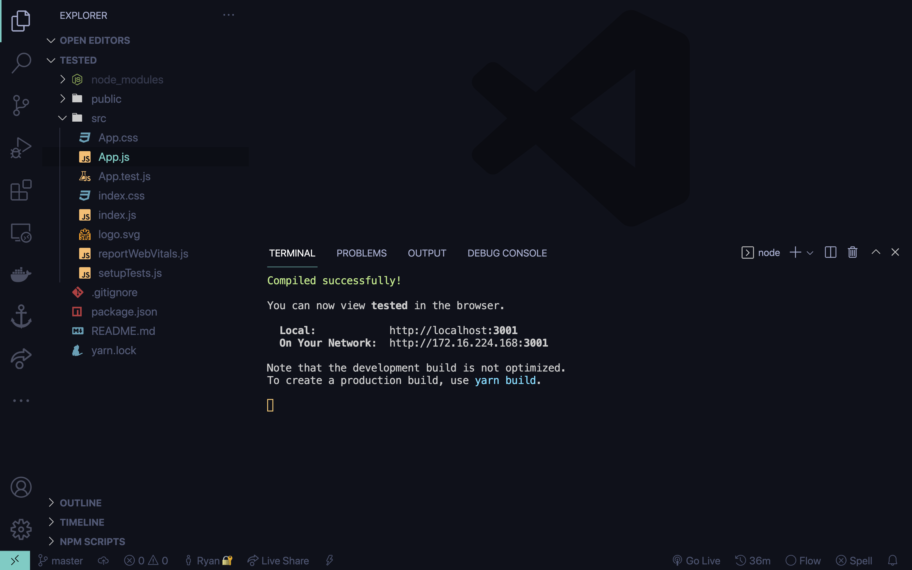
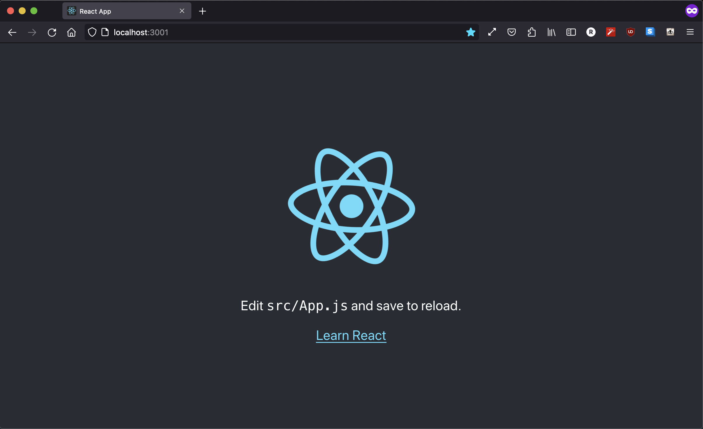

# Creating your first React project

## Table of Contents

* [Installing React](#installing-react)
* [I have Node / NPM installed](#i-have-node-/-npm-installed)
    1. [Running Create React App](#running-create-react-app)
    2. [Running our test server](#running-our-test-server)
    3. [About CRA](#about-cra)
* [Ready to learn React](#ready-to-learn-react)

## Installing React

This is a continuation of a React series so if you haven't installed Node/NPM yet, you're going to want to follow [these steps](./setting-up-react) first.

## I have Node / NPM installed

If you have VSCode, Chrome/Firefox, and Node/NPM installed, then you can go ahead and generate the boilerplate code which will set up everything for you - allowing us to immediately dive into coding React.

### Running Create React App

Create a new folder somewhere on your system (folder should be completely empty). This is where all of our files will go. If you haven't done so already, open this folder up in the terminal and type the command `npx create-react-app .` - An example of this process will look something like this: (If you are on windows and want to follow these Unix commands, you can [switch your terminal to Bash](https://stackoverflow.com/questions/42606837/how-do-i-use-bash-on-windows-from-the-visual-studio-code-integrated-terminal))

```bash terminal
$ ls
Applications	Documents	Movies
Downloads	    Desktop		Library	

$ cd Desktop

$ mkdir react-test

$ cd Desktop

$ npx create-react-app .
Creating a new React app in /Users/Ryan/Desktop/react-test.

Installing packages. This might take a couple of minutes.
Installing react, react-dom, and react-scripts with cra-template...

...
```
Here, I `cd` (Change Directory) into my Desktop directory and create a folder called react-test. Then I `cd` into that folder I just created and run the command `npx create-react-app .`. 
> *Note: The `.` at the end of `npx create-react-app .` just means "in this folder" but you can type a folder name instead and it will create a folder for you.*

The files will take some time depending on your internet speeds, computer hardware, etc. but also whether or not this is your first time installing. 

If everything has finished correctly, you should have something like this:
```file
└── react-test
    ├── node_modules
    │   └── ...stuff
    ├── public
    │   ├── index.html
    │   └── ...stuff
    ├── src
    │   ├── index.js
    │   ├── App.js
    │   └── ...stuff
    ├── package.json
    ├── README.md
    └── ...problably other stuff
```
...stuff denotes may or may not have extra stuff but we don't that much yet

### Running our test server

If all of this is good, then you can probably run a development server really quick by typing in your terminal
```bash terminal
$ npm start

Compiled successfully!

You can now view [folder name] in the browser.

  Local:            http://localhost:3001
  On Your Network:  http://[your local ip]:3001

Note that the development build is not optimized.
To create a production build, use yarn build.

```

*mine is running on port :3001 because I have something on :3000 at the moment*

and it should open up `http://localhost:3000` in your browser. If not, you can just enter `http://localhost:3000` in your browser to access your site.



To stop the development server, you can just type [Ctrl + C] in the terminal to close it.

### About CRA

The terminal command we typed to generate the entire boilerplate code: `npx create-react-app [folder name/location]` does a little more than just download React for us. You'll often see this abbreviated in articles as [CRA](https://create-react-app.dev/) and it sets up a *production* level environment for us and is the easiest way to get coding in React. Here's an incomplete and simplified list of things it does:

 • Initialize npm - makes that node_modules folder and package.json that allows you install libraries with a simple command (something I'll demo later)

 • Setup basic scripts - commands like `npm start` and `npm build` that setup an entire testing platform with hot reloading and compiling prod files
 
 • Setup webpack - bundles all your files into one and only imports things you need
 
 • Setup Babel - generates polyfills (code that makes your code backwards compatible and work on all browsers)
 
 • ... bunch of other stuff but the ones above are most important

Do I need CRA to run React? No, but it's *extremely* helpful in getting projects up and running. In fact, it's not recommended to run React without CRA unless you really know what you're doing.

For every new React project, you'll likely be typing `npx create-react-app [folder name]` so it sets everything up nice for you.

## Ready to learn React

Now that we have our entire setup ready, we can finally start getting into learning React! I would first recommend learning a lil' about [vanilla web development in plain HTML/CSS/JS](./intro-to-web-dev) so you that when you start getting into React, you can see the benefits and understand why devs in the industry use React.


