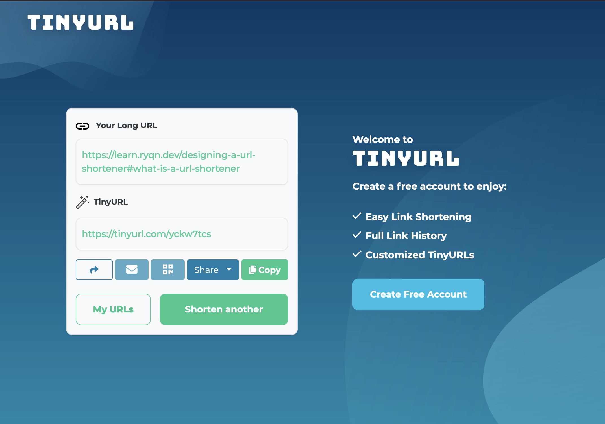
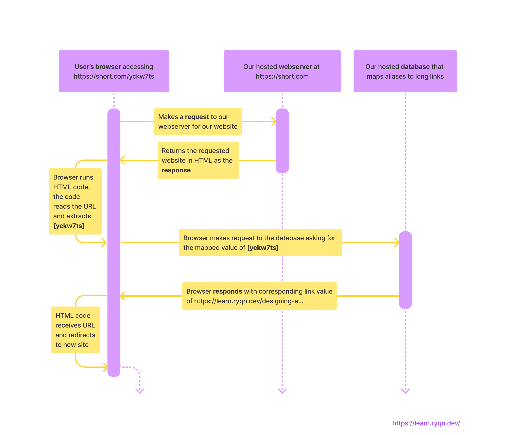

# Designing a URL shortener

## Table of Contents

* [Intro](#intro)
* [What is a URL shortener?](#what-is-a-url-shortener)
    1. [About this app](#about-this-app)
    2. [Picking our tools](#picking-our-tools)
* [Installation and Setup](#installation-and-setup)
* [Ready to start coding](#ready-to-start-coding)
* [Writing the business logic](#writing-the-business-logic)
    1. [Generating a short alias](#generating-a-short-alias)
    2. [Get link from alias](#get-link-from-alias)
    3. [Finishing up business logic](#finishing-up-business-logic)
* [Understanding servers and web requests](#understanding-servers-and-web-requests)
* [Attaching Flask](#attaching-flask)

## Intro
This is a part of a series of design docs for different types of applications. Each of these design docs will (hopefully) have tutorials on how to implement them in various languages. The point of these are not to write a production-ready application but provide some direction on how to develop certain apps. This means that the best or most efficient solution may not always be provided - but rather, the one that gets the job done without significant drawbacks.

This design has 1 supported language, found here:
[Making a URL Shortener in Python (Flask)](./making-a-url-shortener-in-python)

## What is a URL shortener?
A URL shortener is a service that converts your long URL into a shorter one. For example, the link to this article is [https://learn.ryqn.dev/designing-a-url-shortener#what-is-a-url-shortener](https://learn.ryqn.dev/designing-a-url-shortener#what-is-a-url-shortener) which is 72 characters. When I use a url shortening service, it becomes [https://tinyurl.com/yckw7tcs](https://tinyurl.com/yckw7tcs) - a total of 28 characters. 

## Why would I use a URL shortener?
Regardless of what device you're on, typing the second link listed above is infinitely faster than typing the first one. This is the main benefit of URL shorteners: **convenience**. This benefit is immediately apparent when someone needs to manually input your link. A good use case to have URL shorteners in this case are on physical mediums, like posters and magazines, and intangible digital mediums, like screenshared presentations and unhighlightable text (for whatever reason). 

Short links also benefit from being easier to design around (less space, more creative freedom) and also tend to look more professional.

Another hidden (no pun intended) benefit is that the actual link location is disguised behind the shortened URL. This is usually used for nefarious reasons but could potentially be helpful in some cases. For example, you could lead users to https://verybadmaliciouswebsite.com but all they'll see is https://tinyurl.com/yckw7ts.

URL shorteners today usually provide high-level insights and analytics that paid users can use to understand which of their links are providing the most value. For example, you can have 2 different shortened links that go to the same original link but one of them is placed on physical posters in Canada, and another one is placed on physical posters in Mexico. When you notice that the link based in Canada locations have more traction, you may want to invest more in that area. 

## Examples of URL shorteners

[Bit.ly](https://bit.ly) \
[TinyURL](https://tinyURL.com)

You can play around with some of these URL shorteners to see what they're supposed to do but this idea is pretty simple and most people probably didn't need to read the first couple paragraphs if they have ever used the internet.

## Planning out the parts to our system

### Core concept
The core concept here is **redirection**. When someone accesses our short link, we need to redirect them to the original link. Since every alias has a corresponding long link, **we will need to store a mapping that maps `[alias -> long link]`**. A lot of these. 

### Data storage
When a need arises to store large amounts of structured data, it's usually a sign that your application will need to reach for a database. Database management is often an entire job all by itself and implementing a database is an additional system you would have to manage. With that in mind, we're going to hold off on adding a database and just store all of our data in memory - which is perfectly fine for developing a POC (proof-of-concept). 

If I wanted to implement a database as well, I would first develop the system without it, make sure the core functionality works, and then swap out the data access and storage code with database code. That way, I can focus on just learning how databases work without having to debug the main system.

### Redirection
Okay, assuming I figured out how to store my data, how do I do redirection? Well, we know that in order to use our service, users have to go to our alias in the browser, which will then redirect them somewhere else. So does that mean I have to create a website? Let's explore how that would work. We would have a website at (let's imagine our website is hosted at https://short.com - this url is fake don't use pls) `short.com`. When someone goes on a short link, for example https://short.com/yckw7ts, our website would have to take that unique id: `yckw7ts` and then send that data to our database to obtain the mapping, and then once it gets the data back, it'll redirect to the correct location.

This solution... works! It's a perfectly fine implementation of a url shortener service.
