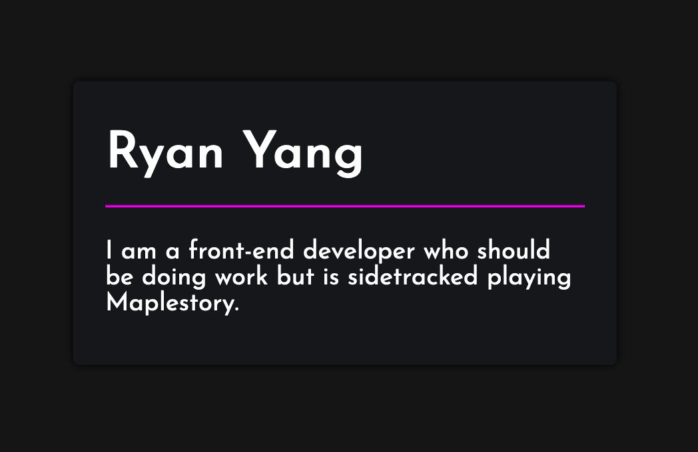
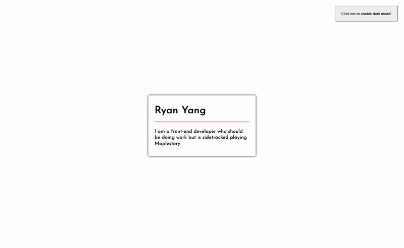
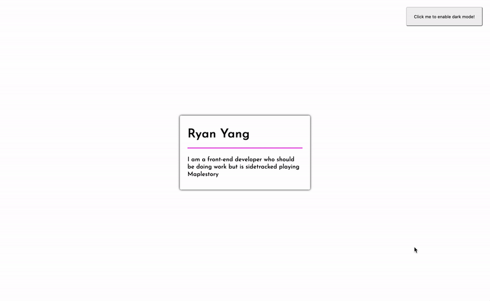

# Making a dark / light mode theme switcher

*Note: This is not a complete guide on dark mode, but rather a quickstart for new developers to get a theme setup up and running in a small codebase. For a more in-depth analysis regarding dark modes, you can check out [this](https://ryanfeigenbaum.com/dark-mode/) amazing article  written by Ryan Feigenbaum.*

## Table of Contents

* [Intro](#intro)
* [Why have a dark mode?](#why-have-a-dark-mode?)
* [Implementing dark mode](#implementing-dark-mode)
    1. [Starting code](#starting-code)
    2. [Dark mode styles](#dark-mode-styles)
* [CSS Variables](#css-variables)
    1. [Applying CSS variables to our code](#applying-css-variables-to-our-code)
    2. [Declaring CSS Variables](#declaring-css-variables)
    3. [Using CSS Variables](#using-css-variables)
* [Working with Javascript](#working-with-javascript)
    1. [Dynamically changing our CSS Variables](#dynamically-changing-our-css-variables)
    2. [Toggling](#toggling)
    3. [Saving and loading themes](#saving-and-loading-themes)
* [Finishing touches](#finishing-touches)
    

#### Intro

For people who have used their phones/computer in the dark, dark mode is one of the most coveted features around. Before we dive into how we can create a dark mode and toggle it, let's first take a look at what dark mode is. Dark mode is a design concept that utilizes light colors (usually white or pastel-like colors) for text and icons contrasted with a dark background, as opposed to the usual dark colored text on a light background (like a book or print newspaper). 


## Why have a dark mode?

Aside from dark mode looking cooler than light mode (personal and subjective preference, of course), dark mode can reduce eyestrain in low-light conditions. Ever surf the web on your phone at night and you visit a page that completely blinds you with white light? 

You can see the end results below to get a feel for what dark mode looks like in case you're unfamiliar but without further ado, let's go ahead and implement it

## Implementing dark mode
#### Starting code
Imagine we have the following website without dark mode (a.k.a. light mode) that we want to add dark mode to:

```file
└── making-a-theme-switcher
    ├── index.html
    ├── styles.css
    └── script.js
```

```html index.html
<!DOCTYPE html>
<html>
  <head>
    <title>Dark Theme Switcher</title>
    <link href="https://fonts.googleapis.com/css2?family=Josefin+Sans&display=swap" rel="stylesheet"> 
    <link rel="stylesheet" type="text/css" href="./style.css" />
    <script src="./script.js"></script>
  </head>
  <body>
    <div class="card">
      <h1>Ryan Yang</h1>
      <hr />
      <p>
        I am a front-end developer who should be doing 
        work but is sidetracked playing Maplestory
      </p>
    </div>
  </body>
</html>
```

And we style it like this (light mode):

```css style.css
* {
    margin: 0;
}

body {
    display: grid;
    height: 100vh;
    width: 100vw;
    font-family: 'Josefin Sans', sans-serif;

    /* here are the styles below we want to 'toggle' later */
    background-color: white;
    color: black;
}

hr {
    margin: 15px 0px 20px;
    color: #f0f;
}

.card {
    place-self: center;
    max-width: 300px;
    padding: 30px 20px;
    border-radius: 4px;
    box-shadow: 0 0 5px black;

    /* here are the styles below we want to 'toggle' later */
    background-color: white;
}
```

```javascript script.js
// our javascript is empty.... for now!
```
When we test this code in the browser, we get something that looks like this:


#### Dark mode styles

In this simple example, to convert our design into dark mode, we only need to swap a couple CSS styles. More specifically, we will be toggling the `background-color` and `color` properties only. Below are the values we will be swapping to but keep in mind that we can toggle ANY css property we want and are not just limited to color styles. (The `/* ... */` is a CSS comment which denotes that the content is left unchanged and not listed again to keep things short)

```css style.css
/* ... */
body {
    /* ... */
    background-color: #151515;
    color: white;
}
/* ... */
.card {
    /* ... */
    background-color: #15171A;
}
```
Swapping these styles will result in something that looks like this:




## CSS Variables

There are a couple ways to implement a dark mode but the way I'll be showing you is with CSS variables. So, how does it work?

[CSS variables](https://developer.mozilla.org/en-US/docs/Web/CSS/Using_CSS_custom_properties) are essentially placeholders for values and you can update them with Javascript. They operate like variables in Javascript or any other programming language and when they get changed, the webpage will immediately respond and apply the new CSS styles, rerendering the webpage.

#### Applying CSS variables to our code

Since there are 3 things we want to toggle, we will only use 3 variables.


| Elements that will change styles | Light Mode (color/hex code) | Dark Mode (color/hex code) |
|----------------------------------|-----------------------------|----------------------------|
| Background color of page         | white / #FFFFFF             | *dark grey / #151515       |
| Background color of card item    | white / #FFFFFF             | *dark blue-grey / #15171A  |
| Color of text                    | black / #000000             | white / #FFFFFF            |

\* - description of color, not actual CSS value


#### Declaring CSS Variables

First, we need to initialize the variables and give them a default value. We can define global variables in something called the root, which is a top-level CSS selector, denoted below:

```css style.css
:root {
    --background: white;
    --card-background: white;
    --text-color: black;
}
/* ... */
```

Ok. What the *heck* did we just do? Well, the general CSS syntax is still the same where we have our selector and a bunch of `[property]: [value];`'s for the selector. Our selector is `:root`, which is a level above `html` and so that allows us to use these variables from anywhere in our CSS code. (If you're comfortable with programming concepts, you can think of these as global variables.)

What might not be familiar, however, are the properties for the selector. The `--` in front of the property lets our CSS know that we are declaring values for a CSS variable, not a CSS style. Everything after the `--` and before the `:` is our variable name. CSS variables are case sensitive and we use, by convention, a single dash, `-`, if our variable name has multiple words. 

#### Using CSS Variables

Now that we initialized the CSS variables in our `:root`, we can use them where we need. Our CSS page will eventually look something like this:

```css style.css
:root {
    --background: white;
    --card-background: white;
    --text-color: black;
}
/* ... */
body {
    /* ... */
    background-color: var(--background);
    color: var(--text-color);
}
/* ... */
.card {
    /* ... */
    background-color: var(--card-background);
}
```

Notice, we simply replaced the value of the CSS style with the variable name. We use `var()` to let CSS know that the value we are applying is going to be a CSS variable, rather than an actual, hardcoded value.

## Working with Javascript

#### Dynamically changing our CSS Variables

Let's recap what we've done so far. Instead of having hardcoded values in our CSS styles, we've now attached CSS variables to our styles and defined the *default* values in our `:root` selector. However, none of this gives us dark mode, nor does it allow us to toggle our styles yet. 

The next question is, how do we now utilize our CSS variables and change them on the fly? Take a look:

```javascript script.js
function changeToDarkMode(){
    document.documentElement.style.setProperty('--background', "#151515");
    document.documentElement.style.setProperty('--card-background', "#15171A");
    document.documentElement.style.setProperty('--text-color', "white");
}
```

The code above simply creates a function named `changeToDarkMode` and will target the `:root` styles (with `document.documentElement.style`) and individually set every variable to a new value. In this case, it will set the CSS variables we defined earlier that represent background colors to something darker and the text color to white.

We can, say, attach this function to a button in our HTML and when we click it, it will toggle our website into dark mode.

```html index.html
<!DOCTYPE html>
<html>
  <head>
    <title>Dark Theme Switcher</title>
    <link href="https://fonts.googleapis.com/css2?family=Josefin+Sans&display=swap" rel="stylesheet"> 
    <link rel="stylesheet" type="text/css" href="./style.css" />
    <script src="./script.js"></script>
  </head>
  <body>
    <button onclick="changeToDarkMode();">Click me to enable dark mode!</button>
    <div class="card">
      <h1>Ryan Yang</h1>
      <hr />
      <p>
        I am a front-end developer who should be doing 
        work but is sidetracked playing Maplestory
      </p>
    </div>
  </body>
</html>
```
```css style.css
:root {
    --background: white;
    --card-background: white;
    --text-color: black;
}
* {
    margin: 0;
}
body {
    display: grid;
    height: 100vh;
    width: 100vw;
    font-family: 'Josefin Sans', sans-serif;
    background-color: var(--background);
    color: var(--text-color);
}
button{
    position: absolute;
    top: 20px;
    right: 20px;
    height: 50px;
    width: 200px;
    border-radius: 4px;
}
hr {
    margin: 15px 0px 20px;
    color: #f0f;
}
.card {
    place-self: center;
    max-width: 300px;
    padding: 30px 20px;
    border-radius: 4px;
    box-shadow: 0 0 5px black;
    background-color: var(--card-background);
}
```
```javascript script.js
function changeToDarkMode(){
    document.documentElement.style.setProperty('--background', "#151515");
    document.documentElement.style.setProperty('--card-background', "#15171A");
    document.documentElement.style.setProperty('--text-color', "white");
}
```

This results in a webpage with a button that can toggle our page into dark mode like so:



#### Toggling

Great! So we can turn our website into dark mode with the press of a button... but how do we turn back if we like it better in light mode? This is going to take some engineering on our part.

First, we're going to need *another* variable - only this time it'll be in javascript - that can keep track of what mode we are in so we know what mode we'll be toggling into.

```javascript script.js
let darkTheme = false;

function toggleTheme(){
    // check if we are currently in dark theme
    if(darkTheme){
        // if we are in dark theme, we should switch to 'light' styles
        document.documentElement.style.setProperty('--background', "white");
        document.documentElement.style.setProperty('--card-background', "white");
        document.documentElement.style.setProperty('--text-color', "black");
    }else{
        // ...otherwise switch to dark styles
        document.documentElement.style.setProperty('--background', "#151515");
        document.documentElement.style.setProperty('--card-background', "#15171A");
        document.documentElement.style.setProperty('--text-color', "white");
    }
    // finally, don't forget to change our darkTheme variable to reflect the new 
    // styles we just added
    darkTheme = !darkTheme;
}
```

#### Saving and loading themes

When our user toggles a theme and leaves the website, we should keep track of their preference so that the next time they visit the site, they won't have to toggle again. Here, we can use the built in [LocalStorage]('https://developer.mozilla.org/en-US/docs/Web/API/Window/localStorage') object to help us save data in the browser in between sessions (persistent storage).

```javascript script.js
// the ?? operator is called the nullish-coalescing operator which allows us to 
// set a default value in case a localstorage value is not found
let darkTheme = JSON.parse(localStorage.getItem('theme')) ?? false;
// we also use JSON.parse(...) because localStorage always saves values as a string
// but we need to parse the string for the actual boolean variable 

function toggleThemeAndSave(){
    if(darkTheme){
        document.documentElement.style.setProperty('--background', "white");
        document.documentElement.style.setProperty('--card-background', "white");
        document.documentElement.style.setProperty('--text-color', "black");
    }else{
        document.documentElement.style.setProperty('--background', "#151515");
        document.documentElement.style.setProperty('--card-background', "#15171A");
        document.documentElement.style.setProperty('--text-color', "white");
    }
    // finally, don't forget to change our darkTheme variable to reflect the new 
    // styles we just added and save it to our localstorage
    darkTheme = !darkTheme;
    localStorage.setItem('theme', darkTheme);
}
```

## Finishing touches

Personally, I find the sudden swap of CSS styles too abrupt of a change for my eyes. I would much rather prefer a slow, animated transition and thankfully, CSS has a powerful animation style called [CSS Transitions]('https://developer.mozilla.org/en-US/docs/Web/CSS/CSS_Transitions/Using_CSS_transitions'). What `transition` allows us to do is specify whether or not the browser should compute animations for us when certain styles are changed. We set the animation style, duration, delay, and even speed and the browser will automatically render it whenever it that style gets changed. It's a lil' confusing so let's take a look at how it works in action:

```css style.css
:root {
    --background: white;
    --card-background: white;
    --text-color: black;
}
* {
    margin: 0;
}
body {
    display: grid;
    height: 100vh;
    width: 100vw;
    font-family: 'Josefin Sans', sans-serif;
    background-color: var(--background);
    color: var(--text-color);

    /* When background-color or color changes, transition a 
    500 millisecond animation between the 2 values */
    transition: background-color 500ms, color 500ms;
}
button{
    position: absolute;
    top: 20px;
    right: 20px;
    height: 50px;
    width: 200px;
    border-radius: 4px;
}
hr {
    margin: 15px 0px 20px;
    color: #f0f;
}
.card {
    place-self: center;
    max-width: 300px;
    padding: 30px 20px;
    border-radius: 4px;
    box-shadow: 0 0 5px black;
    background-color: var(--card-background);

    /* When background-color changes, transition a 500 
    millisecond animation between the 2 values */
    transition: background-color 500ms;
}
```

Which results in this:



