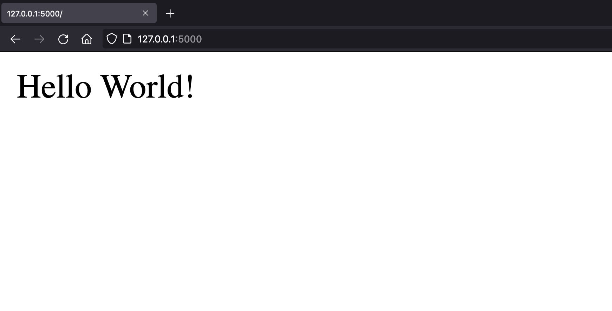

# Making a URL shortener in Python

## Table of Contents

* [Intro](#intro)
* [Background info](#background-info)
    1. [About this app](#about-this-app)
    2. [Picking our tools](#picking-our-tools)
* [Installation and Setup](#installation-and-setup)
* [Ready to start coding](#ready-to-start-coding)

## Intro
This tutorial assumes basic knowledge of Python3 (variables, functions, if-statements, dictionaries, import other files).

The main point of this article is to teach the basics of writing a backend server and how to test with it. It just happens so that a URL shortener service has very little frontend work (allowing us to focus on the backend), explores many different topics in backend development (like http codes, etc.), and allows us to add extra features (that you can try to implement on your own later).

You may have heard of services like [bit.ly](https://bit.ly) called URL shorteners whose job is to take a (usually) long link, and generate a shorter alias for it. 

## Background info
If you want to dive straight into code, you can go straight to [Installation and Setup](#installation-and-setup). Otherwise, I'll talk a little about the tools we're going to use.

#### About this app
Before we start writing code, we should know exactly what we're trying to make here. Okay, so we want to make a URL shortener. The basic idea is this: a user will go on our site and give us a link that they want shortened. We will then generate a short, random, unique link to them. Then, whenever someone goes on our shortened link, we will redirect them to the longer link. Simple as that!

#### Picking our tools
Now that we know the main goal of our app, we need to pick the best tools that will help us achieve that goal. To be able to redirect people, we're going to need to set up a a web server. A `web server` is, in essence, a computer that sits on the internet - constantly listening for requests, and then then executes the request. In this case, we need a `web server` that will sit on the internet and listen for users who access our short link, and then redirect them to the longer link. There are two main tools for setting up web servers in Python: [Flask](https://flask.palletsprojects.com/en/2.0.x/) and [Django](https://www.djangoproject.com/). 

*We will be using Flask due to its simplicity but you may want to look at a more in-depth breakdown between the two tools when you're doing professional development.*

If you think a little bigger, you're going to realize that you're going to have to store all of these short links and their corresponding longer links in a `database` of some sort when you have thousands of links - but we want to keep things simple for now (as an introduction to backend development) so we're going to assume that we have a small userbase and store all of our link mappings as a python dictionary variable in our program.

## Installation and Setup
We need to first install Python3 and  Flask, and setup our boilerplate code. Go ahead and hop [here](https://learn.ryqn.dev/starting-out-with-flask#write-a-flask-program-in-5-lines-of-code) first and follow these instructions until the `Where do we go from here?` section.

## Ready to start coding
After following the steps from the link above, you should end up with this basic structure:
```file
└── url-shortener
            └── app.py
```

```python app.py
from flask import Flask

app = Flask(__name__)

@app.route('/')
def index():
	return "Hello World!"

```

and when you run the command `flask run` in the terminal, you get this:
```shell terminal
~$ flask run

* Environment: production
WARNING: This is a development server. Do not use it in a production deployment.
Use a production WSGI server instead.
* Debug mode: off
* Running on http://127.0.0.1:5000/ (Press CTRL+C to quit)
```

and when you open up [http://127.0.0.1:5000/](http://127.0.0.1:5000/) in the browser (any browser of your choice), you should see something like this:
