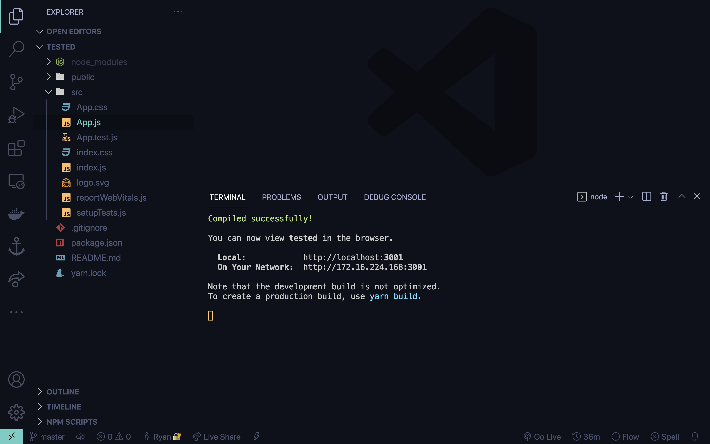
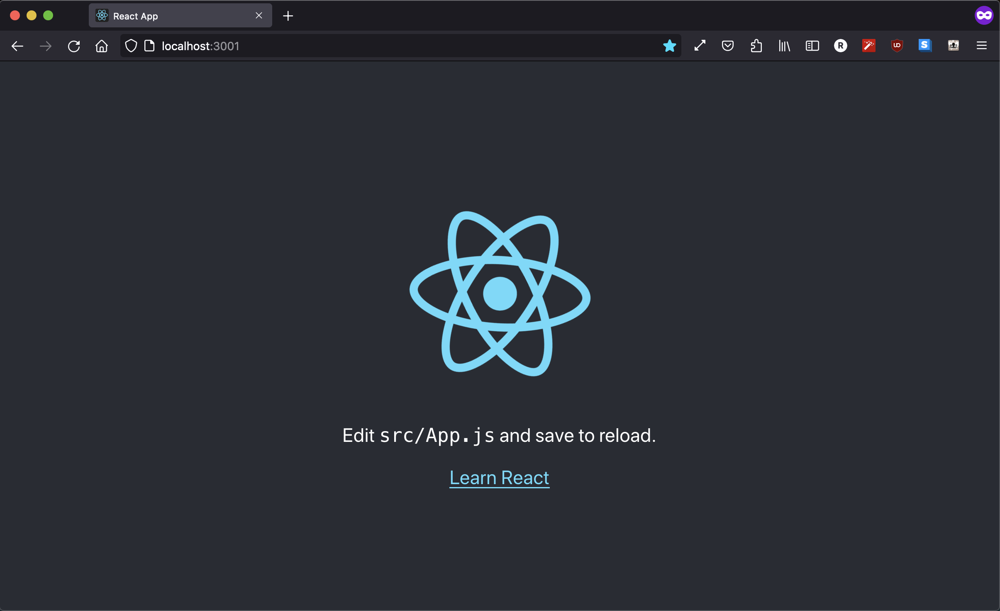

# Setting up React

## Table of Contents

* [Very short intro about React](#very-short-intro-about-react)
* [Installation and Setup](#installation-and-setup)
    1. [Text Editor / IDE](#text-editor-/-ide)
    2. [Browser](#browser)
    3. [Node, NPM, and React](#node,-npm,-and-react)
    4. [Test Setup](#test-setup)
* [About CRA](#about-cra)
* [Finishing up](#finishing-up)
    
## Very short intro about React

React (React.js) is a Javascript library that makes building web interfaces easier for developers. It is one of the most popular web frameworks and is developed by Facebook. 

If you're using the new (sorta) Facebook / meta??? redesign, that's mostly all written in React. 

Web dev was traditionally all done in plain `HTML/CSS/JS` but as computers got faster, websites could do more things, and that means needing a better way to code dynamic webapps.


## Installation and Setup

We're gonna need 3 things: a place to write code (IDE), a place to run code (Browser), and the React library itself (plus the development environment that comes with it).

### Text Editor / IDE
Just like regular vanilla web development, we're going to need a text editor of some sort. My IDE of choice is [VSCode](https://code.visualstudio.com/), as is for many web developers. I highly, highly, highly recommend VSCode.

### Browser
As mentioned earlier, you will need a browser (likely something you already have) but preferably [Chrome](https://www.google.com/chrome/) or [Firefox](https://www.mozilla.org/en-US/firefox/new/). Sorry Safari and Internet Explorer lovers. Since we're pretty much developing websites for the browser, we'll need a browser to see what we made. Chrome and Firefox not only have the best debugging experience (personal preference) but also have the most support (fax, no printer). Different browsers have different interpreters and have different support. You can see if a certain feature is supported on a certain browser through [caniuse.com](https://caniuse.com).

Here's an example for writing CSS colors in hex color notation:

You can see that in Safari, it's only supported starting version 10 - which was released in Sept. 26, 2016. This is an example of a pretty well-supported feature but not all features have good compatability. For the purposes of a hackathon or learning web development, testing for browser compatability isn't important but being aware of it is.

### Node, NPM, and React

Lastly, you're going to need React but more specifically, the developer environment that can install it easily (as well as other packages you will need). We will need to [install Node and the package manager](https://docs.npmjs.com/downloading-and-installing-node-js-and-npm) it comes with - NPM (which funnily enough, does not actually stand for Node Package Manager)

Ensure that the versions you have installed are correct: [Node >= 14.0.0 and npm >= 5.6]

You can type these commands in a standalone terminal or in the [integrated terminal built into VSCode](https://code.visualstudio.com/docs/editor/integrated-terminal) to see if you've installed them correctly.

```bash terminal
$ node -v
v16.13.0

$ npm -v
8.1.0
```

### Test Setup
*this part is just to test if everything all works and not part of the setup*

If you have all of these, then you can go ahead and install the boilerplate code which will set up everything for you to immediately dive into React code.

Create a new folder somewhere on your system (folder should be completely empty). This is where all of our files will go. If you haven't done so already, open this folder up in the terminal and type the command `npx create-react-app .` - An example of this process will look something like this: (If you are on windows and want to follow these Unix commands, you can [switch your terminal to Bash](https://stackoverflow.com/questions/42606837/how-do-i-use-bash-on-windows-from-the-visual-studio-code-integrated-terminal))

```bash terminal
$ ls
Applications	Documents	Movies
Downloads	    Desktop		Library	

$ cd Desktop

$ mkdir react-test

$ cd Desktop

$ npx create-react-app .
Creating a new React app in /Users/Ryan/Desktop/react-test.

Installing packages. This might take a couple of minutes.
Installing react, react-dom, and react-scripts with cra-template...

...
```
Here, I `cd` (Change Directory) into my Desktop directory and create a folder called react-test. Then I `cd` into that folder I just created and run the command `npx create-react-app .`. 
> *Note: The `.` at the end of `npx create-react-app .` just means "in this folder" but you can type a folder name instead and it will create a folder for you.*

The files will take some time depending on your internet speeds, computer hardware, etc. but also whether or not this is your first time installing. 

If everything has finished correctly, you should have 

 • node_modules folder\
 • public folder\
 • src folder\
 • package.json file\
 • ...other files but if you have the above you're probably good to go

### Running our boilerplate

If all of this is good, then you can probably run a development server really quick by typing in your terminal
```bash terminal
$ npm start

Compiled successfully!

You can now view [folder name] in the browser.

  Local:            http://localhost:3001
  On Your Network:  http://[your local ip]:3001

Note that the development build is not optimized.
To create a production build, use yarn build.

```

*mine is running on port :3001 because I have something on :3000 at the moment*

and it should open up `http://localhost:3000` in your browser. If not, you can just enter `http://localhost:3000` in your browser to access your site.



To stop the development server, you can just type [Ctrl + C] in the terminal to close it.

### About CRA

The terminal command we typed to generate the entire boilerplate code: `npx create-react-app [folder name/location]` does a little more than just download React for us. You'll often see this abbreviated in articles as [CRA](https://create-react-app.dev/) and it sets up a *production* level environment for us and is the easiest way to get coding in React. Here's an incomplete and simplified list of things it does:

 • Initialize npm - makes that node_modules folder and package.json that allows you install libraries with a simple command (something I'll demo later)

 • Setup basic scripts - commands like `npm start` and `npm build` that setup an entire testing platform with hot reloading and compiling prod files
 
 • Setup webpack - bundles all your files into one and only imports things you need
 
 • Setup Babel - generates polyfills (code that makes your code backwards compatible and work on all browsers)
 
 • ... bunch of other stuff but the ones above are most important


## Finishing up

Now that we have our entire setup ready, we can finally start getting into learning React! I would first recommend learning a lil' about [vanilla web development in plain HTML/CSS/JS](./intro-to-web-dev) so you that when you start getting into React, you can see the benefits and understand why devs in the industry use React.