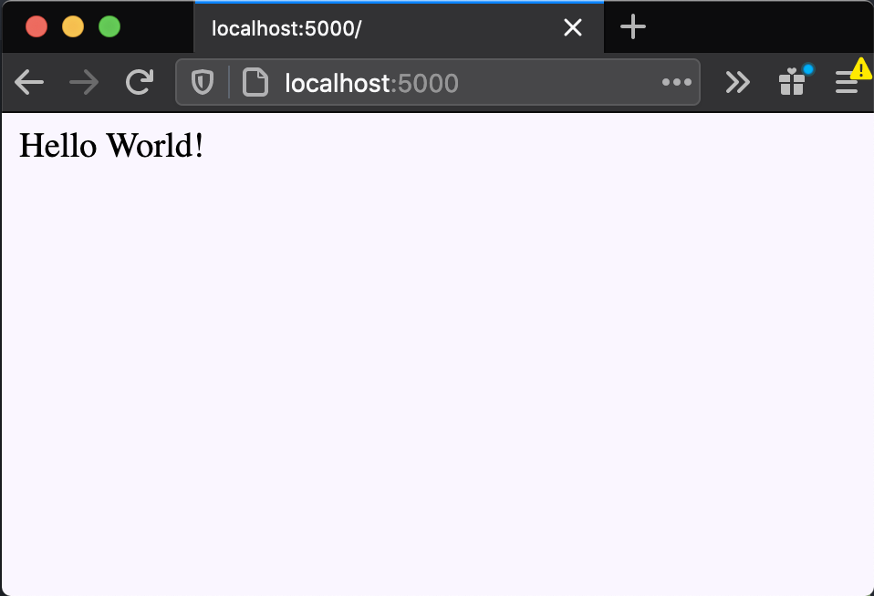

# Starting out with Flask

## Table of Contents

* [Intro](#intro)
* [What is Flask?](#what-is-flask?)
* [When should I use Flask?](#when-should-i-use-flask?)
* [Write a Flask program in 5 lines of code](#write-a-flask-program-in-5-lines-of-code)
    1. [Installation and Setup](#installation-and-setup)
    2. [5 Lines of Code](#5-lines-of-code)
    3. [Running our webserver](#running-our-webserver)
* [Understanding what we just did](#understanding-what-we-just-did)
    1. [Analyzing our source code](#analyzing-our-source-code)
    2. [Analyzing our terminal](#analyzing-our-terminal)
    3. [Testing our web server](#testing-our-web-server)
* [Where do we go from here?](#where-do-we-go-from-here?)
    

## Intro

The internet is essentially a big network of interconnected computers. When we go on a website like `www.google.com`, for example, our computer connects to another computer and asks it for information. More specifically, our personal computer is connecting to a specific type of computer called a `server` owned by Google. This connection, known as an `http request`, will receive an `http response` from the server. In this case, the response will be an HTML file which our browser receives and then says, "Hey! I recognize HTML" and will render it for us to interact with. 

## What is Flask?

Flask is a library that allows you to run a server in Python. Similar to the Google example above, Flask allows us to run a program that sits on the internet waiting for other computers to connect to it - i.e. make requests, which we can then send back a response. However, HTML code is not the only thing a server can send back and requests are not limited to just "getting" information. You can take a look the API calls article to learn more about requests.

## When should I use Flask?

Webservers are extremely versatile and so there are many applications in which you would want to use them.

Here are a couple things you can do with a web server:

• Setup a REST API

• Hosting assets

• Serving websites

and here are a couple examples applications you could make:

• Any dynamic website (especially one that connects to a database and requires user login)*

• URL shortener service

• Server that calls API's while keeping API keys secret


\* - depending on the use case, you could opt for a BaaS (Backend as a Service) like Firebase that can allow you to bypass the need for any backend server.

## Write a Flask program in 5 lines of code

There is only one prerequisite for this tutorial which is having Python 3 installed on your computer. Luckily, for the majority of the intended audience, Python 3 will already have been installed. Otherwise, you can check out [these instructions](https://realpython.com/installing-python/).
#### Installation and Setup

Let's first create an empty folder (anywhere you would like) for us to do all of our development in. 

Then, we need to install the Flask library itself to be able to use it. If you're on Mac/Unix, you can download it using pip in the terminal like so:

*Note: Make sure you download the library in the empty folder we just created. If you are familiar with using a virtual environment like `venv`, you can set that up first.*

```shell terminal
pip3 install flask
```

#### 5 Lines of Code

Now that we have Flask installed, let's go ahead and open up a brand new python file for us to write our code in and call it `app.py`. Go ahead and copy the following 5 lines into the file and I'll explain what they mean in a bit.

```python app.py
from flask import Flask

app = Flask(__name__)

@app.route('/')
def index():
	return "Hello World!"
```

#### Running our webserver

With the base source code, we can finally run our program and so first, we'll let flask know that the starting point of our app is in our `app.py` file. To do this on mac, we type this command in the terminal:

```shell terminal
export FLASK_APP=app.py
```

and finally, to start the program:

```shell terminal
flask run
```
which will execute our code and display the following in the terminal:
```shell terminal
* Environment: production
WARNING: This is a development server. Do not use it in a production deployment.
Use a production WSGI server instead.
* Debug mode: off
* Running on http://127.0.0.1:5000/ (Press CTRL+C to quit)
```

## Understanding what we just did

#### Analyzing our source code

Looking at our source code, let's analyze what each lines does. I've copied the same thing again for convenience.

```python app.py
from flask import Flask

app = Flask(__name__)

@app.route('/')
def index():
	return "Hello World!"
```
Line 1: Importing the flask library for us to use. More specifically, we are importing the Flask class. ( make sure thing we are importing is Flask with a capital F )

Line 3: Using the Flask class, we create an instance of that class and pass into the constructor the import name of the place the app is defined with `__name__`. It's a little complex if you're not familiar with objects and classes but thankfully we don't need to know much about them. All we need to know is that when we want to interact with our web server, we will be doing so through the `app` variable/object/instance (all are valid words to describe it) we initialize here.

Line 5: In the next couple lines, we will be doing what's called creating an `endpoint`. In plain english, this means that when someone accesses our webserver at the default endpoint (`'/'`), we will execute the following function and return the result as a response. In Python, the `@` symbol denotes that this is a [function decorator](https://www.python.org/dev/peps/pep-0318/). You can read more about function decorators but how they function and the intricacies behind them are not important for this tutorial.

Line 6: Basic function definition. The function name is not important and can be anything. 

Line 7: Our function doesn't actually do anything here and will return a string with the value "Hello World!" but keep in mind that this is a regular Python function and we can do anything we want inside this function whether it be making a complex calculation or calling other functions.

#### Analyzing our terminal

After we run the command `~$ flask run` in the terminal, we get the following:

```shell terminal
* Environment: production
WARNING: This is a development server. Do not use it in a production deployment.
Use a production WSGI server instead.
* Debug mode: off
* Running on http://127.0.0.1:5000/ (Press CTRL+C to quit)
```

The only important part about this is the very last line that says: 
`* Running on http://127.0.0.1:5000/`

This means that our webserver is now running and *listening* for requests at that endpoint. 

#### Testing our web server

To test if our web server is running, we can go ahead and send a request to it to see if we get the correct response. We can do that by opening up our most favorite browser (could be chrome, firefox, safari, etc.) and navigating to the endpoint flask has given us at [http://127.0.0.1:5000/](http://127.0.0.1:5000/) which is the same thing as [http://localhost:5000](http://localhost:5000). The way we would say this in english is "localhost port 5000".

What you should see in your browser is something that looks like this:



What happened here was our browser made what's called a `GET` request (a specific type of request) to our webserver at the default endpoint `('/')` - notice we went on [localhost:5000/](http://localhost:5000/) and not something like [localhost:5000/users](http://localhost:5000/users) or [localhost:5000/user/ryanyang](http://localhost:5000/user/ryanyang) - and our server executed the `index` function defined in our `app.py` which returns a string "Hello World!" as a response. Our browser then receives the response and displays it.

## Where do we go from here?

I said earlier that web servers are extremely versatile and rather than talk more about their uses, I wanted to first go through a code demo so you can see firsthand what is possible here. This specific example returns a string to the caller - which happens to be our browser in this case but both the client and the response type can be swapped. Rather than return a string, the web server can return an HTML file which the browser then renders into a webpage with functioning CSS and JS. Or, the web server can return some data in JSON format in which a website can then parse and display. Or a client can attach an image to their request to the server which the server will then analyze using machine learning and return data about what it sees.