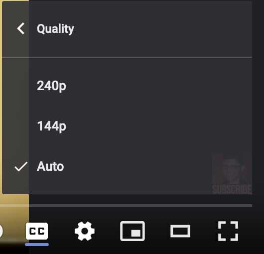
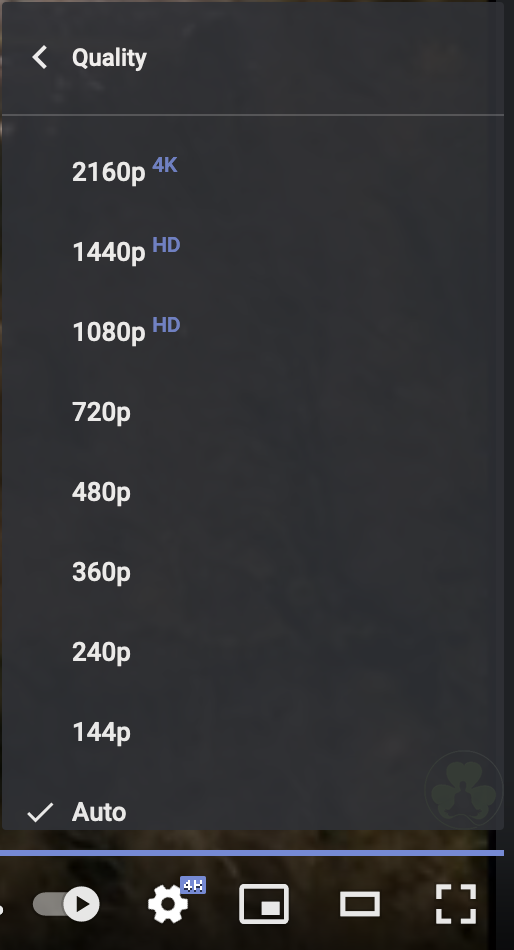
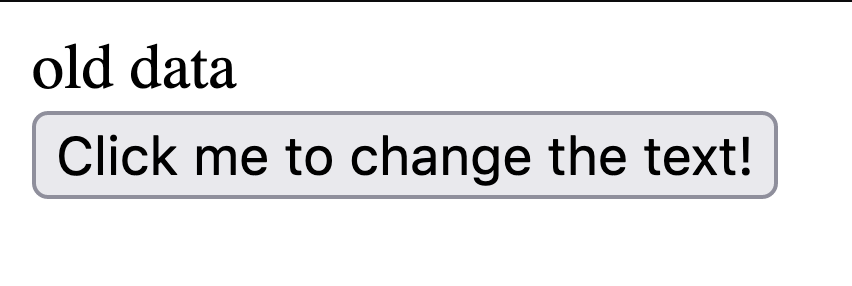
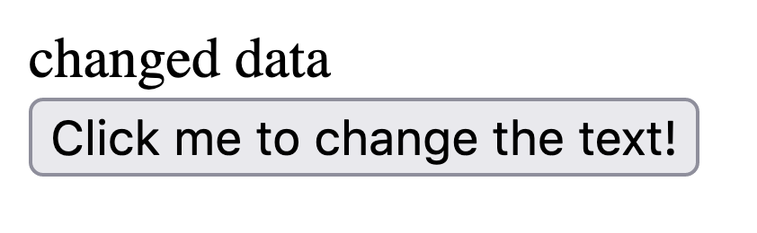

# Starting out with React

## Table of Contents

* [Intro](#intro)
* [What is React?](#what-is-react?)
* [React as an analogy](#react-as-an-analogy)
* [How React is different](#how-react-is-different)
* [More advanced use case](#more-advanced-use-case)
* [When should I use React?](#when-should-i-use-react?)
* [Write a basic React program](#write-a-basic-react-program)
    1. [Installation and Setup](#installation-and-setup)
    2. [Understanding the code](#understanding-the-code)
* [React Examples](#react-examples)
* [Recap](#recap)
    

## Intro

The web has been around for over three decades now and even today, it's still evolving. As computers get faster and the limits of technology get pushed, we, as software developers, should take full advantage of new realm of possibilities.

Consider, just 10 years ago, youtube videos uploaded at 480p were considered "high-quality" and now, even 1080p at 60fps isn't enough for some users.
| before | after |
| --- | --- |
|  |  |
| resolutions offered from an old CLASSIC "Chocolate Rain" by Tay Zonday (Youtube: April 2007) | Second image: resolutions offered from an random video I found about nature (Youtube: November 2021) |

Why are all of these resolutions supported now and not back then? A couple reasons:

• Internet infrastructure limitations\
&nbsp;&nbsp;&nbsp;
• Internet hardware was not good enough to support such high quality video streaming

• Personal computer limitations\
&nbsp;&nbsp;&nbsp;
• PC's were not powerful enough to reliably play these videos even if they had the data on hand

• Monitor limitations\
&nbsp;&nbsp;&nbsp;
• Affordable monitors couldn't even display resolutions that high even if they had all of above

Why is any of this important? Well, it's imperative to understand just how much websites have changed, and with that, how much the way we *write* websites has changed as well. Although you can still write websites in plain HTML/CSS/Javscript, your code will be verbose and you'll find yourself writing the same code over and over again for basic things any website should do.

## What is React?

The official definition: `React is a Javascript library for building UI's (User Interfaces) or components.` That's great! But, what does it mean? Here's *my* description: `React makes writing webapps easier. by alot.`

## React as an analogy

The top AI/ML researchers today are all using Python to write their complex and computationally expensive neural nets and whatnot yet Python has a reputation for being 'slow'. And that's true. Certain operations in Python are much slower than if it were to be implemented in C++ (except for the Python libraries written in C, of course) so why not write all AI/ML in C++ to get the maximum efficiency? Here's another question, **should an AI/ML researcher have to concern themselves with how memory management? no**. They have better shit to do - like writing smart stuff (I have no clue, I'm not that smart). So C++ developers can write fast mathematical operations in C++ and allow Python to call these functions and you get stuff like numpy. 

That's *sorta* like React. It's not exactly a perfect analogy because in most cases, React is likely more efficient than the traditional HTML/CSS/JS version (assuming humans write normal error-prone code). React makes developing dynamic web applications simpler by extracting away the stuff that you shouldn't need to worry about. 

Similar to how **Python allows AI/ML researchers to focus on the actual AI/ML** part of their job as opposed to worrying about writing memory-efficient code, **React allows front-end developers to focus on creating beautiful, interactive websites** without having to worry about *how* to implement things (like *how* to change text on a screen).

## How React is different

Here are some quick snippets that show you *how* React makes things simpler for you. Note: These snippets will not run by themselves, they're just here to illustrate differences in doing the same thing.

Program that displays the text [old data] and button below it that, when click on, changes the text to [changed data].

It looks like this:
 

and after clicking the button:
 

```html Plain HTML/CSS/Javscript 
<div id="display">old data</div>
<button onclick="
    let HTMLElement = document.getElementById('display');
    HTMLElement.innerHTML = 'changed data';
">
    Click me to change the text!
</button>
```

```javascript React
const [textContent, setTextContent] = useState('old data');
return (
    <>
        <div>{textContent}</div>
        <button onclick={() => setTextContent('changed data')}>
            Click me to change the text!
        </button>
    </>
);
```

What's the difference aside from the syntax? 

When you do vanilla web development, you're usually doing something called **imperative programming**. That is, you are giving explicit instructions regarding how to do something. In this example above, we are giving explicit instructions when the button gets clicked: 

On line 3: Find the HTML element with the `id="display"` \
On line 4: Set the HTML inside of that tag to `changed data`

However, in React, we practice **declarative** and **reactive programming**. In the example, we have a variable (this is a special variable called `State` in React) and we directly embed that variable into the HTML-looking syntax (called `JSX` in React). Now, when we click the button, we change the variable only, and React will ***react*** to this and update the places in the HTML where that variable was used.

This is called reactive and declarative programming because we simply say what value should change and let React take care of displaying this change to end-users; this concept is what makes React such a powerful tool for web developers. We no longer need to worry about *how* to make it work, it just works.

## More advanced use case
**tl;dr for this section** it's very difficult to keep our data in memory in sync with the same data we display in the browser if we do it manually (i.e. without a library like React).

That example was to show how it worked, but let's see how this helps us in *actual* production code. I want you to imagine how an app like Twitter or Facebook can benefit from this.

Imagine we were writing something that resembled Facebook's news feed. When we fetch data from our database, they'll give us an array of post data like this:

```javascript
[
    { author: "ryan", likes: 3, content: "hello everyone" },
    { author: "susan", likes: 5, content: "im billy bob" },
    { author: "skyler", likes: 0, content: "i have no friends" },
]
```

How do we display this? Well, that's simple - we just loop through the array and generate some HTML for each of these and insert the data. 

*fyi this next section is supposed to cause confusion*

Ok cool! but what if one of these posts has a new update? Let's say the second post gets another like. Do we loop through everything again and regenerate the HTML? No, there could be hundreds of posts and rerendering everything will be expensive. So we have to create a mapping where you map every item in this array to an HTML element and when one of the posts has a data update, you update the corresponding HTML element, rather than the whole list. Ok but what if you add a comment? Then you need a 2-way mapping where once someone types a comment on a specific post on the website, it needs to map back to that piece of data, which then refreshes, and then goes back.... 

I'm completely lost now. and that's the point. 

In React, all I would have to do is put that array of posts in a state variable and then update that variable only. 

This is why declarative libraries like React are so powerful; we don't need to manage all of these different connections like which buttons and inputs will change which displays. Rather than managing the interface itself, we manage the data behind it. The idea is simple, `if there's a change in the data, React will "react" to it. That's why it's called React.`

I like to think of front-end web development like this: As front-end developers, our job is to transform raw data into beautiful visual components. 
## When should I use React?

Going back to my definition of React, I said it makes writing webapps *easier*. That doesn't mean that without React, it is impossible to write the next Facebook. However, everything I've said so far is really just an argument for using a web framework/library and I would say that for pretty much any production project you have, you should always opt for a web framework/library of some sort whether that be React, JQuery, Vue, Svelte, Three.js, etc. over plain vanilla HTML/CSS/JS. 

React is, once again, a library for building web interfaces. Before you consider whether or not you want React or one of its competitors, ask yourself if a web interface is the most important part of your product. If you're building a AR/VR product in the browser, or a graphics intensive game, you probably don't need React. To reiterate, pick the right tool for the job. Accidental complexity is killer. 

Once you're sure that you need a web framework to develop user interfaces, it's time to pick which one - as there are many. To name a few:

• React.js\
• Vue.js\
• JQuery\
• Svelte\
• Angular

If you're asking which library/framework to use for - say - a startup with a team, the answer is whatever your team is most proficient in. If 2/3 of your frontend team is comfortable in Vue.js, you should probably stick with that as the differences between these component-based frameworks are not nearly worth the difference in developer experience (DX).

If you're asking which library/framework to learn because you're a student or have no prior experience in web development, then that varies and answers will differ wildly depending on who you ask.

Here's a good compilation of stats that show the trends of web technologies: [State of JS 2020](https://2020.stateofjs.com/en-US/technologies/front-end-frameworks/)

React is, by far, the most popular library. Although popularity !== better, it does mean that there's more StackOverflow questions, more resources online, and more job opportunities. 

Since framework preference is mostly just a matter of personal preference, I would search online for different opinions and maybe even try the frameworks yourself but my opinion is I prefer React. Going into the details of why isn't that important for the purposes of this specific article.


## Write a basic React program

Before we actually write React, you should have an understanding of basic HTML/JS. You can learn the basics [here](./intro-to-web-dev).

### Installation and Setup

You can find instructions on how to install React [here](./setting-up-react).

Then, you can move on and setup your first React project using Create React App [here](./creating-your-first-react-project).

### Understanding the code


The file structure for our project looks mostly like this.

```file
├── node_modules
│	└── ... 
├── README.md
├── package-lock.json
├── package.json
├── public
│	└── index.html
└── src
	├── App.js
	└── index.js

```

node_modules, package.json, package-lock.json are all things related to NPM. When we download libraries and packages, they go inside the node_modules folder and are listed in the package.json.

public folder has an index.html. This index.html is essentially our website but if you look inside it, it's pretty much empty.

```html public/index.html (with comments removed)
<!DOCTYPE html>
<html lang="en">
  <head>
    <meta charset="utf-8" />
    <link rel="icon" href="%PUBLIC_URL%/favicon.ico" />
    <meta name="viewport" content="width=device-width, initial-scale=1" />
    <meta name="theme-color" content="#000000" />
    <meta
      name="description"
      content="Web site created using create-react-app"
    />
    <link rel="apple-touch-icon" href="%PUBLIC_URL%/logo192.png" />
    <link rel="manifest" href="%PUBLIC_URL%/manifest.json" />
    <title>React App</title>
  </head>
  <body>
    <noscript>You need to enable JavaScript to run this app.</noscript>
    <div id="root"></div>
  </body>
</html>

```

The body has nothing inside it except a div with an `id="root"`. and that's part of how React works. React will literally generate all the HTML for the code on the fly and render them inside this div with the "root" id. 

Let's take a look at src/index.js to understand how a React program starts.

```javascript src/index.js (extra stuff removed but still runs)
import React from 'react';
import ReactDOM from 'react-dom';
import App from './App';

ReactDOM.render(
    <App />,
  document.getElementById('root')
);

```

You only use `render` from `react-dom` once so you don't need to memorize this (and it'll be generated for you with CRA anyways) but let's look at what it does. It will render this `<App />` component inside an HTML element with the `id="root"`. Ok I get it. But what the heck is `<App />` and why does it look like HTML?

On line 3, we import App so lets go see where that file leads us. 

```javascript src/App.js
import logo from './logo.svg';
import './App.css';

function App() {
  return (
    <div className="App">
      <header className="App-header">
        
        <p>
          Edit <code>src/App.js</code> and save to reload.
        </p>
        <a
          className="App-link"
          href="https://reactjs.org"
          target="_blank"
          rel="noopener noreferrer"
        >
          Learn React
        </a>
      </header>
    </div>
  );
}

export default App;

```

App is a simple Javascript function. However, unlike normal Javascript, it's returning to us JSX (HTML-like syntax). But think back to index.js, when we called `render(<App />, document.getElementById('root'))`, we're pretty much calling this `App` function -> which returns HTML -> which gets embedded into our HTML element with `id="root"`. 

So React programming is literally just a bunch of functions that return HTML which all end up in the main HTML file inside the `<div id="root"></div>` that we found in `public/index.html`. This type of software architecture/design pattern is called component based architecture. We can have smaller components in their own separate files, making developing easier - but the biggest gain here, is that these components are *reusable*. You can put `<App />` as many times in your code as you want. 

It gets better. These javascript functions that return JSX (we call them components), they operate just like normal functions. Like normal functions, they can take parameters. 

## React Examples

So imagine the Facebook news feed again; we can create a component for a singular post item like so:

```javascript FeedItem.js
function FeedItem(data) {
  return (
	<div className="feed-item--container">
	  <h2>{data.author}</h2>
	  <p>Likes: {data.likes}</p>
	  <p>{data.content}</p>
	</div>
  );
}
export default FeedItem;

```

and in our News Feed, we have this:

```javascript NewsFeed.js
function NewsFeed() {
  const [data, setData] = useState(
	[
	  { author: "ryan", likes: 3, content: "hello everyone"},
	  { author: "susan", likes: 5, content: "im billy bob"},
	  { author: "skyler", likes: 0, content: "i have no friends"},
	]
  );

  return (
    <>
	  <FeedItem data={data[0]} />
	  <FeedItem data={data[1]} />
	  <FeedItem data={data[2]} />
	</>
  );
}
export default NewsFeed;

```

or even better

```javascript NewsFeed.js
function NewsFeed() {
  const [data, setData] = useState(
	[
	  { author: "ryan", likes: 3, content: "hello everyone", id: "3956261942"},
	  { author: "susan", likes: 5, content: "im billy bob", id: "6836295035"},
	  { author: "skyler", likes: 0, content: "i have no friends", id: "195035966"},
	]
  );

  return (
	<>
	  {data.map(postData => <FeedItem key={postData.id} data={postData} />)}
	</>
  );
}
export default NewsFeed;

```

and the idea here is, if we decide to change the data at all, we only have to call setData([...]) with the new updated array of posts and React will figure out not only which post needs to be updated, but also create/remove HTML elements as needed. All you need is to provide a unique key which React will use to create these mappings.

## Recap
What we've covered so far is mostly conceptual but ideally it allows you to understand how React works on a theoretical level. This way, when you read other code tutorials (that will mostly just provide code for you), you can see where those pieces fit in the whole context of a React project.

Hopefully I get around to rewriting this article to become a full article, rather than supplemtal content for a live demo.