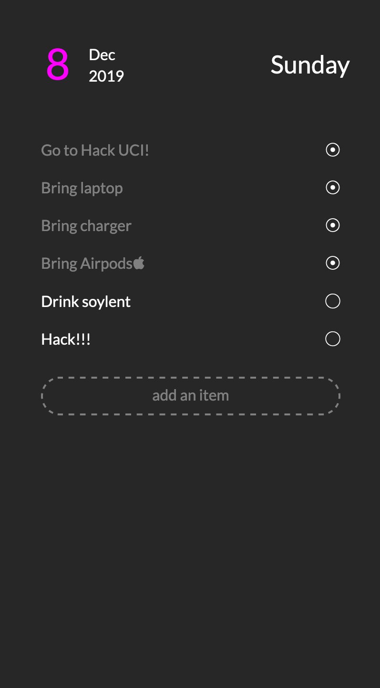
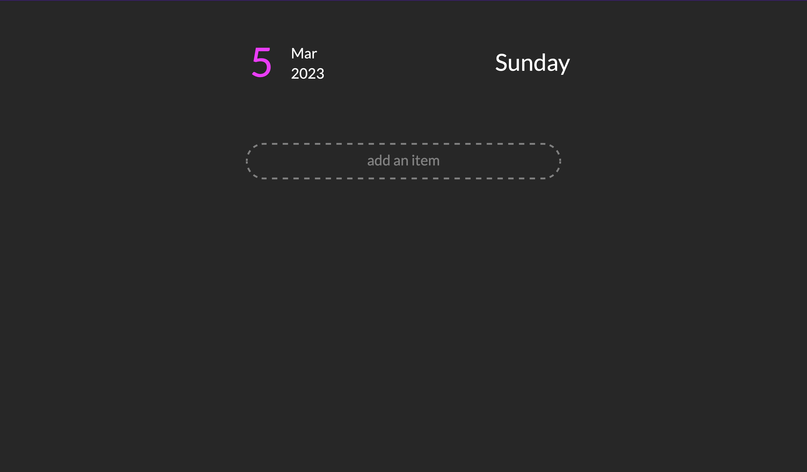
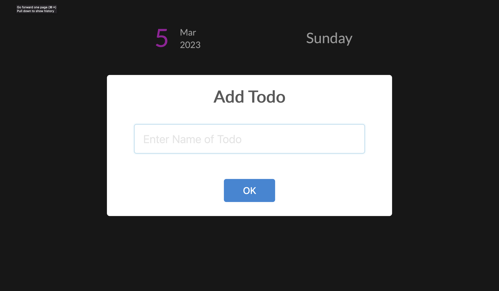
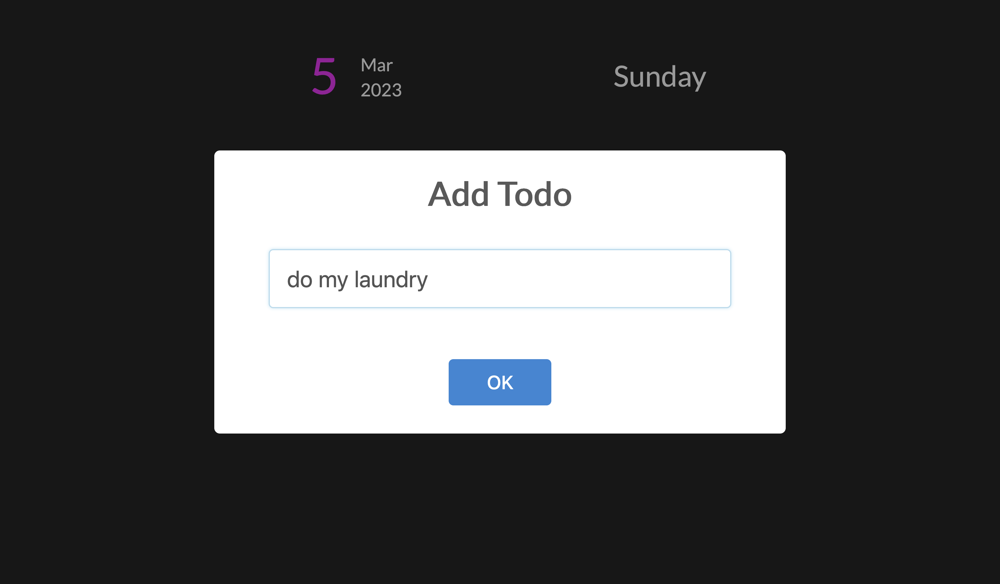
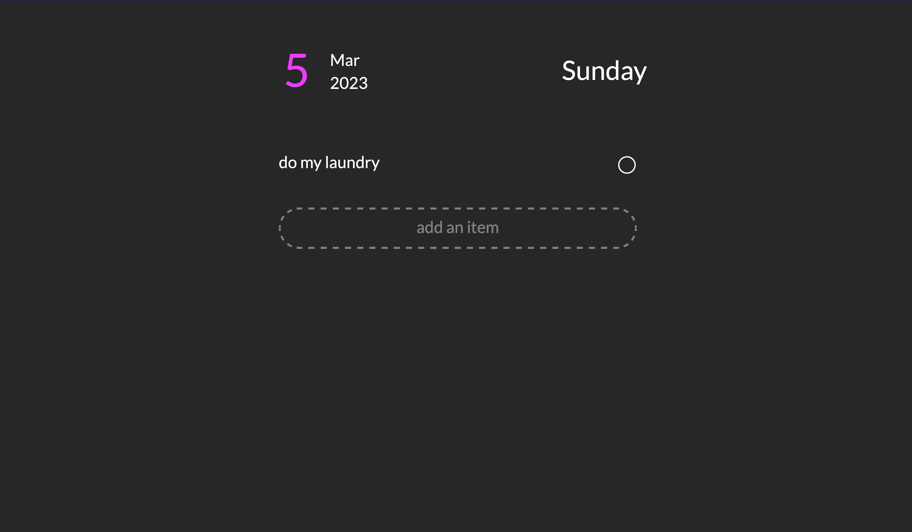
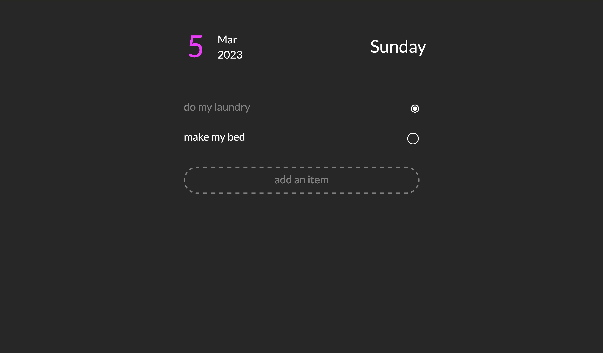
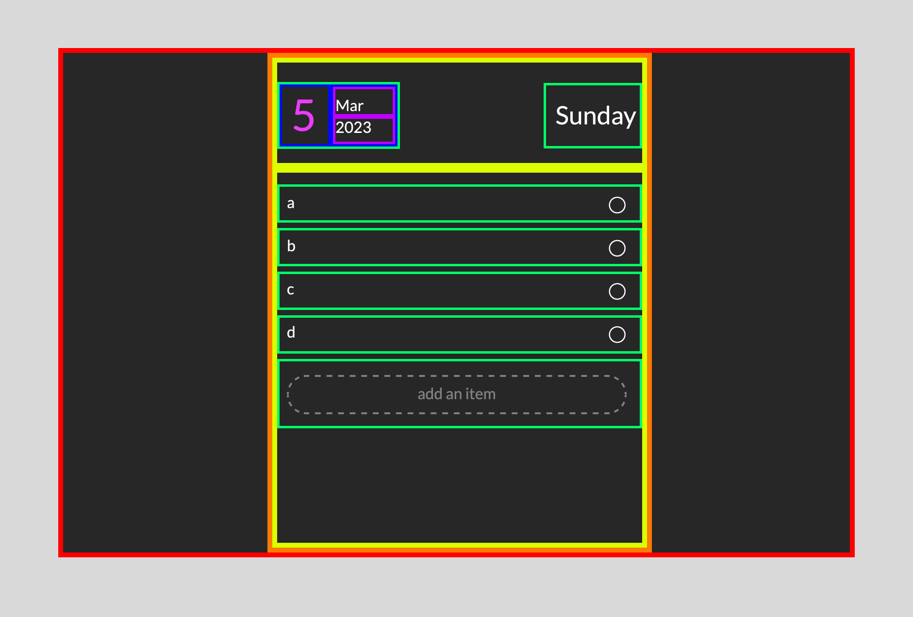
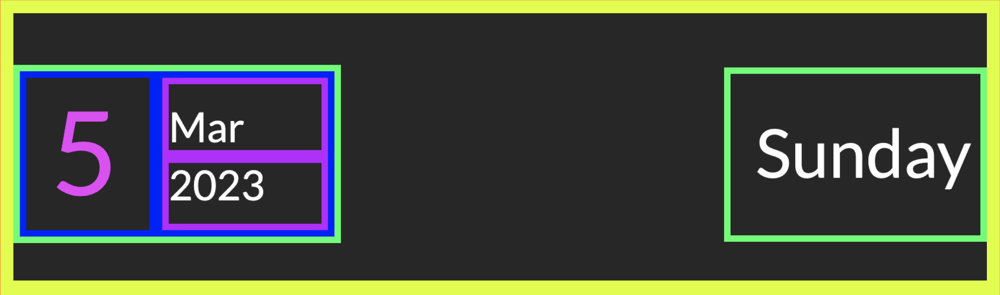
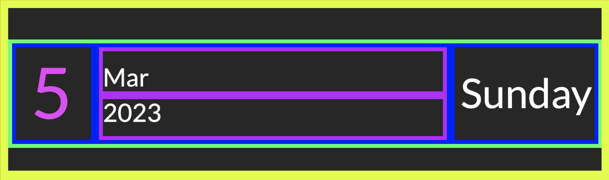

# To-do List

```table-of-contents

* [Idea](#idea)
* [What we'll learn](#what-we'll-learn)
```

## Idea

What we'll be making here is a todo list tracker. The goal of the app is simple: allow a user to keep track of things they need to get done. The basic user flow looks something like this: A user can add as many items as they want and can check them off at any time. We should store the items so that they even if they close the app, the data will persist. For aesthetics (and functionality), let's also show the current date.

What I have in mind will look like this:



*I originally wrote this tutorial as a workshop for HackatUCI 2019 which is why it has those notes*

## What we'll learn
Aside from HTML/CSS/JS, here's a list of native technologies we'll be using as well as the functionalities they will help achieve (and likely what we'll learn if we haven't worked with them before):

* JS Date Object - We will be using Javascript's built-in Date object library to get the current date.
* Local Storage - We will be using local storage to persist the user data even if they close the app.
* UI Library integration - We will be using one basic UI library to help us add pretty popups (optional, but simpler to use than form management).


## Planning out our app
tl;dr: **We need to think about our workflow before we start coding.**

When we start working on a project, we usually don't want to dive straight into the code. We want to first design our application. We want to think about this: **What is the goal of our app? What problems are we trying to solve?** Once we have a definitive answer for that, then we can design our application in service of that and I don't just mean design in the UI/UX sense but also in an engineering sense. When we realize which functionalities we want to include, it'll allow us to think about how we want to architect our system. 

For example, I wrote earlier that I want to have the user data persist even if they close the app but how much? Do we want it to persist in the cloud? Then that means we need to reach for an authentication system so that users can login. Since this is a basic tutorial, we'll just worry about persisting the data locally to the device. This allows us to reach for localStorage which is much, much simpler to use and maintain than a cloud database with a login account system - but this limits our functionality. 

But notice, how thinking about our workflow before we start coding, allows us to decide a direction for our system. It's much better to decide that we want to limit our functionality here to just local storage than to worry about it later and then realize you need to rewrite some code later on to accommodate for it.

### Technical Decisions

There are some technical decisions that will be made here (I made them for you) that you should be aware of. The reason why I made these decisions is to constrain the project to be simple enough to execute at a beginner level but know that in the future, you'll be the one making these decisions either based on your own constraints or your client's constraints. For example, you may be pressed on time or find that some functionality is just not worth the time to implement.

Here's the list:

* We will be using localStorage to persist the user data. No cloud database, no login system - just on device and we use localStorage to do that.

* We will be using a UI library to help us with the popup prompt. We could do this ourselves but I don't want the focus of this to be form submitting and validation. Plus, custom writing popups is a tad more complicated than I would like.

* Limiting the website width. I don't want to worry about responsiveness so I'm just going to limit the width of the website so it looks good on mobile and desktop screens alike without having to worry about designing two different systems.

* Show the current date. This is just a nice to have feature but also introduces you to a built-in JS library that is pretty important to learn.

### Workflow

What is our workflow? Essentially, a user will open up the website to a blank site that prompts them to Add an item.



They will then click on the Add button and a popup will appear that allows them to add an item.



They will then fill out the prompt and click on the Add button. The item will then be added to the list.



The add button will close the popup prompt, process the data, and then display it back on the main page with an empty circle (representing unfinished).



Then a user can either add another task, or click on an existing task to toggle it as complete. Below, I do both.



### Design

I've already come up with a basic design. It's important to have a rough idea of how the app will look so we can break it down into smaller components so we have a better idea of where to start off at. Also - if you plan on working as a Frontend Developer, you'll likely have a design handed off to you by a designer so the main thing I want to teach here is how to break down a design into code.

Websites are largely built rectangular boxes - usually they're `<div></div>` elements so when you're breaking down a design, it normally helps to envision it in terms of smaller boxes. I'll show you how I broke down the current design in my mind. Keep in mind, there's usually multiple ways to do *anything* in web development so you might have something different and that's ok. Some breakdowns might be harder than others to code so coming up with a good solution mostly just comes with experience. It's not really something that's teachable in an article - it's more of a "you'll know it when you see it" kind of thing: just because it's not **teachable**, doesn't mean it's **learnable**.



I've color coded the boxes in rainbow color order (ROY G. BIV -> red, orange, yellow, green, blue, purple) to help show the ordering of nesting. Essentially, if a box is nested *within* another one (also known as a *child* of the *parent* element), it's going to have a different color. If a box is the same color as another box, it means they are on the same level of nesting and if they are within the same box, they are known as *sibling* elements. These boxes will usually translate directly to our HTML code so we can start off by writing out the HTML code for each box.

## Writing the HTML code

### Breaking down the main layout

We'll be writing out the HTML based on the design breakdown posted above. I'll show you how to direclty translate that into HTML at each step.

First the entire app is wrapped in a Red border. Usually, this is just going to be the `HTML` and `body` tags. 

```html index.html
<!DOCTYPE html>
<html>
    <body style="border: 10px solid red;">
    </body>
</html>
```

Then, the main part of our app is wrapped in an orange border but one thing to note is that it's centered horizontally. There are multiple ways to do this but for a block type element, we can just use auto margins.

```html index.html
<!DOCTYPE html>
<html>
    <body style="border: 10px solid red;">
        <div style="border: 10px solid orange; margin: 0 auto;">
        </div>
    </body>
</html>
```

Then, we have two boxes that are yellow within the orange box. This means they are siblings. The top box will display the date and the bottom half will be the list of todos. Here is a good example of where we may differ in breaking down our design. I decided to break it down into two boxes but you could break it down into 3: one for the date, one for the list of todos, and one for the `add an item` button. 

> Actually, looking at this again, it's actually better to break it down into 3 boxes here but since I already drew up the boxes, I'm a lil' too lazy to update it. The main reason I prefer 3 boxes now is because we need to dynamically add the todo items but the add item button doesn't need to change with it (essentially they are separate in functionality so should be split up). We'll explore this more in depth once we get into the Javascript portion.

```html index.html
<!DOCTYPE html>
<html>
    <body style="border: 10px solid red;">
        <div style="border: 10px solid orange; margin: 0 auto;">
            <div style="border: 10px solid yellow;">
                <!-- this will contain the date display -->
            </div>
            <div style="border: 10px solid yellow;">
                <!-- this will contain the todo list display -->
            </div>
        </div>
    </body>
</html>
```

### Breaking down the date header

Now, we'll break down the date header. The date header is a green box that contains two main sections: the Date and the day of the week. Once again, here is another place where we can choose different ways to break it down. In this case, all that changes is how we write the CSS to execute each breakdown. Here are the outlines you could pick from:




We'll be using CSS grid for all positioning things but here you'll see that there can be multiple correct answers to a problem. I'll show you how to do both options. 

> As a quick aside here, sometimes there is a slightly better option and finding out the better option mostly revolves around either complexity, responsiveness, or extensibility. Complexity is just the amount of code needed to make it work. The less code usually, the better. Responsiveness is how well it works on different screen sizes and since you have different solutions, they might stretch differently on different screen sizes. Extensibility is how easy it is to add more features to it. Imagine you have a designer who now thinks that they want to add a weather forecase to this top bar - how difficult would it be to add it? If you have to rewrite it, then it's not as extensible. If it's just a matter of adding some HTML code and the CSS will naturally accomodate it, it's more extensible.

Hopefully, at this point, you can kinda see all we're doing is taking the colors and either nesting it as a `child/parent` or putting it next to each other as a `sibling`.

To execute the first option with what is essentially two separate green boxes within the yellow:

```html index.html
<!DOCTYPE html>
<html>
    <body style="border: 10px solid red;">
        <div style="border: 10px solid orange; margin: 0 auto;">
            <div style="border: 10px solid yellow;">
                <!-- this will contain the date display -->
                <div style="border: 10px solid green;">
                    <!-- this will contain the left green -->
                    <div style="border: 10px solid blue;">
                        5
                    </div>
                    <div style="border: 10px solid blue;">
                        <!-- this will contain the month name and year -->
                        <div style="border: 10px solid purple;">
                            Mar
                        </div>
                        <div style="border: 10px solid purple;">
                            2023
                        </div>
                    </div>
                </div>
                <div style="border: 10px solid green;">
                    Sunday
                </div>
            </div>
            <div style="border: 10px solid yellow;">
                <!-- this will contain the todo list display -->
            </div>
        </div>
    </body>
</html>
```

For the second option:

```html index.html
<!DOCTYPE html>
<html>
    <body style="border: 10px solid red;">
        <div style="border: 10px solid orange; margin: 0 auto;">
            <div style="border: 10px solid yellow;">
                <!-- this will contain the date display -->
                <!-- We actually don't need the green box in this case. If you think about it, the green box and the yellow box here are essentially wrapping the same thing - so we can do this with just 1 wrapper div. It only looks separate because of the padding but the padding doesn't acutally mean anything here - it's just to help you visualize the boxes -->
                <div style="border: 10px solid blue;">
                    5
                </div>
                <div style="border: 10px solid blue;">
                    <!-- this will contain the month name and year -->
                    <div style="border: 10px solid purple;">
                        Mar
                    </div>
                    <div style="border: 10px solid purple;">
                        2023
                    </div>
                </div>
                <div style="border: 10px solid blue;">
                    Sunday
                </div>
            </div>
                
            </div>
            <div style="border: 10px solid yellow;">
                <!-- this will contain the todo list display -->
            </div>
        </div>
    </body>
</html>
```


```html index.html


### Breaking down todo list display