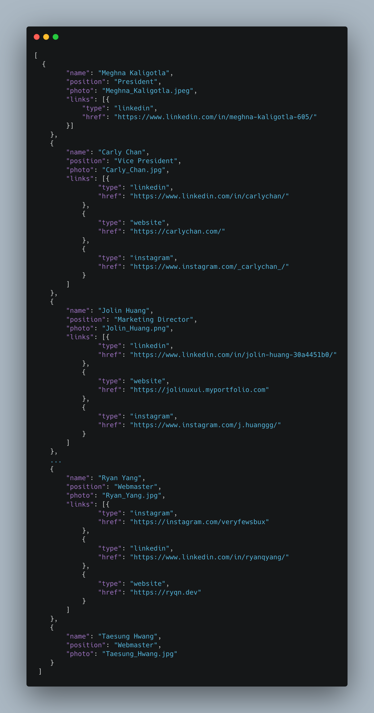

# Design@UCI Intern Program - Adding your profile

```table-of-contents

* [Prerequisites](#prerequisistes)

```

## Prerequisites

Hopefully you've followed the steps on the previous page to completion, if you haven't, please review the [checklist](/tutorial/duci-starter-tasks/setup#checklist) and confirm that when loading up the website on [localhost:3000](http://localhost:3000), it shows the design at uci website.

### What do we need to know?

At this point, you might have minimal understanding of how web development works but fret not, this section can be done without really knowing any web development at all. Truth to be told, most of the requests we need to follow are going to be pretty boring. Sometimes our tasks as a web developer can be as menial as doing basic data entry - which is what adding your profile amounts to. In fact, *because* this task is so basic, it's actually representative of a well designed system. 

### Well designed systems

In our codebase, we separate the code from the actual data. This is usually what you'll see in most web application architectures. When we're writing React code, our job is to write transformation logic. i.e. how should a browser transform raw data into visual components like so:

| Raw Data | Visual Components |
| --- | --- |
|  |  |

```jsx transformation logic
// import raw json board member data
import CURRENT_BOARD from 'assets/data/currentBoard.json';

// rendering logic
{CURRENT_BOARD.map((member, i) => (
    <div className={cn.container} key={i}>
        
        <p>
            {data.name}
            <span>{data.position}</span>
        </p>

        <div className={cn.socials}>
            {data.links?.map(({ type, href }) => (
                <a
                    key={href}
                    target='_blank'
                    rel='noopener noreferrer'
                    href={href}
                >
                    <Icon hoverable src={`nav-${type}.svg`} w='20' h='20' />
                </a>
            ))}
        </div>
    </div>
))}
```

### What does the above code do?

You don't need to worry about what any of this code is doing (we'll learn about this alter), just the general idea of it. 

