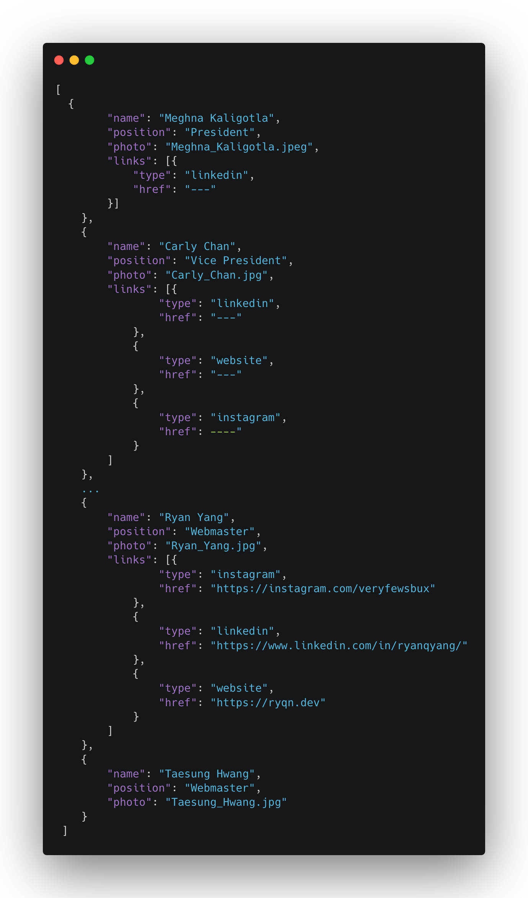
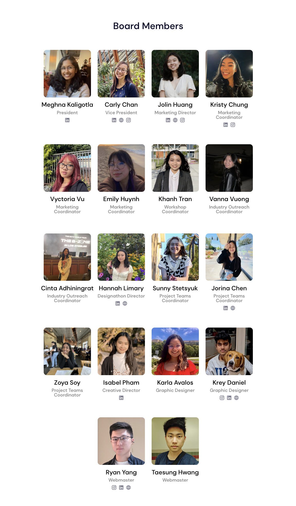

# Design@UCI Intern Program - Adding your profile

```table-of-contents

* [Prerequisites](#prerequisistes)
    1. [What do we need to know?](#what-do-we-need-to-know)
    2. [Well designed systems](#well-designed-systems)
    3. [What does the above code do?](#what-does-the-above-code-do)
* [Adding your data](#adding-your-data)

```

## Prerequisites

Hopefully you've followed the steps on the previous page to completion, if you haven't, please review the [checklist](/tutorial/duci-starter-tasks/setup#checklist) and confirm that when loading up the website on [localhost:3000](http://localhost:3000), it shows the design at uci website.

### What do we need to know?

At this point, you might have minimal understanding of how web development works but fret not, this section can be done without really knowing any web development at all. Truth to be told, most of the requests we need to follow are going to be pretty boring. Sometimes our tasks as a web developer can be as menial as doing basic data entry - which is what adding your profile amounts to. In fact, *because* this task is so basic, it's actually representative of a well designed system. 

### Well designed systems

In our codebase, we separate the code from the actual data. This is usually what you'll see in most web application architectures. When we're writing React code, our job is to write transformation logic. i.e. how should a browser transform raw data into visual components like so:

| Raw Data | Visual Components |
| --- | --- |
|  |  |

```jsx transformation logic
// import raw json board member data (snippet posted above)
import CURRENT_BOARD from 'assets/data/currentBoard.json';

// Since board member data is an array of objects, we "map" every object in the array
// to a visual component according to the HTML code below
{CURRENT_BOARD.map((member, i) => (
    <div className={cn.container} key={i}>
        
        <p>
            {data.name}
            <span>{data.position}</span>
        </p>

        <div className={cn.socials}>
            {data.links?.map(({ type, href }) => (
                <a
                    key={href}
                    target='_blank'
                    rel='noopener noreferrer'
                    href={href}
                >
                    <Icon hoverable src={`nav-${type}.svg`} w='20' h='20' />
                </a>
            ))}
        </div>
    </div>
))}
```

### What does the above code do?

You don't need to worry about what any of this code is doing (we'll learn about this alter), just the general idea of it. Notice, we take the raw array data of board members and for every one of them, we create HTML instructions on how to display it. 

If you're curious:

Line 6: `CURRENT_BOARD` is the array of raw board member data.

Line 8: The first thing we render is their profile picture. The raw board data has information regarding the name of the image file and so we take that value and plug it into an `` component.

Line 13: Display the board members' name.

Line 14: Display the board members' position.

Line 16-27: Members can optionally have up to 3 social links. We once again utilize the `.map()` function to dynamically create social icon links for every member.

The only thing to take note of is the data structure (a.k.a. schema) in which we store the data in. The format in which the data is stored in is important and will break if even a single object in the array does not follow the schema.

The schema for board members (and intern board members alike) is as follows:

```json BoardMember schema
{
    "name": string,
    "position": string,
    "photo": string,
    "links": {
        "type": "instagram" | "linkedin" | "website",
        "href": string
    }[]
}[]
```

`CURRENT_BOARD` and `CURRENT_INTERNS` will have the value above: an array of board member objects.

In addition to the other properties like `name` and `position`, there exists a property called `links` which is an array of link objects with 3 possible values for `type`.


## Adding your data

Sorry, I got a little sidetracked. Anyways, you'll find that our codebase is separated into 2 main parts: `app` and `assets`. `app` is where we have most of our code and essentially the transformation logic. `assets` is where we store all of our site data like board members, events, merch, etc. You might be asking, why don't we have a database for this? You're right in asking why we don't have a database as this is a perfect use case for one and the answer is: it's a lot of extra work to maintain and costs money to host.

### Finding the data files

```file Design@UCI website repo
DUCI-website
├── public 
│   ├── static
│   │   └── ...various assets
│   └── index.html
├── src
│   ├── app
│   └── assets
│       └── data
│           ├── alumniBoard.json
│           ├── currentBoard.json
│           ├── currentBoardInterns.json
│           ├── merchList.json
│           ├── resources.json
│           └── socials.json
├── .gitignore
├── package.json 
└── README.md
```

The above is a brief overview of the code repository (i.e. some files and folders not shown). The place we'll be looking at specifically is `DUCI-website/src/assets/data/currentBoardInterns.json`. Go ahead and open that file up in your favorite code editor.

## Adding your profile

### Upload your assets

What does every profile have? It has a profile picture, a name, a position, and a list of links. That means that we need to add every single one of those things into our code. 3 of these properties are just text data that we can type in but images and other assets follow a slightly different method. This is because we can't (and shouldn't) embed our images directly into our HTML code. We pass in a reference to where the image asset is located and tell the browser to render it after we load the main website code.

When you open up the file, you should see a well-formed JSON object in the form of an array. This is the list of intern board members. Add yourself to the very end of it while following the syntax from the other members above.

One thing to note though, make sure you're following all the JSON specifications (like no trailing comma on the last item) otherwise it will completely crash. 

### Verify your changes

Once you're done, check your dev server again [localhost:3000](http://localhost:3000) and navigate to the `/about` section to verify visually that your profile is up there.

When we write code, it's important to test well and test often - it costs nothing to run our code so do it everytime you make changes.

### Submit a PR

Once you've written in your changes and verify that everything is running fine, it's time to merge our code to the main code base.

Currently, your code changes only exist on your local computer and don't actually affect the hosted website. What we need to do now is go through the review process of merging our code with `main`.

Go ahead and follow [this article on how to submit a proper PR](/tutorial/duci-intern-starter-tasks/making-prs-on-github).

### Make changes

After you make your PR, various reviewers will read through your code and either say it's all good, or request changes. If changes get requested, you're responsible for following through on the comments and making the changes until you get approval from a reviewer. Then, you can merge and delete the branch. 

## Deploying the code

Once your changes are merged to the `main` branch of the codebase, we can build the code and deploy it onto the hosting servers. You can do this by running `npm run deploy` in the terminal.

