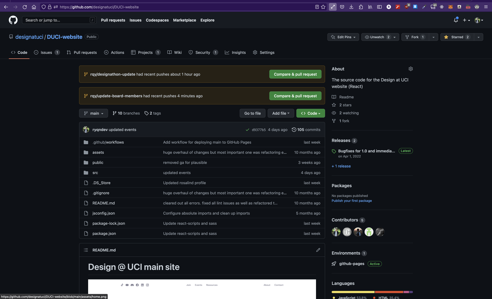
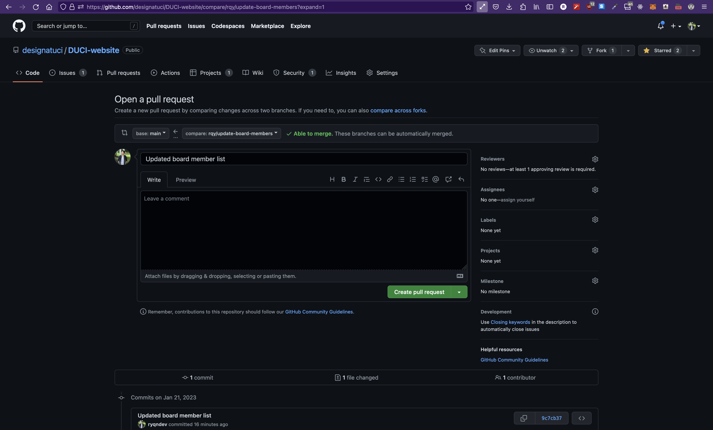
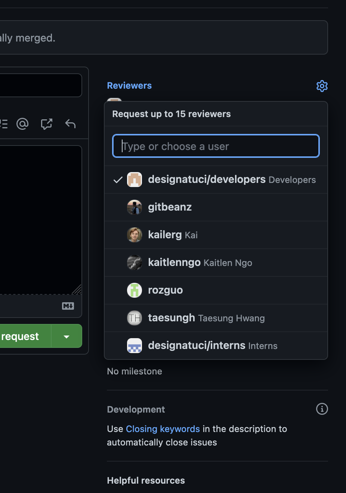

# Design@UCI Intern Program - Making PRs on Github
```table-of-contents

* [Intro](#intro)
* [Steps to follow](#steps-to-follow)
    1. [Clone the codebase](#clone-the-codebase)
    2. [Pull latest main](#pull-latest-main)
    3. [Create a new branch](#create-a-new-branch)
    4. [Make your changes](#make-your-changes)
    5. [Make a commit](#make-a-commit)
    6. [Write up your PR](#write-up-your-pr)
    7. [Assign reviewers](#assign-reviewers)
    7. [Make changes](#make-changes)

```


## Intro

Git is one of the most popular version control systems out there. Similarly, Github is one of the most popular places to host repositories that uses Git for version control. So here, we'll be learning how to make pull requests. This is a copy-paste of [Making PRs on Github](./article/making-prs-on-github) except I'll have all the exact commands added here with respect to the Design@UCI code repo.

## Steps to follow

### Clone the codebase

Likely you've done this already, but to make changes to the codebase, you have to actually have the codebase to begin with. You can clone the codebase with:

```bash terminal
git clone git@github.com:designatuci/DUCI-website.git
```

### Pull latest main

Chances are, you're going to want to be making changes to the main branch of the codebase. If you've just cloned the repository, then you likely don't need to do this (doesn't hurt to run it though). When we make a change to the codebase, we want to be making changes to the `main` branch. `main` is usually the codebase that the most recent version of the product is using. As an example, the code that's running on the [design@uci website](https://designatuci.com) is currently the code that's on the latest `main` branch. 

If you were to add a bunch of words to `main` branch of the repo, the actual website will have those changes. The reason why we have branches is so that we can write, run, and test our code without affecting the "main" codebase.

First, we're going to want to switch to the `main` branch if we're not on it already with the `git switch` command and the pull the latest changes with `git pull`.

```bash terminal
$ git switch main

Switched to branch 'main'
Your branch is up to date with 'origin/main'.

$ git pull
Already up to date.
```

### Create a new branch 

Now that we're on the latest main branch, we're going to want to `branch` off of this and create our own new branch and add our changes there. We will use the `git switch` command except with an added flag: `-c` which means to create the branch first, and then switch to it.

When we create a new branch, we need to specify the name of this new branch. We usually name things after what that entire branch is doing. At most companies, they'll have specific naming conventions that you have to follow. For us, we use this scheme `<initials>/<name of change>`. This allows us to see *whose* branch it is and *what* it does at a glance.

If I were to create a new branch that updates list of board members, for example, the command I run would look something like this:

```bash terminal
$ git switch -c rqy/update-board-members

Switched to a new branch 'rqy/update-board-members'
```

### Make your changes

Now that we're in our new branch that's branched from latest `main`, we can start making changes to the codebase. Assume in this case, I moved some board members to alumni since they graduated :(.

I can see the entire list of changes I've made by using the `status` and `diff` commands.
```bash terminal
$ git status

On branch rqy/update-board-members
Changes not staged for commit:
  (use "git add <file>..." to update what will be committed)
  (use "git restore <file>..." to discard changes in working directory)
	modified:   src/assets/data/currentBoard.json

no changes added to commit (use "git add" and/or "git commit -a")

```
The `git status` command provides a high level overview of all the files that were changed. In this case, we just `modified` the `currentBoard.json` file.

```bash terminal
$ git diff

diff --git a/src/assets/data/currentBoard.json b/src/assets/data/currentBoard.json
index e0bb396..4332a4a 100644
--- a/src/assets/data/currentBoard.json
+++ b/src/assets/data/currentBoard.json
@@ -177,10 +177,5 @@
         "name": "Ryan Yang",
         "position": "Webmaster",
         "photo": "Ryan_Yang.jpg"
-    },
-    {
-        "name": "Person that was moved name",
-        "position": "Person that was moved position"
-        "photo": "Person-that-was-moved.jpg"
     }
 ]

```
The `git diff` command allows us to see the exact changes that were made in each file. Here, the `-` denotes that a line was removed. (Not shown but `+` will show lines added)

By default, the `git diff` command will show the diff between the current changes and the latest commit (which is the one we pulled from `main`) but you can add flags to find the diffs between different commits. You can find the documentation here: [git diff docs](https://git-scm.com/docs/git-diff).

### Make a commit

Once we've tested our code and verified the changes are what we want. We now need to `stage` our files and then `commit` them. To do so, we use the `git add` and `git commit` commands respectively.

We need to manually specify which files we want to include in this commit during our `add` command which you can do like so: `git add file1.js src/file2.js` or we can just add all files that have been changed with a `.` like below:

```bash terminal
$ git add .

$ git commit -m "Updated board member list"

[rqy/update-board-members 9c7cb37] Updated board member list
 1 file changed, 5 deletions(-)
```

When we make a commit, we need to add a message about *what* that commit does. It's important to note that for a single branch/pr, we can have multiple commits. The best way to discern the difference is to think of a branch/PR as a single feature, where as each commit is a save point but not the entire thing.

Imagine we're working for Facebook (now Meta) and we've been tasked with creating the "like" button on users' posts. We might have a branch called `rqy/add-like-button` that might have 3 commits with messages like:

- git commit -m "added like counter" <- that shows the # of likes on a post
- git commit -m "added popup on hover" <- that shows the names of some people who liked a post when the like counter is hovered
- git commit -m "added like button" <- allows users to click 'like' to add their own like.

Even though this one overarching feature, we might have multiple commits to save our changes at each step. We shouldn't actually merge after the first and second step because the entire feature is technically incomplete - so we just commit to a branch and leave it there until we're done.

### Push your branch

In our case though, we're just updating a single entry and it's not too complicated so we only really need one commit in this PR. Once we've commited, we now need to push this branch onto Github. It exists on our local computer, but not the public repo that's hosted on the internet and Github. To do this, we need to run `git push --set-upstream origin <branch-name>` as follows:

```bash
$ git push --set-upstream origin rqy/update-board-members

Enumerating objects: 11, done.
Counting objects: 100% (11/11), done.
Delta compression using up to 16 threads
Compressing objects: 100% (6/6), done.
Writing objects: 100% (6/6), 606 bytes | 606.00 KiB/s, done.
Total 6 (delta 3), reused 0 (delta 0), pack-reused 0
remote: Resolving deltas: 100% (3/3), completed with 3 local objects.
remote: 
remote: Create a pull request for 'rqy/update-board-members' on GitHub by visiting:
remote:      https://github.com/designatuci/DUCI-website/pull/new/rqy/update-board-members
remote: 
remote: GitHub found 1 vulnerability on designatuci/DUCI-website's default branch (1 high). To find out more, visit:
remote:      https://github.com/designatuci/DUCI-website/security/dependabot/6
remote: 
To https://github.com/designatuci/DUCI-website.git
 * [new branch]      rqy/update-board-members -> rqy/update-board-members
Branch 'rqy/update-board-members' set up to track remote branch 'rqy/update-board-members' from 'origin'.
```

`origin` is just the default name for where remote branches are stored on Github so that part just means where on Github it's targeting (you'll probably be using origin for 99% of use cases). The `branch-name` is the name of the branch to be created on Github. It doesn't *need* to be the same name as the one you created locally but there's no good reason to change it.

### Write up your PR

Once you've pushed your branch, navigate to the repo on Github in your browser. For Design@UCI, it's [https://github.com/designatuci/DUCI-website](https://github.com/designatuci/DUCI-website). You should see something like this:



I have two popups on the top (ignore the first one since I'm working on multiple things at once) but you should see something like the second popup that says you have a new branch! Go ahead and click `Compare & pull request`. That should redirect you to:



Here, you fill out the proper information fields. Take a look at this pr: https://github.com/designatuci/DUCI-website/pull/10 to see what you want to have. Add screenshots of the changes you made so reviewers can see what you did.

### Assign Reviewers

Before you create your PR, make sure you assign reviewers to look at your code. For D@UCI, make sure you add `developers` as well as `Ryan Yang`.




### Make changes

Once you're all done with that, go ahead and click the green `Create pull request` button on the bottom. Now, we just wait for reviewers to look over your code - it's always good to have a fresh pair of eyes look at the code.

When reviewers look at your work, they'll either request changes or approve. If they request changes, go back to your code editor, fix what needs fixing, and then go back to the [Making Your Changes section](#make-your-changes). Essentially, you'll be adding a new commit to your branch likely with a message about how you fixed those issues.

If the change that was requested was significant enough, you may also want to edit your PR description.

After you've made changes, re-request review from those that asked for changes until you get an approval. Once it's approved, go ahead and merge and delete the branch.
