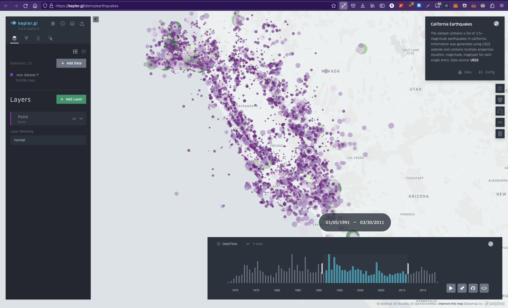
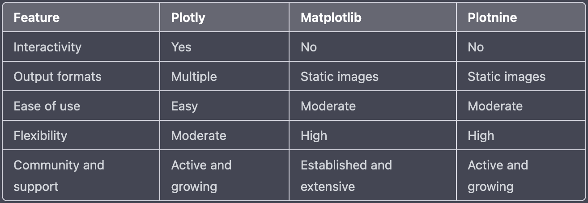

# Intro to data viz with Python


```table-of-contents
* [Overview](#overview)
    1. [Why Python?](#why-python)
    2. [tl;dr](#tldr)
    3. [Some differences](#some-differences)
* [Final thoughts](#final-thoughts)
```

## Overview


> [Heatmap of earthquakes](https://kepler.gl/demo/earthquakes). Despite over 54,000 data points, we can understand it at a glance.

What is data visualization? I'd describe it as a way of understanding extremely large sets of data at a glance. When it comes to creating data visualizations, it really just comes down to two parts: First, aggregate and format your data. Then, transform that data into a visual representation. If you think about it, if you break down the word data visualization into two parts, you get: data and visualization. So let's learn how to do it.

### Why Python?

Python is the language of choice for most data scientists. Because of this, tons of libraries have been developed to help with data visualization. You'll likely be using pandas and numpy for a majority of your data processing - so learning these tools are crucial to getting better at data visualizations. Then, you'll select from a multitude of data-vis libraries of which I've listed a few below.


## tl;dr




## Some differences

Plotly, Matplotlib, and Plotnine are all Python libraries for creating visualizations, but they have some key differences:

* **Interactivity**: Plotly is designed to create interactive visualizations that can be manipulated and explored in real-time, while Matplotlib and Plotnine primarily create static visualizations.
* **Output formats**: Plotly can output visualizations in a variety of formats, including HTML, SVG, and PDF, while Matplotlib and Plotnine typically output static images (e.g. PNG, JPG, or PDF).
* **Ease of use**: Plotly is generally considered to be more user-friendly and easier to use than Matplotlib and Plotnine, especially for creating interactive visualizations. Plotly provides a set of high-level functions and APIs that make it easy to create complex visualizations with minimal code.
* **Flexibility**: Matplotlib and Plotnine provide a wide range of customization options, allowing users to create highly-customized visualizations with full control over every aspect of the chart. Plotly also provides customization options, but may not be as flexible as Matplotlib and Plotnine in some cases.
* **Community and support**: Matplotlib and Plotnine have been around longer than Plotly and have a large and established user community, as well as extensive documentation and resources available online. Plotly is also well-supported, but may have fewer resources available for certain types of problems.

Overall, the choice of which library to use depends on your specific needs and requirements. If you need to create interactive visualizations that can be explored in real-time, Plotly is likely the best choice. If you need to create highly-customized static visualizations with full control over every aspect of the chart, Matplotlib or Plotnine may be more suitable.

## Final thoughts

Regardless of which library you choose here, the skills are transferrable between them. The bulk of the difficulty in working with data visualizations you'll find is acutally in manipulating the data to get it into the correct format. That's the part that can only be learned through practice and experience. When it comes to putting the values into the visualization libraries, it's just a matter of copying the docs. 
