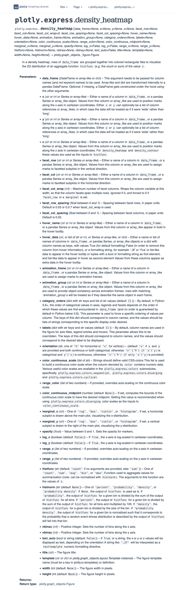
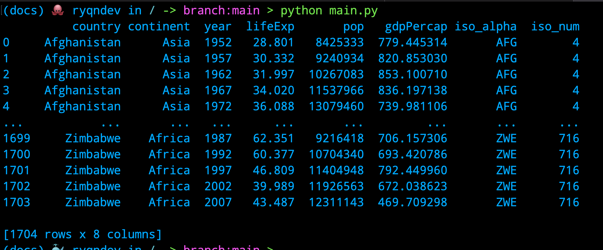
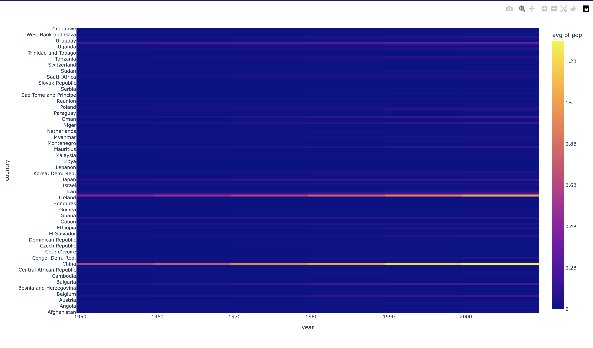
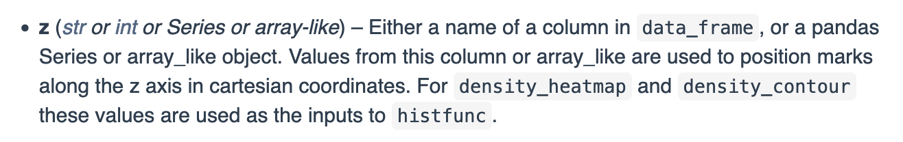
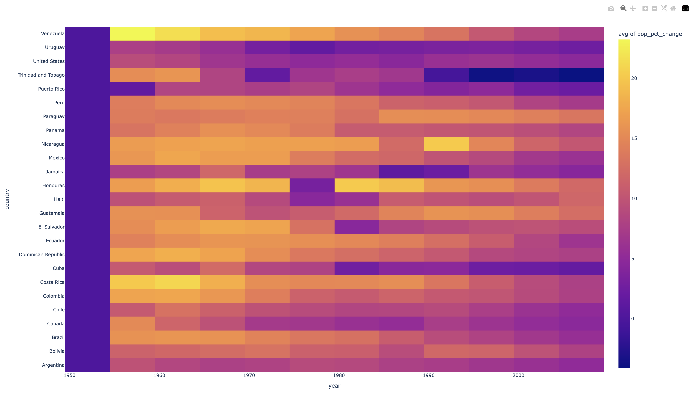
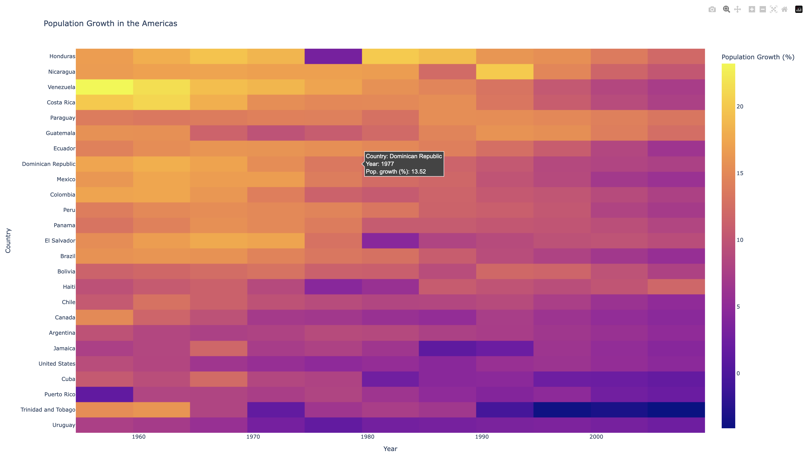

# Intro to data viz with Python [Plotly]

*The finished code can be found [here](https://github.com/ryqndev/learn-ryqn-dev/blob/main/src/content/tutorial/intro-to-data-visualization/python/plotly/docs/main.py).*

```table-of-contents
* [Overview](#overview)
* [Intro](#intro)
    1. [Prerequisites](#prerequisites)
    2. [My setup](#my-setup)
* [Getting started](#getting-started)
* [Understanding the code](#understanding-the-code)
* [Let's make our own chart](#lets-make-our-own-chart)
    1. [Getting the data](#getting-the-data)
    2. [Cleaning the data](#cleaning-the-data)
    3. [Choosing our idea](#choosing-our-idea)
    4. [Choosing the right chart](#choosing-the-right-chart)
    5. [Read the docs](#read-the-docs)
    6. [Basic heatmap](#basic-heatmap)
    7. [Customizing the chart](#customizing-the-chart)
    8. [Formatting the data](#formatting-the-data)
    9. [Final product](#final-product)
* [Source Code](#source-code)
```

## Overview


> [Heatmap of earthquakes](https://kepler.gl/demo/earthquakes). Despite over 54,000 data points, we can understand it at a glance.

What is data visualization? I'd describe it as a way of understanding extremely large sets of data at a glance. When it comes to creating data visualizations, it really just comes down to two parts: First, aggregate and format your data. Then, transform that data into a visual representation. If you think about it, if you break down the word data visualization into two parts, you get: data and visualization. So let's learn how to do it.


## Intro

Python is the language of choice for most data scientists. Because of this, tons of libraries have been developed to help with data visualization. In this tutorial, we'll be covering Plotly specifically. If you're curious about other libraries, check out the [Intro to data viz with Python](/tutorial/intro-to-data-visualization/python) comparison.

### Prerequisites

Although this tutorial is meant for beginners, the hope is that you understand very basic Python - or atleast one other programming language. For a dev environment, you should have Python 3 installed and a code editor of your choice.

Also, since we're using plotly, you're going to want to have [plotly installed](https://plotly.com/python/getting-started/#installation).

### My setup

For reference, this will be my setup:
- [Python3](https://realpython.com/installing-python/) (version 3.7.9 to be specific)
- [VSCode](https://code.visualstudio.com/download) (my code editor)

We'll also need the following Python libraries:
- [plotly](https://pypi.org/project/plotly/) (I'll be on 5.14)
- [pandas](https://pypi.org/project/pandas/) (I'll be on 1.3.5)
- [kaleido](https://pypi.org/project/kaleido/) (if you want to save charts as images instead of html files)

If you want to just copy my setup, you can copy my `requirements.txt` file [here](https://github.com/ryqndev/learn-ryqn-dev/blob/main/src/content/tutorial/intro-to-data-visualization/python/plotly/docs/requirements.txt) and run `pip3 install -r requirements.txt` in your terminal.

## Getting started

Let's verify that everything in our setup is working as intended. We'll start by importing plotly and [copying the basic starter code from the website docs](https://plotly.com/python/getting-started/).

I went ahead and created a new folder on my computer desktop and added a file called `main.py`. The exact file name and folder location is arbitrary so don't feel like you need to copy exactly.

In my file, I copied the following code:
```python main.py
import plotly.express as px

fig = px.bar(x=["a", "b", "c"], y=[1, 3, 2])
fig.write_html(file='first_figure.html', auto_open=True)

```

and ran this code in my terminal by running `python3 <filename>` in the same directory as the file

```bash terminal
$ ls
main.py

$ python3 main.py
```

This should create an HTML file in your current directory and automatically open this up:


## Understanding the code

Let's break down the code we just ran. The first line imports the plotly library as a variable `px` - but more specifically, a subset of the library called `express`. The `express` module of plotly is specifically designed to rapidly prototype figures (...hence the name).

On line 3, we call the `bar` method from the `express` module which creates a bar chart. However, the `express` module actually supports a whole bunch of charts. You can see the full list [here](https://plotly.com/python/plotly-express/). The API documentation for the module can be found [here](https://plotly.com/python-api-reference/plotly.express.html).

The `bar` method takes in two arguments: `x` - a list of values that will be used for the x-axis - and `y` - a list of values that will be used for the y-axis. It will then take these two lists of data and create a bar chart with them. 

When you generate a chart with Plotly, it will return a special Plotly objet called a `figure`. A Plotly `figure` has a bunch of methods that you can call on it to do things like save the chart as an image or HTML file.

In this case, we're going to store the figure to a variable called `fig` and then on line 4, we're going to call the `.write_html()` function frmo the `figure` class to save it as an HTML file.

## Let's make our own chart

Now that you've seen a basic use case of plotly, let's make a chart of our own.

Remember how I mentioned earlier that data visualization is composed of two parts? I sorta half lied. Although getting the data is the first half of data visualization, there's multiple steps involved. Let's break it down.

First, we need to get the entire data set we're working with. Usually every data set will have multiple unrelated columns and rows and you'll find yourself throwing away some of the data - or even needing more. Once you've found a data set you want to work with, you then need to clean it, mutate it, and then format it.


### Getting the data

We need to first find a data set we want to work with. If you're trying to create some sort of visualization to supplement your research for example, you might already have a data set that you're working with. Otherwise, if you're coming up with a project or research idea, you'll likely want to explore several data sets and see if there's any story there worth telling.

Plotly actually happens to provide users with a bunch of data sets built into the library. This is super cool because it means we can quickly test out different charts without having to worry about finding data for them. You can find the entire list [here](https://plotly.com/python-api-reference/generated/plotly.data.html#module-plotly.data) and to access them, all you have to do is call the `data` property of the plotly library.

Here are some examples:

```python main.py
# Each row represents the availability of car-sharing services near the centroid of a zone in Montreal over a month-long period.
car_share_data = plotly.data.carshare()
print(car_share_data)

# Gapminder - one of the most popular libraries for data scientists to learn with about countries and their populations.
gapminder_data = plotly.data.gapminder()
print(gapminder_data)

```

For this example, let's go ahead and use the gapminder data set. 

### Cleaning the data

There isn't much work needed here when we're using the built-in data sets. However, if you're creating your own data set from your own research, you'll likely need to clean it up by removing outliers and whatnot.

### Choosing our idea

Once we have a data set, we need to decide what story we're going to tell with our visualizations. When I print out the gapminder data set, I can see that it contains information regarding countries and their population sizes, GDPs, and life expectancies as they change over time. 

At this point, it's time to tap into your own creativity and think critically about what connections you could make with your data set.

For our example here, we'll try to show the change in population growth over time for ALL countries. Now, we need to choose the right type of visualization that will do this data justice.

### Choosing the right chart

To pick the best chart for the job, we should first figure out what [charts are available](https://plotly.com/python/getting-started/#overview) for us to use in the plotly library. I screenshotted a bunch of them for you here:

[Basic Charts:](https://plotly.com/python/basic-charts/)


[Statistical Charts:](https://plotly.com/python/statistical-charts/)


[Scientific Charts:](https://plotly.com/python/scientific-charts/)


[Maps:](https://plotly.com/python/maps/)


[3D Charts:](https://plotly.com/python/3d-charts/)


Let's think back to our goal: we want to see how countries' population sizes have changed over time. How can we represent population size over time? There's no "right" answer here - usually there's a few different ways to represent the same data but each one tells a different story.

I'm going to show you this exact same data set with two different charts so you can see what I mean by a "different story" but for the code example, I'm going to pick a 2d histogram - which is pretty much a heatmap.

### Read the docs

Let's take a look at the [documentation for the histogram](https://plotly.com/python-api-reference/generated/plotly.express.density_heatmap.html) and see what arguments we can pass in to create and customize our chart.



I found this page by looking for the heatmap link in the [Full API Reference page](https://plotly.com/python-api-reference/index.html) - specifically under the `express` module.

Let's dissect this documentation page to see what every part means. 

The title `plotly.express.density_heatmap` is what we need to import to use this function. Since we're already importing the `plotly.express` module, we can just call the `density_heatmap` function from it - which will look something like this:

```python main.py
import plotly.express as px

fig = px.density_heatmap()
```

Now, to customize our heatmap, the `density_heatmap` has a ton of parameters that we can pass in. The section immediately below the title lists the entire list of parameters as well as their default values. Most of these default values will be of `None` type so if you don't pass anything in, you'll just get the base look.

After that is a tiny blurb that describes what this function does exactly:

> In a density heatmap, rows of `data_frame` are grouped together into coloured rectangles to visualize the 2D distribution of an aggregate function `histfunc` (e.g. the count or sum) of the value `z`

And now the important part: a description of each parameter and what data it expects for it. We can worry about customizing our chart later to look pretty - first, let's understand how to pass in data to the chart.

The data objects that come with plotly are all `pandas` dataframes. For those of you who are unfamiliar, `pandas` is a data analysis library that allows you to easily manipulate and analyze data. You'll see how simple it is to manipulate data with `pandas` in the next section but for now, all we need to know is that we'll be using the `data_frame` parameter of `density_heatmap()` and passing in our `gapminder_data` object.

A `dataframe` is really just an excel spreadsheet. It's a multidimensional array of data that has rows and columns and if we just print out the dataframe in python, we'll see this:



Just based on what we see here, we see a subset of a dataset of over 1700 rows that each detail the population size, GDP, and life expectancy of a country over a period of time - let's plot this data!


### Basic heatmap

Looking at the data above, let's just go ahead and try to display a basic chart. Our goal here is to create a heatmap that helps us visualize the population sizes of countries over time and so, we'll specify the columns we want to use for the x and y axes and the z axis.

```python main.py 
import plotly.express as px
import plotly.data as data

gapminder_data = data.gapminder()

fig = px.density_heatmap(data_frame=gapminder_data, x="year", y="country", z="pop", histfunc="avg")
fig.show()
```

Which results in this cute chart: 


What did we do here? We essentially just passed in the entire data frame and told the chart to use the `year` column for the x axis, the `country` column for the y axis, and the `pop` column for the z axis. One thing about histograms - they don't *plot* data, they *aggregate* data. So, we need to tell the chart how to aggregate the data. We do this by passing in the `histfunc` parameter and telling it to use the `avg` function (by default it will `sum` data) on data values that have been `binned` togther.

The `histfunc` is applied on all `z` values that have been `binned` together as it says in the parameter list:




### Customizing the chart

The chart we made is pretty cool - except it doesn't provide that much value for us. Here are a list of problems with it:
- The `x` axis here is categorical and doesn't make sense to hide labels (which is done because there are too many countries to list at once)
- The vast majority of data here is blue, simply because China and India have such large populations, it makes the rest of the data look like it's not there
- The chart itself is pretty, but the rest of the chart is pretty plain.

So what can we do here?
- We can limit the `x` axis here to only show a select few countries at a time.
- We still want to visualize population growth over time but what we can do here to highlight the differences is to show change in growth by %, rather than the absolute population.
- Let's add some spice to it.

### Formatting the data

We haven't done any data manipulation just yet ... but we're about to! As with anything in the coding realm, there's multiple correct ways of doing things so I'll go ahead and show a couple ways of doing the exact same thing and you can take your pick with what makes more sense or might be easier for you to understand.

#### First problem statement: We need to limit the number of countries being shown at any time.

There are a couple directions we can go here like only showing the top 10 most populated countries, or showing the top 10 growth countries but let's just do a basic filter operation where we only show countries in the Americas.

```python main.py
import plotly.data as data

gapminder_data = data.gapminder()

# This is called a mask. It's a boolean array that tells us which rows to keep that is created by comparing the values in the "continent" column to "Americas". This is probably the fastest method.
filtered_data = gapminder_data[gapminder_data["continent"] == "Americas"]
# If you wanna see that the boolean array looks like, you can print the command below
# print(gapminder_data["continent"] == "Americas")

# This is a query operation. It's much slower but likely more familiar if you're used to working with SQL queries.
filtered_data = gapminder_data.query("continent == 'Americas'")
```

#### Second problem statement: We want to show % change in pop growth, rather than the absolute value.

This is a slightly more complicated data manipulation operation than the last one because now, we need to derive new data from existing data. The gapminder dataset doesn't just have a column that we can use to get the population growth % so we can go ahead and create one by using the pandas built-in `pct_change()` function.

```python main.py
import plotly.express as px
import plotly.data as data

gapminder_data = data.gapminder()

formatted_data = gapminder_data[gapminder_data['continent'] == 'Americas']

# Calculate the percentage change in population from the previous year
formatted_data['pop_pct_change'] = formatted_data.groupby("country")['pop'].pct_change() * 100

# Another way of doing the above:
# formatted_data["pop_pct_change"] = formatted_data.groupby("country")["pop"].apply(lambda x: x.pct_change() * 100)

fig = px.density_heatmap(
    data_frame=formatted_data, 
    x="year", 
    y="country", 
    z="pop_pct_change", 
    histfunc="avg",
    nbinsx=20, 
    nbinsy=20
)
fig.write_html(
  file=f"{FIGURES_FOLDER_NAME}/formatted_heatmap.html", 
  auto_open=True
)

```



### Final Product

Now that we have the bulk of the data down, let's go ahead and make this chart prettier. We'll do some more formatting and sorting to make the chart more informative while also making it look more aesthetically pleasing. By sorting the values, we end up grouping a lot of the same colors to create a beautiful gradient, rather than a random clump of colors.

Then, we utilize the `update_traces` and `update_layout` functions that are built into the `Figure` object to change the text and formatting of the hover tooltip and legend respectively.

```python main.py
import plotly.express as px
import plotly.data as data

gapminder_data = data.gapminder()
formatted_data = gapminder_data[gapminder_data['continent'] == 'Americas']
formatted_data['pop_pct_change'] = formatted_data.groupby("country")[
    'pop'].pct_change() * 100

formatted_data = formatted_data[formatted_data['year'] >= 1957]


country_sum = formatted_data.groupby(
    'country')['pop_pct_change'].sum().reset_index()
formatted_data = formatted_data.merge(country_sum, on='country')
formatted_data = formatted_data.sort_values(by='pop_pct_change_y')

fig = px.density_heatmap(
    data_frame=formatted_data,
    x="year",
    y="country",
    z="pop_pct_change_x",
    histfunc="avg",
    nbinsx=20,
    nbinsy=20,
    title="Population Growth in the Americas",
    labels={
        "country": "Country",
        "year": "Year",
    },
)
fig.update_traces(
    hovertemplate='Country: %{y}<br>Year: %{x}<br>Pop. growth (%): %{z:.2f}<br>',
)

fig.update_layout(
    coloraxis_colorbar={
        "title": "Population Growth (%)"
    },
)

fig.write_html(
    file=f"{FIGURES_FOLDER_NAME}/gfp_formatted_heatmap.html",
    auto_open=True
)

```

Giving us this chart:



## Source code

As mentioned at the start, the entire code demo can be found [here](https://github.com/ryqndev/learn-ryqn-dev/blob/main/src/content/tutorial/intro-to-data-visualization/python/plotly/docs/main.py).

If you run this `main.py` file (with all the libraries installed), it will save all of the generated HTML files into a `figures` folder in the same directory as the `main.py` file and also open them in the browser at the same time.

