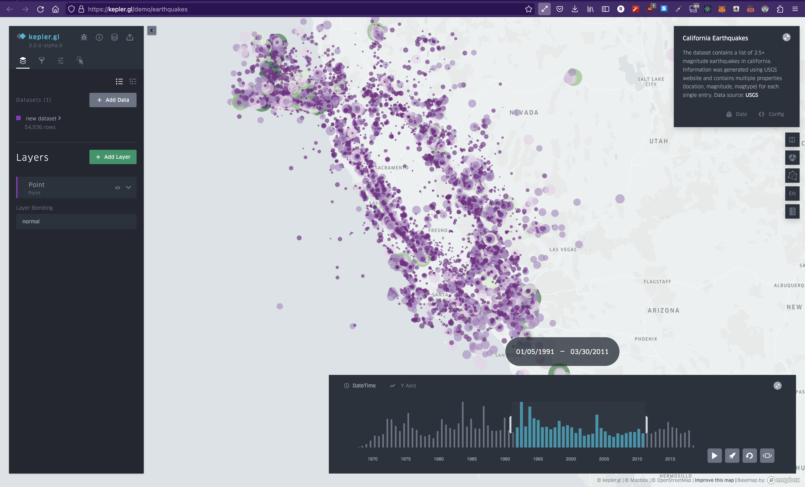
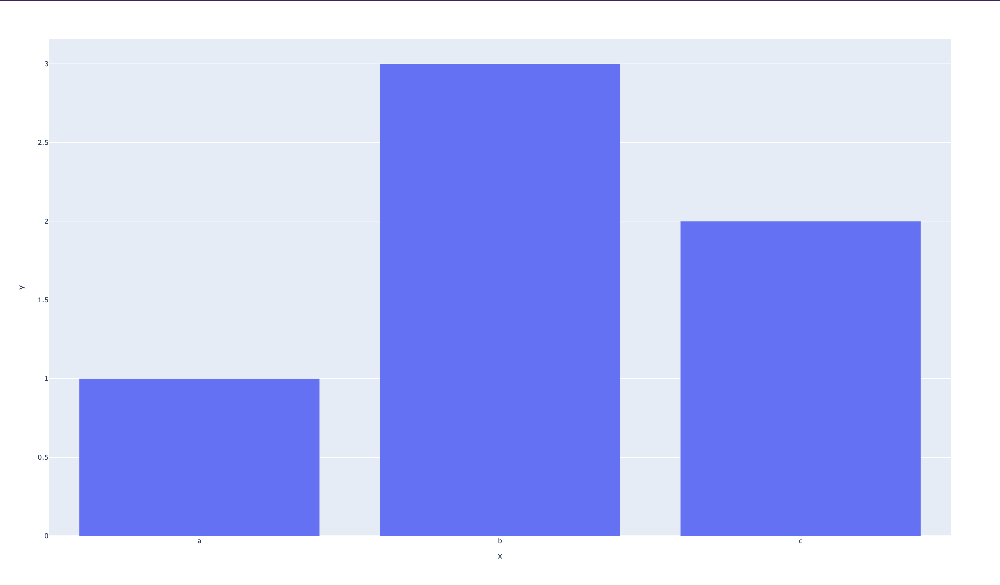
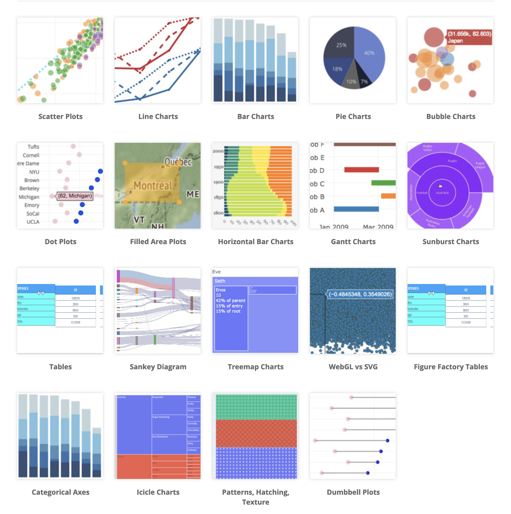
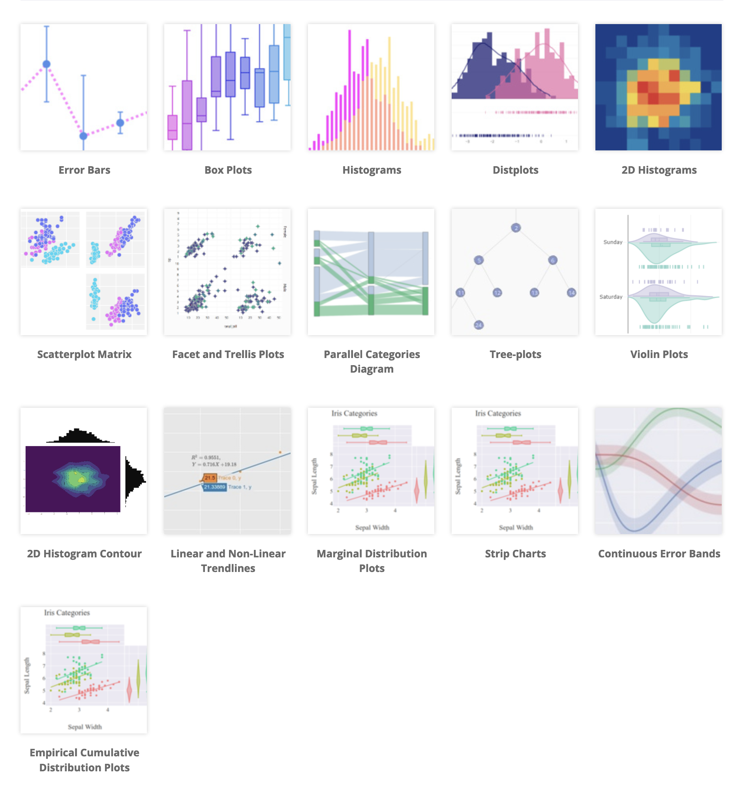
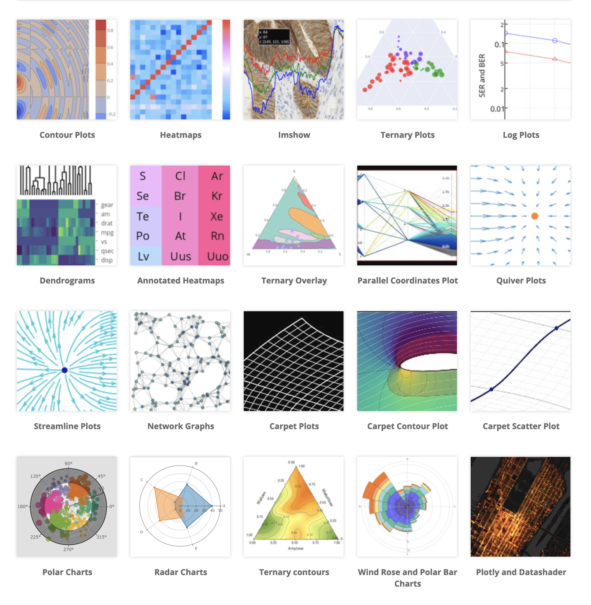
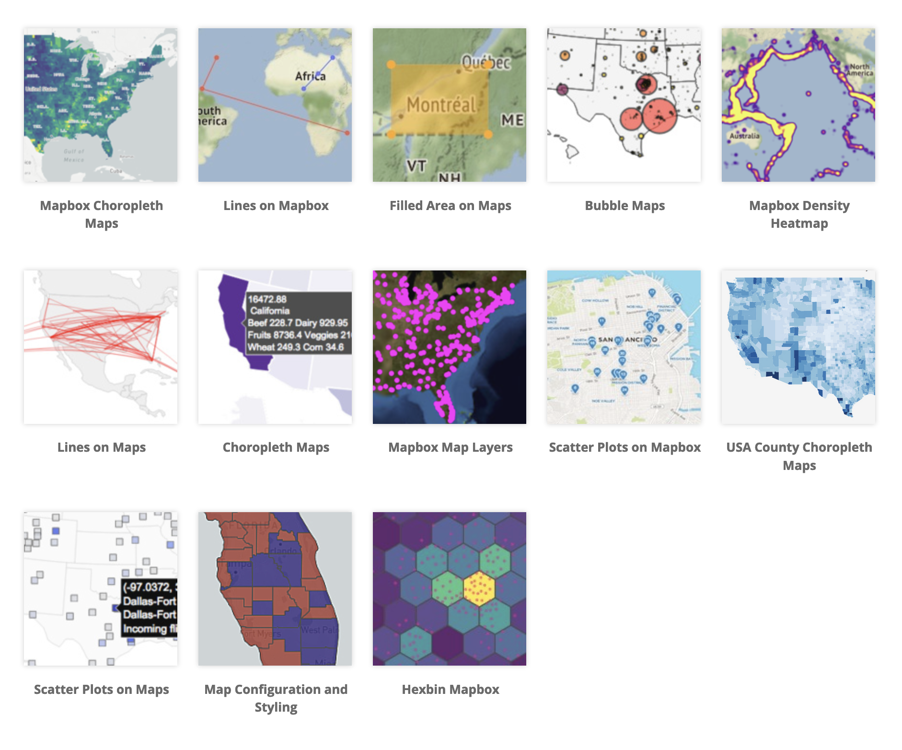
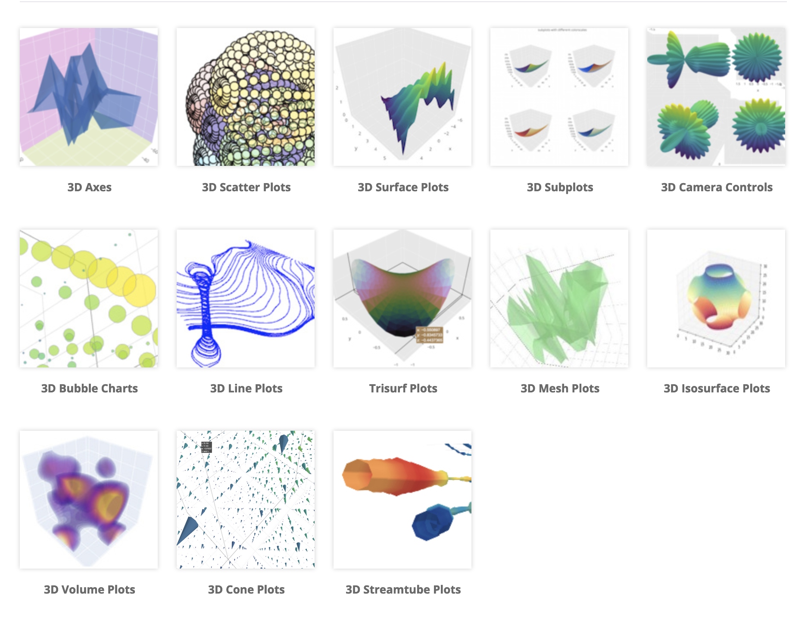
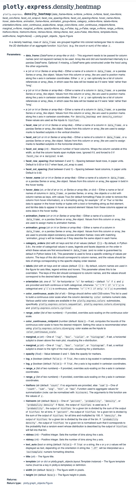

# Intro to data viz with Python [Plotly]

*The finished code can be found [here](https://github.com/ryqndev/learn-ryqn-dev/blob/main/src/content/tutorial/intro-to-data-visualization/python/plotly/docs/main.py).*

```table-of-contents
* [Overview](#overview)
* [Intro](#intro)
    1. [Prerequisites](#prerequisites)
    2. [My setup](#my-setup)
* [Getting started](#getting-started)
* [Understanding the code](#understanding-the-code)
* [Let's make our own chart](#lets-make-our-own-chart)
    1. [Getting the data](#getting-the-data)
    2. [Cleaning the data](#cleaning-the-data)
    3. [Formatting the data](#formatting-the-data)
    4. [Choosing the right chart](#choosing-the-right-chart)

```

## Overview


> [Heatmap of earthquakes](https://kepler.gl/demo/earthquakes). Despite over 54,000 data points, we can understand it at a glance.

What is data visualization? I'd describe it as a way of understanding extremely large sets of data at a glance. When it comes to creating data visualizations, it really just comes down to two parts: First, aggregate and format your data. Then, transform that data into a visual representation. If you think about it, if you break down the word data visualization into two parts, you get: data and visualization. If you take away one thing today, it's that! So let's learn how to do it.


## Intro

Python is the language of choice for most data scientists. Because of this, tons of libraries have been developed to help with data visualization. In this tutorial, we'll be covering Plotly specifically. If you're curious about other libraries, check out the [Intro to data viz with Python](/tutorial/intro-to-data-visualization/python) comparison.

### Prerequisites

Although this tutorial is meant for beginners, the hope is that you understand very basic Python - or atleast one other programming language. For a dev environment, you should have Python 3 installed and a code editor of your choice.

Also, since we're using plotly, you're going to want to have [plotly installed](https://plotly.com/python/getting-started/#installation).

### My setup

For reference, this will be my setup:
- [Python3](https://realpython.com/installing-python/) (version 3.7.9 to be specific)
- [VSCode](https://code.visualstudio.com/download) (my code editor)

We'll also need the following Python libraries:
- [plotly](https://pypi.org/project/plotly/) (I'll be on 5.14)
- [kaleido](https://pypi.org/project/kaleido/) (if you want to save charts as images instead of html files)

## Getting started

Let's verify that everything in our setup is working as intended. We'll start by importing plotly and [copying the basic starter code from the website docs](https://plotly.com/python/getting-started/).

I went ahead and created a new folder on my computer desktop and added a file called `main.py`. The exact file name and folder location is arbitrary so don't feel like you need to copy exactly.

In my file, I copied the following code:
```python main.py
import plotly.express as px

fig = px.bar(x=["a", "b", "c"], y=[1, 3, 2])
fig.write_html(file='first_figure.html', auto_open=True)

```

and ran this code in my terminal by running `python3 <filename>` in the same directory as the file

```bash terminal
$ ls
main.py

$ python3 main.py
```

This should create an HTML file in your current directory and automatically open this up:


## Understanding the code

Let's break down the code we just ran. The first line imports the plotly library as a variable `px` - but more specifically, a subset of the library called `express`. The `express` module of plotly is specifically designed to rapidly prototype figures (...hence the name).

On line 3, we call the `bar` method from the `express` module which creates a bar chart. However, the `express` module actually supports a whole bunch of charts. You can see the full list [here](https://plotly.com/python/plotly-express/). The API documentation for the module can be found [here](https://plotly.com/python-api-reference/plotly.express.html).

The `bar` method takes in two arguments: `x` - a list of values that will be used for the x-axis - and `y` - a list of values that will be used for the y-axis. It will then take these two lists of data and create a bar chart with them. 

When you generate a chart with Plotly, it will return a special Plotly objet called a `figure`. A Plotly `figure` has a bunch of methods that you can call on it to do things like save the chart as an image or HTML file.

In this case, we're going to store the figure to a variable called `fig` and then on line 4, we're going to call the `.write_html()` function frmo the `figure` class to save it as an HTML file.

## Let's make our own chart

Now that you've seen a basic use case of plotly, let's make a chart of our own.

Remember how I mentioned earlier that data visualization is composed of two main parts? I sorta half lied. Although getting the data is the first half of data visualization, there's multiple steps involved. Let's break it down.

First, we need to get the entire data set we're working with. Usually every data set will have multiple unrelated columns and rows and you'll find yourself throwing away some of the data - or even needing more. Once you've found a data set you want to work with, you then need to clean it, mutate it, and then format it.


### Getting the data

We need to first find a data set we want to work with. If you're trying to create some sort of visualization to supplement your research for example, you might already have a data set that you're working with. Otherwise, if you're coming up with a project or research idea, you'll likely want to explore several data sets and see if there's any story there worth telling.

Plotly actually happens to provide users with a bunch of data sets built into the library. This is super cool because it means we can quickly test out different charts without having to worry about finding data for them. You can find the entire list [here](https://plotly.com/python-api-reference/generated/plotly.data.html#module-plotly.data) and to access them, all you have to do is call the `data` property of the plotly library.

Here are some examples:

```python main.py
# Each row represents the availability of car-sharing services near the centroid of a zone in Montreal over a month-long period.
car_share_data = plotly.data.carshare()
print(car_share_data)

# Gapminder - one of the most popular libraries for data scientists to learn with about countries and their populations.
gapminder_data = plotly.data.gapminder()
print(gapminder_data)

```

For this example, let's go ahead and use the gapminder data set. 

### Cleaning the data

There isn't much work needed here when we're using the built-in data sets. However, if you're creating your own data set from your own research, you'll likely need to clean it up by removing outliers and whatnot.

### Choosing our idea

Once we have a data set, we need to decide what story we're going to tell with our visualizations. When I print out the gapminder data set, I can see that it contains information regarding countries and their population sizes, GDPs, and life expectancies as they change over time. 

At this point, it's time to tap into your own creativity and think critically about what connections you could make with your data set.

For our example here, we'll try to show the change in population growth over time for ALL countries. Now, we need to choose the right type of visualization that will do this data justice.

### Choosing the right chart

To pick the best chart for the job, we should first figure out what [charts are available](https://plotly.com/python/getting-started/#overview) for us to use in the plotly library. I screenshotted a bunch of them for you here:

[Basic Charts:](https://plotly.com/python/basic-charts/)


[Statistical Charts:](https://plotly.com/python/statistical-charts/)


[Scientific Charts:](https://plotly.com/python/scientific-charts/)


[Maps:](https://plotly.com/python/maps/)


[3D Charts:](https://plotly.com/python/3d-charts/)


Let's think back to our goal: we want to see how countries' population sizes have changed over time. How can we represent population size over time? There's no "right" answer here - usually there's a few different ways to represent the same data but each one tells a different story.

I'm going to show you this exact same data set with two different charts so you can see what I mean by a "different story" but for the code example, I'm going to pick a 2d histogram - which is pretty much a heatmap.

### Read the docs

Let's take a look at the [documentation for the histogram](https://plotly.com/python-api-reference/generated/plotly.express.density_heatmap.html) and see what arguments we can pass in to create and customize our chart.

### Formatting the data

To do this, I need to keep track of three distinct values (most 2d charts only have two): the country, the year, and the population size. Now the fun part, I need to figure out which type of chart would allow me to tell this story of population sizes for various countries over time.

