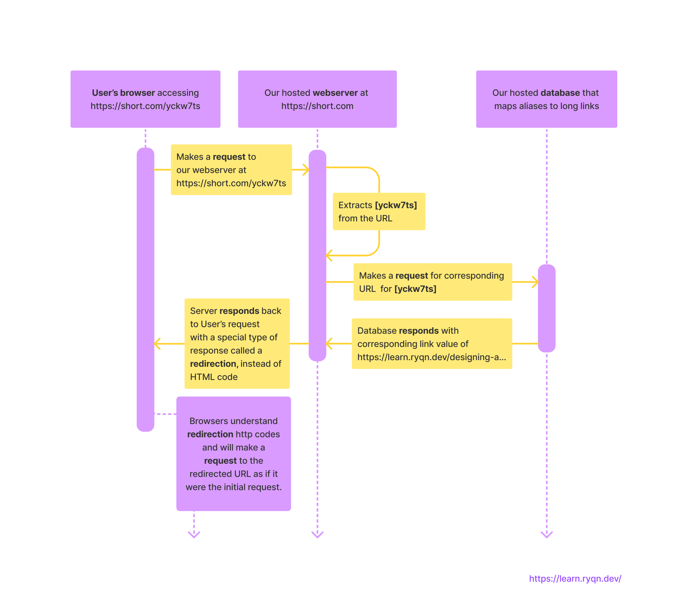

# Making a URL shortener in Python

*The finished code can be found [here](https://github.com/ryqndev/learn-ryqn-dev/tree/content-update/src/content/making-a-url-shortener-in-python/docs). To run it, you need to [setup Flask](https://learn.ryqn.dev/starting-out-with-flask#installation-and-setup). Once that's done, you can type `flask run` in your terminal to start the webserver*

```table-of-contents

* [Intro](#intro)
* [Background info](#background-info)
* [Picking our tools](#picking-our-tools)
* [Installation and Setup](#installation-and-setup)
* [Ready to start coding](#ready-to-start-coding)
* [Writing the business logic](#writing-the-business-logic)
    1. [Generating a short alias](#generating-a-short-alias)
    2. [Get link from alias](#get-link-from-alias)
    3. [Finishing up business logic](#finishing-up-business-logic)
* [Understanding servers and web requests](#understanding-servers-and-web-requests)
* [Writing the Flask code](#writing-the-flask-code)
    1. [Creating a web interface](#creating-a-web-interface)
    1. [Redirecting](#redirecting)
* [Final Result](#final-result)
```

## Intro 
This tutorial assumes basic knowledge of Python3 (variables, functions, if-statements, dictionaries, import python modules).

You may have heard of services like [bit.ly](https://bit.ly) called URL shorteners whose job is to take a long link, and generate a shorter alias for it. 

Here, we will **write a URL shortener service in Python**. This article is meant for students who have dabbled with Python and are exploring ways to apply that knowledge to real-world applications. We'll be touching on setting up a webserver using Flask, serving webpages, understanding http codes, and some basic software design fundamentals. 

Ideally, you'll be able to see the process a developer goes through when writing software and learn enough from the system so you have *some* direction when you work on your own project!

## Background info
If you want to dive straight into code, you can go straight to [Installation and Setup](#installation-and-setup). Otherwise, I would recommend you read an [in-depth explanation of the design of our system](https://learn.ryqn.dev/article/designing-a-url-shortener) first.

We are essentially developing this:


This is what our code will be doing in the back:

Except our "database" will just be a dictionary variable in memory.
### Picking our tools
In our design doc, we realized we needed a web application server. In Python, there are 2 main web application server libraries:[Flask](https://flask.palletsprojects.com/en/2.0.x/) and [Django](https://www.djangoproject.com/). 

*We will be using Flask due to its simplicity but you may want to look at a more in-depth breakdown between the two tools when you're doing professional development.*

## Installation and Setup
We need to first install Python3 and  Flask, and setup our boilerplate code. Go ahead and hop [here](https://learn.ryqn.dev/article/starting-out-with-flask#write-a-flask-program-in-5-lines-of-code) first and follow these instructions until the `Where do we go from here?` section.

## Ready to start coding
After following the steps from the link above, you should end up with this basic structure:
```file
└── url-shortener
            └── app.py
```

```python app.py
from flask import Flask

app = Flask(__name__)

@app.route('/')
def index():
	return "Hello World!"

```

and when you run the command `flask run` in the terminal, you get this:
```shell terminal
~$ flask run

* Environment: production
WARNING: This is a development server. Do not use it in a production deployment.
Use a production WSGI server instead.
* Debug mode: off
* Running on http://127.0.0.1:5000/ (Press CTRL+C to quit)
```

and when you open up [http://127.0.0.1:5000/](http://127.0.0.1:5000/) in the browser (any browser of your choice), you should see something like this:


If you've made it this far, then that means you've set up Python and Flask correctly! The code that we just ran is pretty much the most barebones Flask application you can have. 

Notice that we only wrote 5 lines of code but when we ran it, our code spun up an entire webserver that immediately started listening for requests on the "internet" and responded to a request when we accessed [http://127.0.0.1:5000/](http://127.0.0.1:5000/) in the browser. If you knew what you were doing, this setup takes less than a minute. This is why we (and companies like Lyft and Netflix) reach for a library like Flask when we need to run a webserver.

> One thing to note, companies like Lyft and Netflix likely *aren't* using Flask as a webserver for their main product, but rather for their internal tools. This is because Flask is valued for its simplicity and ability to prototype quickly. This makes Flask the tool of choice for educational tutorials (like this one), hackathons, and internal tooling. If you wanted a powerful and robust webserver expected to serve thousands of different webpages and millions of requests, you may want to reach for Django instead - but you should look at a more in-depth comparison between the tools first.

## Writing the business logic

We're going to set the web server code aside for a quick second and work on the `business logic`. If you're not familiar with that term, **business logic simply means the core set of code that solves the main problem our app tackles**. (i.e. core algorithms)

Going back to the design document, our app is a URL shortener, but all of the setup we did with Flask actually has nothing to do with shortening URLs. In other words, despite being a vital part of our app (by being a medium for users to access our product and redirects short links), **our Flask code doesn't actually do any link shortening**. This is why our Flask code we wrote just now isn't considered "business logic" and should be **separate** from it. 

We *could* write all of our code in one file - it would be okay since our codebase is going to be fairly small - but we should try to follow some good programming practices and splitting different pieces of logic into different files is vital to any codebase.

With that in mind, let's go ahead and create a new file in the same folder called `business_logic.py` and here we'll first list out all of the functions we expect to have.

```file
└── url-shortener
            ├── app.py
            └── business_logic.py

```

```python business_logic.py
# We need a python dictionary variable that will store our mapping of 
# short_urls to long_urls
link_mappings = {
    # Here's an example of a mapping
    # 'https://short.com/d63hs': http://learn.ryqn.dev/making-a-url-shortener-in-python#writing-the-business-logic
}

def create_short_link(long_link):
    """Should receive a link in the form of a string (ex. 
    https://short.com/...) and return a short alias that will redirect to 
    the original long_link parameter.
    """
    pass

def get_long_link(short_link_id):
    """Look at dictionary of link_mappings and return the corresponding 
    long_link.
    """
    pass

```

### Generating a short alias

Generating a short alias has 3 parts to it: Generating an unused random string (we can call this a hash), saving the `<hash, long_link>` pair, and returning the full aliased url. It would look something like this:

```python business_logic.py
import random

link_mappings = {}

def create_short_link(server_url, long_link):
    """Generates and returns an alias for the given link

    Parameters:
        server_url [string]: Base URL of the server
            Ex.: https://short.com/ (if example aliased link was https://short.com/d63hs)

        long_link [string]: Original link that the alias should redirect to.
            Ex.: http://learn.ryqn.dev/making-a-url-shortener-in-python#writing-the-business-logic

    Returns:
        [string]: full aliased url.
            Ex.: https://short.com/d63hs
    """
    LENGTH_OF_ALIAS_ID = 6
    unused_hash = generate_random_string(LENGTH_OF_ALIAS_ID);

    link_mappings[unused_hash] = long_link

    return server_url + unused_hash

def generate_random_string(length_of_string):
    """Generates a valid random Base62 string of given length

    Parameters:
        length_of_string [int]: length of generated Base62 string
            Ex.: 6

    Returns:
        [string]: random Base62 string
            Ex.: d63hs
    """
    ALPHANUMERIC_CHARACTERS = 'abcdefghijklmnopqrstuvwxyzABCDEFGHIJKLMNOPQRSTUVWXYZ0123456789'

    while True: # loops until it generates unused id. Not expected to iterate in majority cases.

        # Generates list of characters randomly picked from ALPHANUMERIC_CHARACTERS string
        # and then joins them together into a string.
        valid_random_alphanumeric = ''.join(random.choice(
            ALPHANUMERIC_CHARACTERS) for _ in range(length_of_string))

        # Checks validity of generated id. Breaks from loop if valid, otherwise generate again
        if valid_random_alphanumeric not in link_mappings:
            return valid_random_alphanumeric

# ...
```

Notice that in our `link_mappings`, we are storing the hash, rather than the entire url. This is because we know that every short url will be prepended with our server url - in this example it's https://short.com/. (don't actually go on this site, it's a fake domain i made up) 

By not storing the whole link, not only do we save space in memory, we also solve another problem which is comparing URLS. https://short.com/d63hs, https://short.com/d63hs/, and http://short.com/d63hs are all "technically" the same URL but have different string values. However, we do know that they all have the same route: [d63hs] which is much easier to compare.

### Get link from alias

Getting the link is actually pretty simple, thankfully. Since we have a dictionary mapping of short alias id's to their original links, we just need to get the corresponding value of a key, like so:

```python Access dictionary value in Python with key
long_link = link_mappings.get(short_link)

# You may be more familiar with this way:
long_link = link_mappings[short_link]
# but this second way throws a KeyError when the key doesn't exist, 
# whereas .get() will return None. It's better to check for None, 
# rather than catch the error because we expect this to happen 
# frequently

```

Our `get_long_link` function should end up looking like this:

```python business_logic.py
# ...

def get_long_link(short_link_id):
    """Finds and returns original link from alias

    Parameters:
        short_link_id [string]: random string of characters denoting alias. 
            Ex.: d63hs (if aliased link was https://short.com/d63hs)

    Returns:
        [string|None]: full original link as string or NoneType if link wasn't found. 
            Ex.: http://learn.ryqn.dev/making-a-url-shortener-in-python#writing-the-business-logic
    """
    return link_mappings.get(short_link_id)

```

### Finishing up business logic

We can test our `business_logic.py` by adding this snippet at the end of our file:
```python business_logic.py
# ...

if __name__ == "__main__":
    long_link = "http://localhost:3000/making-a-url-shortener-in-python#intro"
    short_link = create_short_link("https://short.com/", long_link)
    print("Converted:", long_link, "->", short_link)
    
    print("Current state of link_mappings: ", link_mappings)

```

which simply says if we run this file by itself, execute those commands. Otherwise (like when we import it as a module for our Flask application), don't.

After running the file by itself in the terminal, we get this:
```bash 
~$ python business_logic.py

Converted: http://localhost:3000/making-a-url-shortener-in-python#intro -> https://short.com/x1GZrT
Current state of link_mappings:  {'x1GZrT': 'http://localhost:3000/making-a-url-shortener-in-python#intro'}
```
## Understanding servers and web requests

Now that we know our business logic works, we can now start attaching our Flask routes to our core algorithms. But first let's understand conceptually how our web server will work.

Our webserver is essentially a python program always running on a computer connected to the internet and it's constantly listening for requests. An example of a request is when a user tries to access our short link. When they access `https://short.com/x1GZrT` in their favorite browser, that browser is making a GET request (type of HTTP request) to our server that's hosted on `https://short.com` through the `/x1GZrT` route. Since we are writing the server, we're can return any type of data we want in our response.

In our app, we will return 2 different types of responses: First, we will return HTML code - essentially a website - to people who want to make their own short link. Second, we will return a URL Redirection response to people who are accessing short links.

## Writing the Flask code

### Creating a web interface

I'm going to skip over the details of how to write a website for now (I have other tutorials on web dev). All you need to know is what the `index.html` code does. After the users type their long link into the textbox and submits it, their browser will send a POST request to our server at the `/create` endpoint through a form object. The way Flask serves websites is through a templating engine called Jinja and their [tutorial](https://pythonbasics.org/flask-tutorial-templates/) on how to utilize templating is actually pretty simple so I would check that out as well. Once again, the purpose of this write up isn't to learn web development but to see how one can implement a service in Python.

To serve websites in Flask, we're going to use a function called `render_template` that takes in an HTML file and a list of variables. We'll embed variables later on but for now, we just want to return a simple website that has a text input and a shorten! button. By default, Flask will look for templates in the `/templates` folder in our filesystem. In addition to the HTML, we need to add some CSS styles so our website doesn't look THAT ugly. We'll put these in a `/static` folder and you can just copy and paste these until you're more familiar with front-end web development.

```file
└── url-shortener
	├── templates
	│	└── index.html
	├── static
	│	└── styles.css
	├── app.py
	└── business_logic.py


```
```html templates/index.html
<!DOCTYPE html>
<html>
    <head>
        <title>URL Shortener</title>
        <link rel="stylesheet" type="text/css" href="{{ url_for('static', filename='styles.css') }}" />
    </head>

    <body>
        <form action="{{ url_for('create') }}" method="POST">
            <div class="input--container">
                <input 
                    type="text" 
                    name="link" 
                    autocomplete="off" 
                    required 
                    placeholder="ex. https://ryqn.dev/" 
                />
                <button>Shorten!</button>
            </div>
        </form>
    </body>
</html>
```
```css static/styles.css
html, body {
    margin: 0;
    height: 100%;
}

body {
    display: grid;
    place-content: center;
    background-color: #151515;
    font-size: 1.2em;
}

.input--container {
    box-sizing: border-box;
    width: 80vw;
    max-width: 850px;
    display: grid;
    grid-template-columns: 1fr auto;
    column-gap: 20px;
    background-color: white;
    border-radius: 4px;
    padding: 15px;
}

.content {
    display: grid;
    place-content: center start;
}

.input--container>input[type="text"] {
    font-size: 1.5em;
    border: none;
}

.input--container>input[type="text"]:focus {
    outline: none;
}

.input--container>button, .input--container>a>button {
    font-size: 1em;
    padding: 15px 25px;
}

.input--container>button:hover, .input--container>a>button:hover {
    cursor: pointer;
}

```

In our Flask code, instead of returning the string "Hello World!" as we had before, we return a pretty website!

```python app.py 
from flask import Flask, render_template

app = Flask(__name__)

@app.route('/')
def index():
	return render_template("index.html")

```

I mentioned earlier that when someone submits their long link into our website, their browser will make a POST request to the `/create` endpoint. This request will contain form data in this format `{ link: "user_link_input_here" }`. Thus, we can setup a route in our Flask server to handle this request like so:

```python app.py
from flask import Flask, render_template
from business_logic import create_short_link, get_long_link
# ...

@app.route('/create', methods=['POST'])
def create():
    server_url = request.host_url
    long_link = request.form['link']
    short_link = create_short_link(server_url, long_link)
    return render_template("result.html", short_link=short_link)

```
Let's go through this line by line.

On line 7: we define the `/create` route and specify it'll handle POST requests \
On line 9: we get the current url of the server. (right now it should be http://localhost:5000) \
On line 10: we are getting the user input value from the form data. \
On line 11: we invoke the function we wrote earlier in `business_logic.py` \
On line 12: we return an HTML file again, except this time we pass in the generated alias into the template to be displayed

Since we're returning a different webpage, let's create `result.html` and define it like so:
```file
└── url-shortener
	├── templates
	│	├── result.html
	│	└── index.html
	├── static
	│	└── styles.css
	├── app.py
	└── business_logic.py


```
```html templates/result.html
<!DOCTYPE html>
<html>
    <head>
        <title>URL Shortener</title>
        <link rel="stylesheet" type="text/css" href="{{ url_for('static', filename='styles.css') }}" />
    </head>

    <body>
        <div class="input--container">
            <div class="content">
                Success! You can now access your site from
                <a href="{{ short_link }}" target="_blank" rel="noopener noreferrer">
                    {{ short_link }}
                </a>
            </div>

            <a href="../">
                <button>
                    Create another
                </button>
            </a>
        </div>
    </body>
</html>

```

### Redirecting
Now that we've handled how a user will generate a short link, let's go ahead and implement the redirection process.

```python app.py
from flask import Flask, render_template, request, redirect
# ...

@app.route('/<alias>', methods=['GET'])
def find_and_redirect(alias):
     return redirect(get_long_link(alias), code=301)

```

Ok. What does this all do?

On line 4: We setup something called a "wildcard" route. It takes the text that would go there and stores it in a variable called `alias`.

I think seeing examples will help demonstrate how these wildcard routes work:

|   |`@app.route('/<alias>')`|`@app.route('/<alias>/there')`|
|---|---|---|
| will match: | / **hey** |/ **hey** / there|
|                 | / **this-super-long-text** | / **boop** / there |
| will **NOT** match: | / hey / there | / hey  |

On line 6: Instead of returning HTML like we've done before, we will return a redirect response with a HTTP code 301. You can read the documentation for this function [here](https://flask.palletsprojects.com/en/2.0.x/api/#flask.redirect)

## Final result
Our final result should look like this:
```file
└── url-shortener
	├── templates
	│	├── result.html
	│	└── index.html
	├── static
	│	└── styles.css
	├── app.py
	└── business_logic.py


```

```html templates/result.html
<!DOCTYPE html>
<html>
    <head>
        <title>URL Shortener</title>
        <link rel="stylesheet" type="text/css" href="{{ url_for('static', filename='styles.css') }}" />
    </head>

    <body>
        <div class="input--container">
            <div class="content">
                Success! You can now access your site from
                <a href="{{ short_link }}" target="_blank" rel="noopener noreferrer">
                    {{ short_link }}
                </a>
            </div>

            <a href="../">
                <button>
                    Create another
                </button>
            </a>
        </div>
    </body>
</html>

```

```html templates/index.html
<!DOCTYPE html>
<html>
    <head>
        <title>URL Shortener</title>
        <link rel="stylesheet" type="text/css" href="{{ url_for('static', filename='styles.css') }}" />
    </head>

    <body>
        <form action="{{ url_for('create') }}" method="POST">
            <div class="input--container">
                <input 
                    type="text" 
                    name="link" 
                    autocomplete="off" 
                    required 
                    placeholder="ex. https://ryqn.dev/" 
                />
                <button>Shorten!</button>
            </div>
        </form>
    </body>
</html>

```

```css static/styles.css
html, body {
    margin: 0;
    height: 100%;
}

body {
    display: grid;
    place-content: center;
    background-color: #151515;
    font-size: 1.2em;
}

.input--container {
    box-sizing: border-box;
    width: 80vw;
    max-width: 850px;
    display: grid;
    grid-template-columns: 1fr auto;
    column-gap: 20px;
    background-color: white;
    border-radius: 4px;
    padding: 15px;
}

.content {
    display: grid;
    place-content: center start;
}

.input--container>input[type="text"] {
    font-size: 1.5em;
    border: none;
}

.input--container>input[type="text"]:focus {
    outline: none;
}

.input--container>button, .input--container>a>button {
    font-size: 1em;
    padding: 15px 25px;
}

.input--container>button:hover, .input--container>a>button:hover {
    cursor: pointer;
}

```

```python app.py
from flask import Flask, render_template, request, redirect
from business_logic import create_short_link, get_long_link

app = Flask(__name__)

@app.route('/')
def index():
	return render_template("index.html")

@app.route('/create', methods=['POST'])
def create():
    server_url = request.host_url
    long_link = request.form['link']
    short_link = create_short_link(server_url, long_link)
    return render_template("result.html", short_link=short_link)

@app.route('/<string:alias>', methods=['GET'])
def find_and_redirect(alias):
    return redirect(get_long_link(alias), code=301)

```

```python business_logic.py
import random

link_mappings = {}

def create_short_link(server_url, long_link):
    LENGTH_OF_ALIAS_ID = 6
    unused_hash = generate_random_string(LENGTH_OF_ALIAS_ID)
    link_mappings[unused_hash] = long_link
    return server_url + unused_hash

def generate_random_string(length_of_string):
    ALPHANUMERIC_CHARACTERS = 'abcdefghijklmnopqrstuvwxyzABCDEFGHIJKLMNOPQRSTUVWXYZ0123456789'

    while True: 
        valid_random_alphanumeric = ''.join(random.choice(
            ALPHANUMERIC_CHARACTERS) for _ in range(length_of_string))

        if valid_random_alphanumeric not in link_mappings:
            return valid_random_alphanumeric

def get_long_link(short_link_id):
    return link_mappings.get(short_link_id)

```