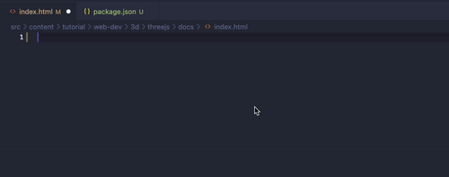
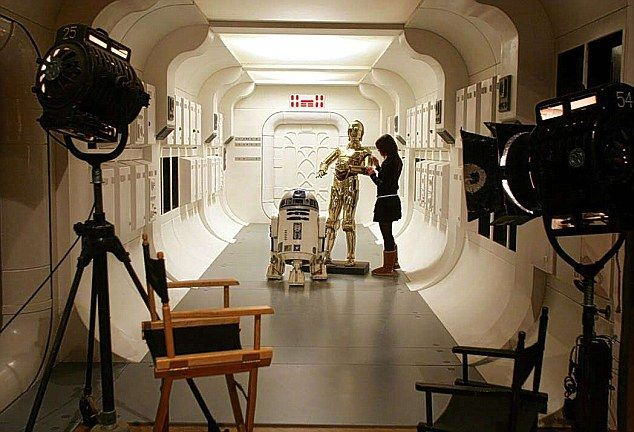
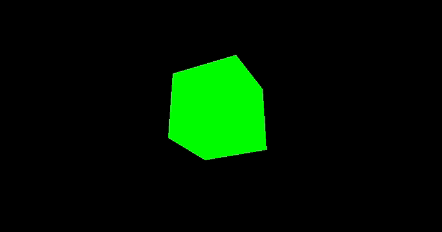

# Intro to 3D Web Dev [Three.js]

```table-of-contents

* [Overview](#overview)
    1. [Background](#background)
    2. [Prerequisites](#prerequisites)
* [Getting Started](#getting-started)
    1. [Concepts](#concepts)
    2. [Boilerplate code](#boilerplate-code)
```

## Overview

In my opinion, 3-dimensional visualization is one of the cooler things you can do in the web - but it's much more different than traditional web development. In this tutorial, we'll go over the basics of 3D web development using Three.js - a Javascript library built for making 3d visualizations with WebGL in the browser.

### Background

I mentioned that Three.js uses WebGL, but what is WebGL? This is the code for a Fragment Shader:

```html
<script id="vertex-shader" type="x-shader/x-vertex">
    attribute vec2 aVertexPosition;

    uniform vec2 uScalingFactor;
    uniform vec2 uRotationVector;

    void main() {
      vec2 rotatedPosition = vec2(
        aVertexPosition.x * uRotationVector.y +
              aVertexPosition.y * uRotationVector.x,
        aVertexPosition.y * uRotationVector.y -
              aVertexPosition.x * uRotationVector.x
      );

      gl_Position = vec4(rotatedPosition * uScalingFactor, 0.0, 1.0);
    }
</script>
```

Pretty scary imo. Essentially, WebGL is a built-in Javascript API that allows you to utilize the GPU and render 3D graphics efficiently in the browser, but it's not very easy to learn. Luckily, some developers have created Three.js - a library that utilizes WebGL under the hood but exposes a much more user-friendly API for developers to use. If you end up really going off the deep end in 3D web dev, the Three.js library probably won't cover all of your use cases and you'll have to dive into WebGL directly. If you're just starting out, however, Three.js is a perfect start.

### Prerequisites

-   basic web dev
-   Intermediate Javascript
-   Programming fundamentals (loops, conditionals, functions, etc.)

Notice, there's pretty much no need to know any HTML or CSS - it's almost all programatically done with Javascript. Although you can integrate HTML and CSS overlays/popups (and likely will later on) into your 3D project, it's not the main part of 3d stuff in the web.

## Getting Started

### Concepts

All 3D development follows these basic concepts (Game engines like Unity and Unreal Engine also follow these concepts): To render our world in 3D, we need 3 main things: a `scene`, a `camera`, and a `renderer`.

Think about how you, as a human, perceive the 3-dimensional world around you. The entire world is the scene, your eyes are the camera, and the way your brain takes in light from the eye and creates a picture is the renderer.

There are other parts as well - like lights and textures - but we'll cover them later. For now, let's just focus on the scene, camera, and renderer.

### Setting up

To set up our development environment, we're going to need the following:

-   a browser (preferably chrome or firefox)
-   a code editor (I'll be using vscode)
-   and [have node/npm installed](https://docs.npmjs.com/downloading-and-installing-node-js-and-npm)

With the above, we can create a quick npm project somewhere on our computer by creating a folder, and typing this command in our terminal in the root directory of the folder we just created `npm init -y`.

As an example on my mac, I did:

```bash terminal
$ pwd
/Users/ryqndev/Desktop

$ mkdir threejs-test
$ cd threejs-test
$ pwd
/Users/ryqndev/Desktop/threejs-test

$ npm init -y
Wrote to /Users/ryqndev/Desktop/package.json:

{
  "name": "threejs-test",
  "version": "1.0.0",
  "description": "",
  "main": "index.js",
  "scripts": {
    "test": "echo \"Error: no test specified\" && exit 1"
  },
  "keywords": [],
  "author": "",
  "license": "ISC"
}

```

What did I do above? I used `pwd` (print working directory) to show where I am in my filesystem on my computer in the terminal. It shows me I'm currently on my desktop. I then `mkdir` (make directory) - create a folder on my desktop - named "threejs-test". I `cd` (change directory) into the folder I just created and run my `npm init -y` command to automatically generate the boilerplate package.json.

With this, I can now run, `npm install vite three`. This will allow me install both vite and three.js and NPM will automatically configure all the downloading, linking, dev server, etc. EVERYTHING for us.

Every website starts with an HTML file - so let's create one. We'll create an html file called `index.html` and type `!` to automatically generate our boilerplate HTML using an emmett tag.



Finally, we add one more line to the generated package.json in the scripts section:

```json package.json
    //...
    "scripts": {
        "test": "echo \"Error: no test specified\" && exit 1",
        "start": "vite"
    },
    //...
```

Now, in the terminal, we should be able to type `npm start` to run our entire dev server and you should be able to navigate to `localhost:5173` in the browser and see a blank screen.

At this stage, your file structure should mostly look like this:

```file-json
{
  "name": "threejs-test",
  "contents": [
    { "name": "node_modules", "contents": [] },
    { "name": "index.html", "type": "html" },
    { "name": "package.json", "type": "json" },
    { "name": "package-lock.json", "type": "json" }  ]
}
```

### Starting our Javascript

Compared to traditional web development, we won't actually be working with that much HTML or CSS. In a full fleshed out project, you'll likely want to incorporate _some_ HTML/CSS but for the 3d/interactive portion of your website, you'll be working almost exclusively in Javascript.

With that in mind, let's go ahead and setup our Javascript and test that our vite setup is all working as intended.

We'll create a javascript file in our folder, link it in our HTML, and then go ahead and try printing out the Three.js library in its entirety.

```html index.html
<!DOCTYPE html>
<html lang="en">
    <head>
        <meta charset="UTF-8" />
        <meta name="viewport" content="width=device-width, initial-scale=1.0" />
        <title>Document</title>
        <script type="module" src="./script.js"></script>
    </head>
    <body></body>
</html>
```

```js script.js
// import ALL modules under this library into a variable called three.
// this means you can access them by doing `THREE.Scene` or `THREE.Camera`
import * as THREE from "three";

// similarly, you could also import specific modules you want by doing something like:
// import { scene, camera } from 'three';

console.log(THREE);
```

### Starting Three

Now to the fun part! tbh - the setup process for _any_ coding project usually takes the longest and is the most furstrating part so don't feel discouraged if you're running into a ton of issues now - it'll be more striaghtforward from here on .... anyways, as I mentioned earlier, every three.js project has a couple required elements: a scene, a camera, and a renderer.



Take a look at the above movie set (I had to do something star wars related :)) - in every film set, there's at least one camera: the camera in our app will be where the user is positioned within a 3d space. I.e. by controlling the camera, we can control what a user sees at any given time, and from what direction, etc. Similarly, all of the filming usually takes place inside a soundstage or maybe even in nature. That area is what we call a _scene_. In our scene, we can place object, draw landscapes, and essentially is the thing we decorate to give our users something pretty to look at.

Lastly, the entire job of the renderer is to transform what the camera is seeing into a 2d picture that we place onto our _canvas_ in the HTML.

Let's go ahead and replace our `script.js` with the following:

```js script.js
import * as THREE from "three";

const scene = new THREE.Scene();
const camera = new THREE.PerspectiveCamera(
    75,
    window.innerWidth / window.innerHeight,
    0.1,
    1000
);

const renderer = new THREE.WebGLRenderer();
renderer.setSize(window.innerWidth, window.innerHeight);
document.body.appendChild(renderer.domElement);

const geometry = new THREE.BoxGeometry(1, 1, 1);
const material = new THREE.MeshBasicMaterial({ color: 0x00ff00 });
const cube = new THREE.Mesh(geometry, material);
scene.add(cube);

camera.position.z = 5;

function animate() {
    requestAnimationFrame(animate);

    cube.rotation.x += 0.01;
    cube.rotation.y += 0.01;

    renderer.render(scene, camera);
}

animate();
```

Put it all together and we should get something that looks like this:


