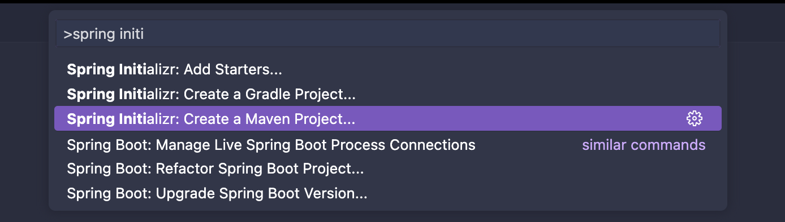
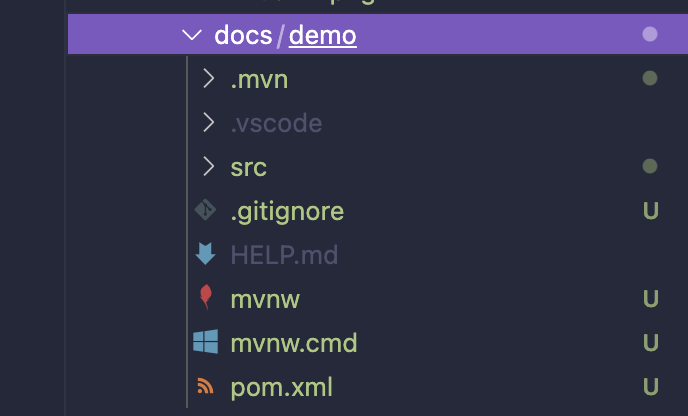
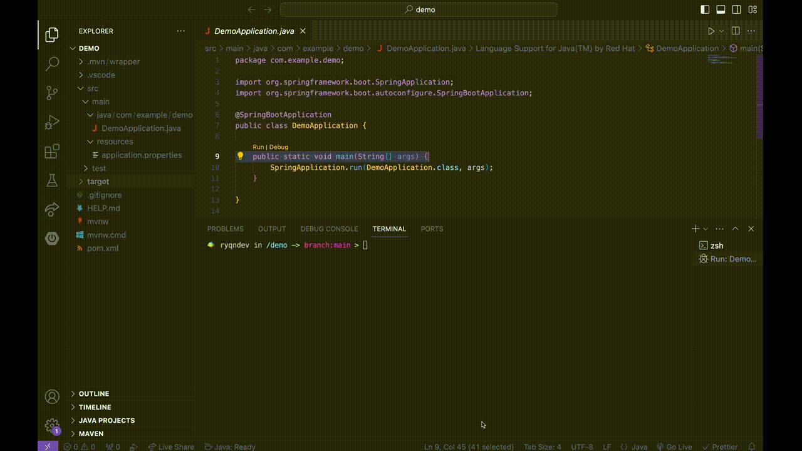
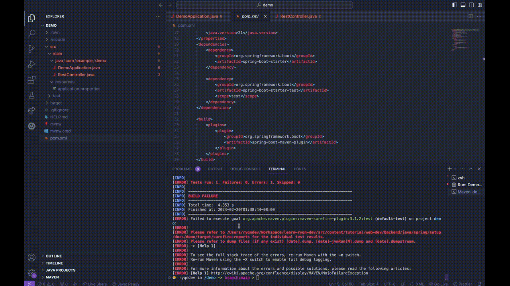
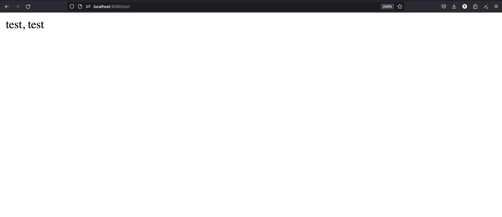

# Java Backend [Spring]: Setup

```table-of-contents

* [Overview](#overview)
* [Setup](#setup)
    1. [Prerequisites](#prerequisites)
    2. [Create project](#create-project)
    3. [Running your project](#running-your-project)
    4. [Add a route](#add-a-route)
    5. [Add a dependency](#add-a-dependency)
* [Finish](#finish)

```

## Overview

In this series, we'll explore how we can spin up a backend in Java using the Spring framework. As of 2024, [Spring Boot](https://spring.io/projects/spring-boot) is still the most popular web server framework for Java. It's a very well established framework and supports a variety of different architectures but first, we'll be going over how to create a basic REST API.

## Setup

Since I use VSCode for everything, I'll be showing the setup in VSCode but if you're able to find a tutorial for your preferred IDE, I would recommend following that. The steps I've outlined here follow this wonderful documentation from the [official VSCode docs](https://code.visualstudio.com/docs/java/java-spring-boot).

### Prerequisites

We need to setup our dev environment to be able to work with Spring Boot. Ensure that you have Java installed ([JDK](https://www.microsoft.com/openjdk)) and then you'll want to install the following extensions in VSCode:

-   [Extension Pack for Java](https://marketplace.visualstudio.com/items?itemName=vscjava.vscode-java-pack)
-   [Spring Boot Extension Pack](https://marketplace.visualstudio.com/items?itemName=vmware.vscode-boot-dev-pack)

### Create project

Now that you have the extensions installed, you should be able to open up the command palatte (Command + Shift + P on Mac), type in `Spring Initializr: Create a Maven Project`, and select the option from the dropdown.



You'll have to go through the guide steps but you can select the first option for all of them if you're unsure. The one thing you need to make sure here is that the version of Java you select (either 17 or 21) should match the JDK version you have installed. Once you're done, you should be able to see all the files that have been generated in your project - which looks something like this:



### Running your project

To run our project, all we need to do is open up the file that our main function is in. You should be able to find it in `/src/main/java/com/example/demo/DemoApplication.java` (if you selected the default option during the initializer wizard). Then, click the run button and you should see the program run immediately.



You should then be able to navigate to `http://localhost:8080` and see an error - but something!

### Add a dependency

Before we can create our first route, we'll need to install some dependencies needed for the next part. All we have to do here is right click on our `pom.xml` file, select `Add Starters...`, and we'll install the Spring Web dependency.



### Add a route

To add a route, we'll have to create a new class that's annotated with a `RestController`. To do so, we'll create a new file called `TestController.java` in the same folder as our main and copy the following into it:

```java TestController.java
package com.example.demo;

import org.springframework.web.bind.annotation.GetMapping;
import org.springframework.web.bind.annotation.RestController;

@RestController
public class TestController {

    @GetMapping("/test")
    public String greeting() {
        return "test, test";
    }
}

```

## Finish

Now, when you rerun your project, you should be able to navigate to `http://localhost:8080/test` and see the same thing below:


