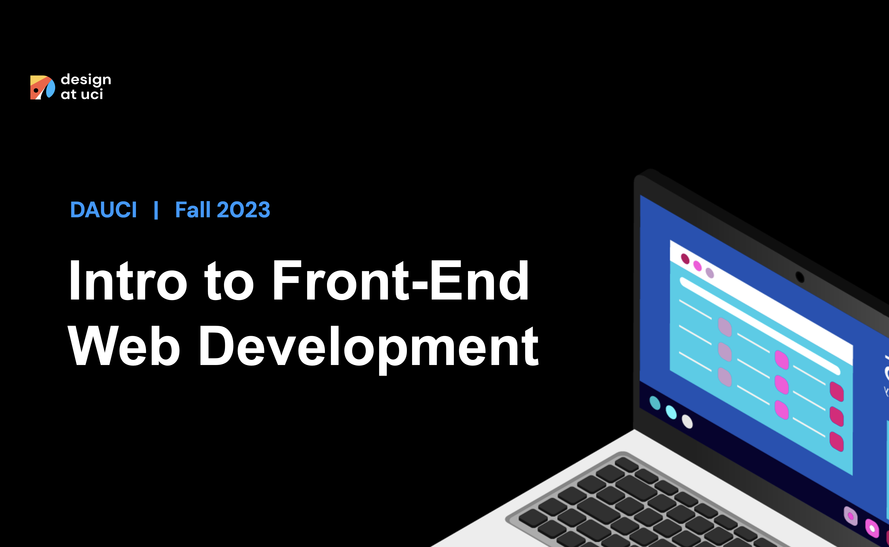
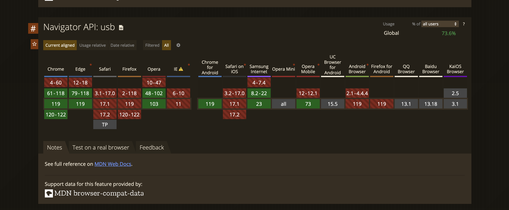
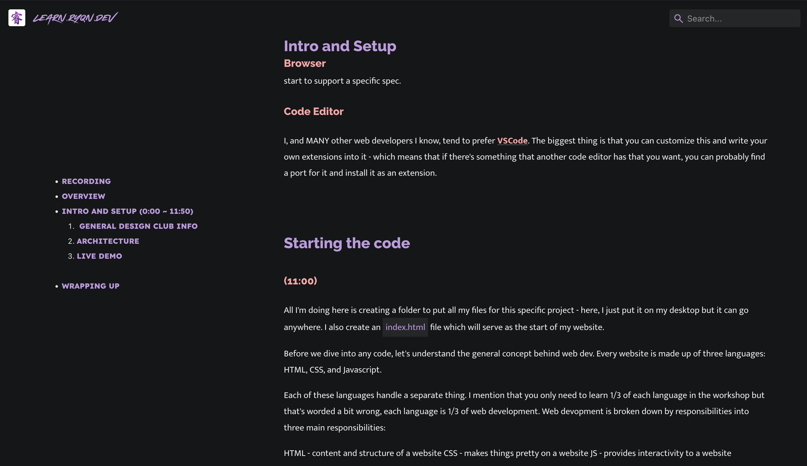
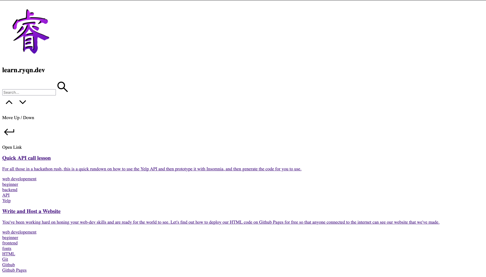

# Design at UCI Fall 2023: Intro to Frontend Development



```table-of-contents

* [Recording](#recording)
* [Overview](#overview)
* [Intro and Setup](#intro-and-setup)
    1. [Web XR/VR](#web-xr/vr)
    2. [Some 3D Stuff](#some-3d-stuff)
    3. [Other cool design examples](#other-cool-design-examples)
    4. [Setup](#setup)
    5. [Browser](#browser)
    6. [Code Editor](#code-editor)
* [Starting the Code](#starting-the-code)
    1. [With HTML/CSS/JS](#with-html/css/js)
    2. [Just HTML](#just-html)
    3. [HTML/CSS, no JS](#html/css-no-js)
    4. [HTML and JS, no CSS](#html-and-js-no-css)
    5. [Resources](#resources)
* [Making an API call](#making-an-api-call)
* [What is web development?](#what-is-web-development)
* [Other Resources](#other-resources)
```

## Recording

```video
https://www.youtube-nocookie.com/embed/Uf4Q-rGX1jY
```

## Overview

Welcome to the first software focused workshop for Design at UCI for the 2023 school year! Here, we'll be exploring some of the basics of web developement fundamentals and seeing how everything connects. This workshop is a slightly adapted version of the original web dev tutorial https://learn.ryqn.dev/article/intro-to-web-dev, and rather than just building a simple click counter, we'll make an API call as well to render some data coming from an outside 3rd party data source. At the very end, we should have learned the basic fundamentals of web development, and have written a web app that will display COVID-19 stats.

### Following along

This write up is meant to supplement the recording of the workshop to help hone main concepts and add in stuff that I may have missed the first time around - so, the various sections I've chosen to break up the recording will be listed with the relevant timestamps.

## Intro and Setup

### (0:00)

> Brutal joke I read in chat at 1:04 that was something along the lines of "not the first time Fire Nation destroyed the Earth Kingdom"

The first 5 or so minutes is just general information for the club and other logicstical stuff so it's completely skippable. The real content starts at around (5:28).

I start off by talking about some different applications of web technology to show off what's possible:

### Web XR/VR

Found a random article showing how to do a basic web xr using a library called a-frame: [https://medium.com/@mattnutsch/tutorial-how-to-make-webxr-games-with-a-frame-eedd98613a88](https://medium.com/@mattnutsch/tutorial-how-to-make-webxr-games-with-a-frame-eedd98613a88)


Image source: the article linked above.

Not the biggest expert on this (..yet), but definitely seems to be promising. The main thing I want to showcase here is that you can literally apply any new and exciting technology to the web.

### Some 3D Stuff

I personally believe 3D web stuff is the future of web tech and we'll start to see a TON of things integrating with it (namely, you can also use it in conjunction with WebXR/AR as mentioned above).

Some examples:

> [https://ryqn.dev](https://ryqn.dev) - My personal website lmaoooo. It uses a [React](https://react.dev/) port of [Three.js](https://threejs.org/) called [react-three-fiber](https://docs.pmnd.rs/react-three-fiber/getting-started/introduction) to render a fun 3d model of Aldrich Park in UCI based on some beautiful concept art by [Ryan Hartanto](https://ryanhartanto.com/) under Hack at UCI (with their permission of course).

> [https://vr.ff.com/us/](https://vr.ff.com/us/) - This is the sample web app I show during the workshop of the 3d car. It's super fun to play around with and fairly straightforward but hopefully goes to show _where_ we can go.

### Other cool design examples

I usually like looking at [https://www.awwwards.com/](https://www.awwwards.com/) to look at some new innovative web designs. Take a look here and see if there's anything of interest to you - this is the site where I realized the web has SO much that's possible.

### Setup

Ok, enough of the selling - time to get into the code. How do we get started?

We only need two things to start developing: a browser, and a code editor.

### Browser

For a browser, I would recommend either Chrome or Firefox (sorry Safari users) - or atleast any chromium based browser (Edge - the new one, Brave, etc). One thing to note here is that in web dev, people can use any browser they would like so you would actually want to install _all_ the browsers and make sure your website works on all of them. It's a bit weird but realize that every single web browser has their own web rendering engine so your code on one browser might not work on another (this is probably the worst part of web development).

A good tool to use to see if browsers support a certain functionality is to use [https://caniuse.com/](https://caniuse.com/). Let's look at an example:

Let's say there's a brand new experimental technology called the WebUSB API (as of November 2023, this is actually still in experimental phase). We can look at the caniuse tables to see this



And you'll immediately see the breakdown of various browsers that exist (who knew there were this many!) and which versions start to support a specific spec.

### Code Editor

I, and MANY other web developers I know, tend to prefer [VSCode](https://code.visualstudio.com/). The biggest thing is that you can customize this and write your own extensions into it - which means that if there's something that another code editor has that you want, you can probably find a port for it and install it as an extension.

## Starting the code

### (11:00)

All I'm doing here is creating a folder to put all my files for this specific project - here, I just put it on my desktop but it can go anywhere. I also create an `index.html` file which will serve as the start of my website.

Before we dive into any code, let's understand the general concept behind web dev. Every website is made up of three languages: HTML, CSS, and Javascript.

Each of these languages handle a separate thing. I mention that you only need to learn 1/3 of each language in the workshop but that's worded a bit wrong, each language is 1/3 of web development. Web devopment is broken down by responsibilities into three main responsibilities:

HTML - content and structure of a website
CSS - makes things pretty on a website
JS - provides interactivity to a website

To understand this better, let's imagine what this current website looks like when it's missing any of these things.

Without HTML, there is no website. HTML has all the content and the structure of the website so it's actually more helpful to see what the website looks like without CSS or JS.

### With HTML/CSS/JS



> by the way, this is suuuper meta. I'm attaching screenshots of the article I'm writing as I'm writing it 🤯

### Just HTML



> you ever go on a website and for some reason it's just white background with black text that seems relatively similar to the website you meant to go on? That's because, for whatever reason, something broke when your browser was trying to fetch the CSS files for the website and only got the HTML. Could happen for a variety of reasons but most likely is the internet connection died after it got the HTML, and before it got the CSS.

### HTML/CSS, no JS

This one is hard to see so I'm not going to attach a screenshot but it'll look the same at first glance, but when you try to click on the search bar or do anything interactive, nothing will happen. This site isn't the _most_ JS heavy (since it's mostly just a content-based website) but if you look at an e-commerce site or a social media site, interactions like adding to a cart or liking a post won't work. However, you would be able to navigate to another page and view videos (since these are actually base interactions that can be handled natively by HTML)

### HTML and JS, no CSS

This one is just weird. All of the parts of the websites will still "work" but it just won't look pretty. If you click the like button on a website, you'll see the like counter go up by a number but there won't be any pretty visuals and it's unlikely that you'll see the fact that the post was "liked".

### Resources

Again, most of these intro concepts are covered in [my intro to web dev article](../../../article/intro-to-web-dev).

## Making an API call

### (45.00)

This one is probably the hardest part to fully understand but the general gist of it is: we are going to query someone else's database for their data to render onto our website. This is especially common when you want to make an application that integrates with another company's data. For example, let's say you wanted to make an app that would play a random song from someone's spotify playlist and make them guess which song it is (btw, Spotify's terms and conditions specifically **forbids** making any kind of game with their API - i know, it sucks, but this is just an example). There's no way for you create an entire song database or get a users spotify playlists without integrating with their API.

In this case, we're integrating with an API that aggregates COVID stats. (I don't know how relevant this article will be 5 years from now) What we do here is use a built-in javascript function called [fetch](https://developer.mozilla.org/en-US/docs/Web/API/Fetch_API/Using_Fetch).

Essentially, what the Fetch API does is it "fetches" data from another website. In this case, "another website" means a website that serves pure data (known as JSON). Traditionally, when you go on a website, you're getting their `.html` file, but the internet is not limited to only sending one file type. In fact, in most website, we're sending multiple different file types: `.html`, `.css`, `.js`, any media formats (`.png`, `.jpeg`, `.mp4`), and raw data formats (`.csv`, `.json`).

Most API's will return data in a JSON format - which is a key value store. In Python, it's known as a dictionary; in C++/Java, it's usually called a map. It's a semi-structured data format that allows someone to send over data in an arbitrary, yet structured form that allows anyone to parse the data, but keeps it dynamic for any use case.

## What is web development?

After going through this exercise, I think it makes sense to describe what the job of a web developer is (a.k.a frontend developer): our job is to transform raw data into intuitive, visual components. In our covid stats app, you see that we get this gigantic raw string of data into an interactive, visual component ... and that's all web development really is. Whatever your preferred medium, whether that be just basic HTML card components or beautiful interactive charts, or 3D rendering, etc; your job is to utilize that medium to convey raw data in an organized way.

Hopefully you found this interesting and if you have any questions, other topics of interest you want to learn, please connect with me on any of my socials on my [website](https://ryqn.dev) to let me know and I'd be more than happy to help!

## Other Resources

As I mentioned, despite doing this same intro to web dev workshop over and over again, I like to try my best to keep this diverse and as up to date as possible. So I've linked below a couple other times I've done this workshop and (remembered to) record[ed] them.

> [Hack at UCI 2023](../hack-at-uci-2023) A full frontend + backend workshop that goes through how you can set up both a frontend, and a backend server, and then connect them all together for a full-stack web app. Note that there's like a billion different permutations of technologies that you can choose to use that all do the exact same thing, or some variant and so this specific setup is a HTML/CSS/JS frontend and a Python (Flask) REST web server that calls a Yelp API and connects end to end.

> [Zothacks 2023](../zothacks-web-dev-2023) A frontend based app that calls a recipe backend. Essentially makes an app that allows users to input what ingredients/dietary restrictions they have and sends it to an API. After getting the data back, it will display the list of recipes to the user.
