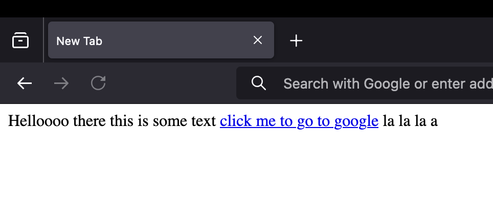
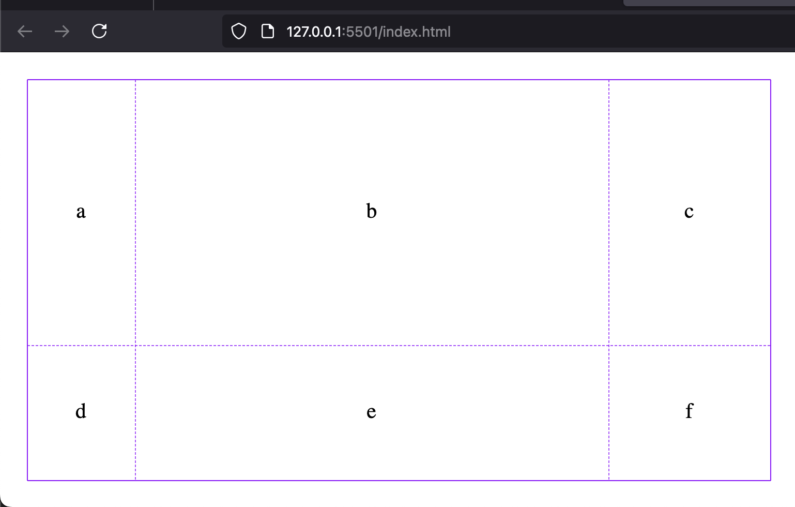
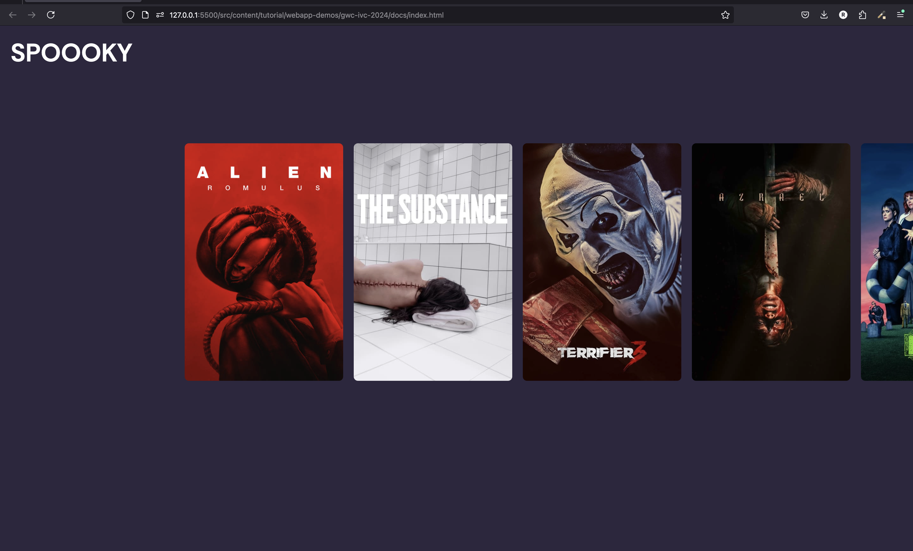
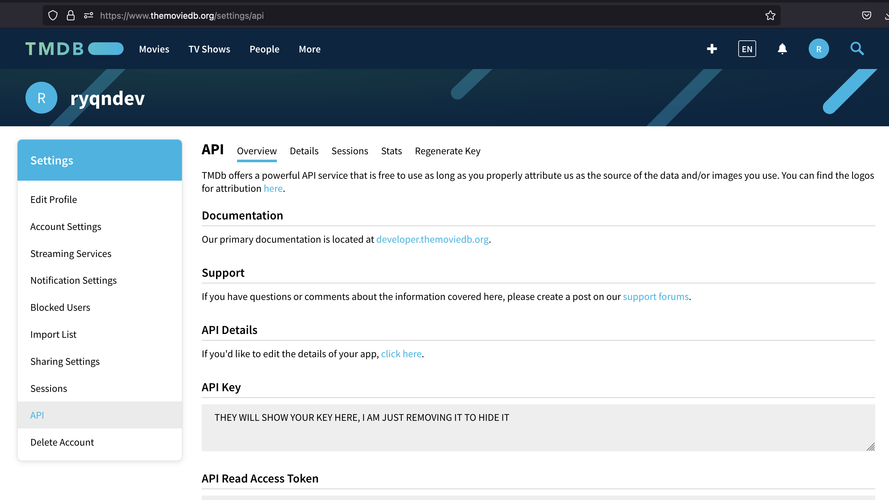

# Intro to Web Developement [Halloween Edition]

```table-of-contents

* [Overview](#overview)
* [Basics](#basics)
    1. [HTML](#html)
    2. [CSS](#css)
    3. [CSS for positioning](#css-for-positioning)
    4. [Javascript](#js)
* [Build our spooky app](#build-our-spooky-app)
    1. [Design](#design)
    2. [Finished Code](#finished-code)
* [Browsers](#browsers)
* [References](#references)

```

> You can find all the [source code for this app here](https://github.com/ryqndev/learn-ryqn-dev/tree/20242740ba79679e70eb14da7c7cdc208f8c125a/src/content/tutorial/webapp-demos/gwc-ivc-2024/docs). It's fully commented to help you understand how each line works.

## What you need

Requirements:

-   Computer (doesn't matter mac/windows/linux/etc.)
-   text editor (prefer a code editor like [VSCode](https://code.visualstudio.com/))

How dope is that? you literally only need a computer and a code editor. The reason why is because in web development, we run/test all of our code in the browser which comes default on every personal computer. In fact, you could probably even use a phone for this (super not recommended though.. do it for the memes)

Soft requirements:

For your IDE (Integrated Developer Environment, aka code editor), would highly recommend VSCode. This is (as of 2024) the industry standard and I'd estimate 90% of web developers in silicon valley use it. I've seen others: webstorm, vi/vim but would say [VSCode](https://code.visualstudio.com/) is probably your choice to start off with.

For browsers, would prefer if you had [chrome](https://www.google.com/chrome/)/[firefox](https://www.mozilla.org/en-US/firefox/) (tbh chrome _probably_ better). This is for three main reasons: 1. they have the best developer environment, 2. they have the largest market share (safari is important to test on but their dev ex is not the best) and 3. they have the most support for common web standards.

You can read the [browsers](#browsers) section down below for more information.

## Overview

This workshop is geared for folks who are interested in web development (...or even those not interested tbh...) and have little to no experience in this field. Ideally, having taken one or two coding classes may help you pick up the Javascript portion of this but it's doesn't mean it's impossible or anything. What we're gonna do is go over the basic concepts behind each web development language, and use these to build a quick halloween themed application.

## Basics

Phew. Ok let's get started. All web development is done in three language: HTML, CSS, and Javascript (JS). Now, before you get too spooked (no pun intended), it's not really three entire languages you have to learn... each language is like 1/3 of the entire "web development language" and this actually makes things easier. If you take nothing away from this entire workshop, I'd want you to at least remember these quick one line zingers I use:

1. HTML denotes the content and structure of a website.
2. CSS makes things pretty
3. JS provides interactivity to the webpage

That's it. Knowing these will let you know exactly which languages you need to work in to get the job done.

I have a slightly condensed version below but it's probably better to read [this instead](https://learn.ryqn.dev/article/intro-to-web-dev/)

### HTML

Once again, HTML (HyperText Markup Language) denotes the content and structure of a website. What does this mean? Essentially, you can think of HTML as a sort of glorified PDF or word document. When I say that HTML denotes the content, that means that whatever we put on the HTML, will show up on the website.

```html index.html
Helloooo there this is some text
<a href="www.google.com">click me to go to google</a>
la la la a
```

It will look like this:


I also mentioned that HTML denotes the structure - notice how the text shows up in the exact order as I put in the code. Similarly, only the content I put between the `<a>` anchor tags (what we use to make a link clickable) has the blue highlight and can be clicked.

With these tags and the ability to place content before, after, and inside, we are able to structure every website design in the world.

### CSS

Of the three web development languages, CSS (Cascading Style Sheets) is the easiest to learn but arguably one of the hardest to master. Remember how I said CSS makes things pretty? All CSS does is that it allows users to change individual styling properties of every item on a webpage. An example of a property here could be the color of the text, or the size of the text, or a border - whether it's a dashed/solid/dotted border, etc.. and the syntax is _really_ simple. Each CSS block is split into two parts: a _selector_ and a set of _rules_. Each rule can also be broken down into two parts: a _property_ and a _value_. Let's see it in action:

```css styles.css
/**
 * All CSS blocks bollow this format:
 *
 * <selector> {
 *      <property1>: <value1>;
 *      <property2>: <value2>;
 * }
 *
 * some examples:
 */

body {
    margin: 0;
    background-color: black;
    color: white;
}

button {
    padding: 20px;
    border-width: 1px;
    border-style: solid;
    border-color: black;
    border-radius: 8px;
}

.large-button {
    padding: 80px;
}
```

### CSS for positioning

CSS is used to position items as well as style them. Although you might think, "hey, I thought HTML was supposed to denote structure". Well yes, but HTML only really says what goes first, second, etc. - CSS is what you use to decide if it should be a 1 or 2 column format or maybe a scrollable 1 dimensional list for example. A common practice is to use CSS Flexbox for 1-dimensional positining (think navbars) and CSS Grid for 2D placement (think grid formats) - although personally, I tend to prefer using CSS Grid for all of my positioning.

You should use a dedicated CSS Grid tutorial to learn how to use it but just as an example:

```html grid example (index.html)
<div class="parent-container">
    <div>a</div>
    <div>b</div>
    <div>c</div>
    <div>d</div>
    <div>e</div>
    <div>f</div>
</div>
```

```css grid example (styles.css)
.parent-container {
    height: 100vh;
    width: 100vw;

    box-sizing: border-box;
    padding: 20px;

    display: grid;
    grid-template-columns: 80px 1fr 120px;
    grid-template-rows: 1fr 100px;
}

/* this selector just means every div that's a direct descendent of the .parent-container class */
.parent-container > div {
    display: grid;
    place-content: center; /* grid allows you to perfectly center items. this is for the letters */
}
```

which results in:



### JS

Javascript provides interactivity for our website. It's event driven - meaning that it's usually executed in response to some sort of event (user mouse click, website finishes loading, user hovers over something, etc.). It's capable of interacting with the HTML itself -> dynamicallly adding and removing HTML elements -> and can pull information from the website (user types into an text input, for example).

## Build our spooky app

Now, let's put all of these together to see what it looks like to build a quick web app.

### Design

This isn't part of the coding process but normally you'd want to have some designs prepared - maybe sketch out on a piece of paper or prototype on some design software like Figma.

> I kinda cheated this part, I made the app first and am just screenshotting the finished product BUT IMAGINE A DESIGNER DESIGNED THIS IN FIGMA AND SEND THIS TO US.

Our home page is gonna just be a list of horror movies:


and when you click on one of them, you'll get this popup to help read more about it to see if you're interested


### Finished Code

The most important thing here if you want to copy and paste and try running it is to add a `keys.js` file and add the following:

```js keys.js
let authorizationCode = "PUT UR CODE HERE";
```

where you can find your API key in your dashboard of the TMDB website: https://www.themoviedb.org/settings/api which looks like this once you create a free account:



OR... if you're too lazy to do that, you can just uncomment line 25 in the script.js file and and comment out lines 18-23 which will swap out the API call with a hardcoded response that I saved from making the call earlier.

> Note: This implementation relies on using an API which you can find a quick tutorial on how I make this [with the Yelp API here](https://learn.ryqn.dev/article/intro-to-web-dev/). You'd swap this out with the [TMDB API](https://developer.themoviedb.org/docs/getting-started).

```file-json
{
  "name": "spoopy-app",
  "contents": [
    { "name": "index.html", "type": "html" },
    { "name": "styles.css", "type": "css" },
    { "name": "script.js", "type": "js" },
    { "name": "keys.js", "type": "js" }
  ]
}
```

```html index.html
<!DOCTYPE html>
<html lang="en">
    <head>
        <meta charset="UTF-8" />
        <meta name="viewport" content="width=device-width, initial-scale=1.0" />

        <title>Spoooky</title>

        <!-- import your CSS file -->
        <link rel="stylesheet" type="text/css" href="./styles.css" />

        <link rel="preconnect" href="https://fonts.googleapis.com" />
        <link rel="preconnect" href="https://fonts.gstatic.com" crossorigin />
        <link
            href="https://fonts.googleapis.com/css2?family=Rethink+Sans:ital,wght@0,400..800;1,400..800&display=swap"
            rel="stylesheet"
        />

        <!-- import your JS file -->
        <script src="./keys.js"></script>
        <script src="./SAMPLE_RESPONSE.js"></script>
        <script src="./script.js"></script>
    </head>
    <body onload="getMovies()">
        <nav>SPOOOKY</nav>
        <div class="container">
            <div id="movie-list"></div>
        </div>
    </body>
</html>
```

```css styles.css
html,
body {
    padding: 0;
    margin: 0;
    background-color: #2d273e;
    color: white;

    font-family: "Rethink Sans", sans-serif;

    height: 100vh;
}

button {
    background-color: transparent;
    border: none;
    cursor: pointer;
}

#movie-list {
    height: 100vh;
    width: 100vw;
    box-sizing: border-box;
    padding: 0 20vw;

    /* makes it horizontally scrollable if the content is larger than the parent container */
    overflow-x: scroll;
    display: grid;
    grid-auto-flow: column;
    gap: 20px;
}

.movie-list-item {
    display: grid;
    place-self: center;
    grid-template-rows: 1fr 100px;
    height: min-content;
    width: 300px;
}

nav {
    position: fixed;
    top: 0;
    padding: 20px;
    font-size: 3em;
    font-weight: bold;
}

.movie-list-item h2 {
    font-size: 1em;
    color: #f3ddb8;
    text-align: center;
}

.movie-list-item img {
    display: grid;
    place-self: center;
    max-width: 300px;

    border-radius: 8px;
}

dialog {
    height: 100vh;
    width: 100vw;
    background-position: center;
    background-size: cover;
}

.modal {
    display: grid;
    box-sizing: border-box;
    height: 100%;
    grid-template-columns: 1fr 1fr;
    padding: 40px;
    background-color: #000000ae;
    place-content: center;
}

.modal img {
    border: 1px solid #f3ddb8;
    place-self: center;
    border-radius: 4px;
}

.modal .description {
    max-width: 600px;
    place-self: center;
    color: #f3ddb8;
}

.modal h1 {
    font-size: 3em;
    line-height: 1em;
}

.modal p {
    font-size: 1.2em;
}
```

```js script.js
/**
 * This function will make an API call to the TMDB api and return
 * a list of movies for us. After we get the data, we will call the
 * displayMovieRecommendations function and pass in the returned
 * movie data
 */
function getMovies() {
    const options = {
        headers: {
            // authorizationCode is a variable I set in the keys.js file
            // which isn't public on github because it has my private API key
            Authorization: authorizationCode,
        },
    };

    // fetch is a function built into javascript that allows us to
    // "fetch" a resource from somewhere else online. In this case,
    // we're hitting the TMDB (themoviedb.org) API to get a list
    // of horror movies
    fetch(
        "https://api.themoviedb.org/3/discover/movie?include_adult=false&include_video=false&language=en-US&page=1&sort_by=popularity.desc&with_genres=27",
        options
    )
        .then(parseResponseAsJSON)
        .then(displayMovieRecommendations);

    // displayMovieRecommendations(SAMPLE_RESPONSE);
}

/**
 * this just converts the data from string into a json format
 */
function parseResponseAsJSON(response) {
    return response.json();
}

/**
 * this takes the returned movie data and loops through the movies
 * and injects html code into our website
 */
function displayMovieRecommendations(jsonResponse) {
    // The API returned data is formatted where our movie data array can be
    // found in the results portion of the object
    let movieList = jsonResponse.results;

    // For loop that will loop through the movies in our movie list that we
    // get from the movie api
    for (let i = 0; i < movieList.length; i++) {
        // create an object referencing each movie object
        let movie = movieList[i];

        // We can create HTML in multiple ways and we'll see two of them here.
        // The first way is to use JS functions like document.createElement
        let movieButton = document.createElement("button");
        movieButton.className = "movie-list-item";
        movieButton.id = `m-${movie.id}`;

        // the other way is to just set the innerHTML value and set it equal to the HTML code
        // we want it to be. there are tradeoffs to each
        movieButton.innerHTML = ``;

        // when someone clicks the movie
        movieButton.addEventListener("click", function () {
            openMovieDetailPopup(movie);
        });

        // finally add the generated DOM element (a.k.a. HTML element) into our website
        document.getElementById("movie-list").appendChild(movieButton);
    }
}

/**
 * This is the function that actually generates the popup by using the same
 * methods as above with appending html elements to our DOM (website). We style
 * the dialog to be as big as the screen using CSS
 */
function openMovieDetailPopup(movie) {
    let modal = document.createElement("dialog");
    modal.style.backgroundImage = `url("https://image.tmdb.org/t/p/original/${movie.backdrop_path}")`;
    modal.innerHTML = `
        <div class="modal">
            <div class="description">
                <h1>${movie.title} (${movie.release_date.substring(0, 4)})</h1>
                <p>${movie.overview}</p>
            </div>
            
        <div>
    `;
    modal.addEventListener("click", function () {
        modal.close();
    });
    document.body.appendChild(modal);

    // showModal() and .close() are functions built into the
    // HTML dialog component.
    // documentation here: https://developer.mozilla.org/en-US/docs/Web/HTML/Element/dialog
    modal.showModal();
}
```

## Browsers

(I added this portion earlier but idr a good place to put it so i'm just leaving it here oops...)

Browsers are lowk one of the bigger pain points of web development. There are like 3 main browsers out there (chrome/firefox/safari) and quite literally, they each have a different rendering engine. What that means is your code can actually run differently if your users have different browsers. Not only that, different browsers have different version and are even different on different devices (yikes!!).

Firefox/Chrome on an iOS device is actually running the same rendering engine as Safari which means that you're actually abiding by Safari limitations. Some browsers like Arc and Brave have some market share but they all use the webkit based rendering engine underneach -> which is known as Chromium and is thus similar to Chrome. There's so much extra information on this that I could probably write up an entire article on this but until you start writing production level applications, you can ignore this part for now.

## References

[Using custom fonts](https://learn.ryqn.dev/article/how-to-use-fonts)
How to find free fonts, import them, and use them in your website.

[Basic Javascript events](https://learn.ryqn.dev/tutorial/web-dev/frontend/fundamentals/events)
Listening to button clicks, getting user text inputs, getting keyboard events

[Quick API call lesson](https://learn.ryqn.dev/article/quick-api-call-lesson)
I reference this article earlier but to recap, it teaches you how I ended with the code for that fetch call to get data from an online resource like an API.

[Host your website](https://learn.ryqn.dev/article/write-and-host-a-website)
Once you're done with your website, learn how to put it online for everyone to see for free!
