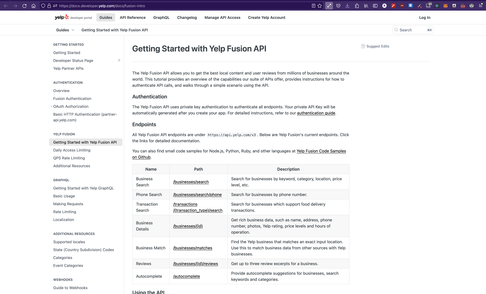

# Hack at UCI 2023: Intro to Product Design and Web Dev

```table-of-contents

* [Overview](#overview)
* [Why wouldn't you want an Web App?](#why-wouldnt-you-want-a-web-app)
* [Ideation](#ideation)
    1. [Data Sources](#data-sources)
    2. [Architecture](#architecture)
    3. [Live Demo](#live-demo)
* [Wrapping Up](#wrapping-up)
```

## Overview

Welcome to Hack at UCI 2023! The general, overarching goal at a hackathon is to create *something*. There's no limit on what you can make or how you make it but we tend to see web apps as the most popular submission. This is in part because web apps are *(arguably)* the simplest to use but also *(arguably)* the simplest to get started.

As some quick examples, you could create a game in Unity but that requires exporting some executable that someone has to download on their phone or computer. You could create an Android or iOS native app, but then you only have a product that works on a single OS (can't write an iOS app that works on Android and vice versa). You could write some AI/ML or data vis applications in R or Python, but that requires a user to have R or Python installed on their computer.

For the average joe, if you give them a website, they can open it on their phone, tablet, or computer and expect it to work on any operating system or browser - without needing to install anything or do any setup on their device. They click on a link and everything just ... works!

Development-wise, it's extremely simple to get started. To write and run code, you only need a text editor and a browser (which you already have if you're reading this). 

## Ideation

Ideation comes from different angles depending on the context. If you're a product designer for a company, your new product will likely stem from one of the products your company already makes. If you work for Garmin under the GPS making team, you might find yourself trying to come up with ways that you can improve people's lives when they're using a Garmin GPS Product. For a hackathon though, you can create *anything*. Although offers you flexibility, the paradox of choice makes it fairly difficult to find a starting point in your ideation.

So, a common way to sort of "force" and idea at a hackathon is to work backwards. Rather than trying to figure out a problem that you want to solve with your app, you can look at the list of data and tools you have at your disposal and work backwards to see if these things can solve issues that currently exist.

### Data Sources

I know that Yelp has a gigantic database of restaurants and businesses and their data. I can google something like: `Yelp API` and see that Yelp, indeed, does have an API. 




### Architecture

So now we have an idea. Great! How do we execute it? Since we came up with our idea backwards, it's actually almost guaranteed that it'll work. If you were to come up with an idea organically, you first need to do research if it's actually *possible* or doable before you start working on it. What you'll find here, unfortunately, is that a lot of REALLY REALLY good ideas fall short because one tiny piece of the application just isn't doable yet.

For most web apps (and apps in general), you're going to need a frontend and a backend. Frontend, in general, refers to the interface that our users will interact with when using our app. Backend, is our business logic. It is all the code that will make our application do what we said it does.

> If you think about how a piano works, the key is the frontend, the hammer, the strings and everything that makes the actual sound is the backend. 

### Live Demo

Frontend Tasks:

1. [Intro to Web Dev](https://learn.ryqn.dev/article/intro-to-web-dev)
    * [if you want to try React](https://learn.ryqn.dev/article/setting-up-react)
    * [create react app](https://learn.ryqn.dev/article/creating-your-first-react-project)
2. Test your backend

Backend Tasks:

1. [Make API call to Yelp](https://learn.ryqn.dev/article/quick-api-call-lesson)
2. [Setup Flask backend](https://learn.ryqn.dev/article/hackathon-flask)
3. Test your backend


## Wrapping up

This hopefully gives a good overview of how to create a hackathon web app project. The learning of the languages and actual implementation is left up to you but hopefully have left enough resources here to get everyone started!

I'll be mentoring for the entire event so if you have questions, try and find me and I'll do my best to help y'all's!

## Final Questions

- Any part of that unclear that you want to revisit?
- Any ideas for styling things? 
- 
