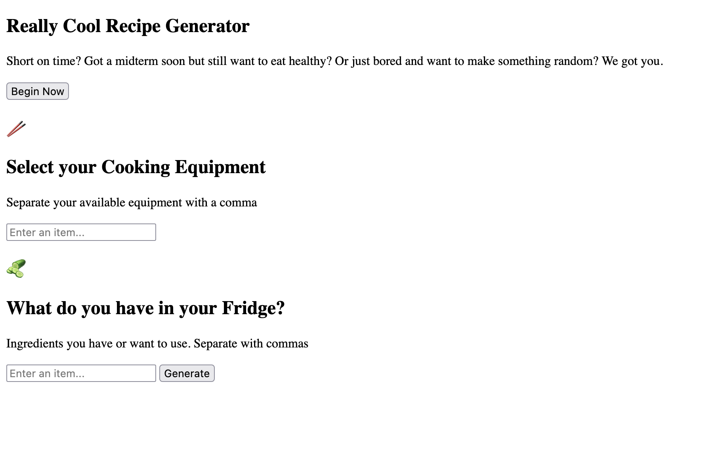
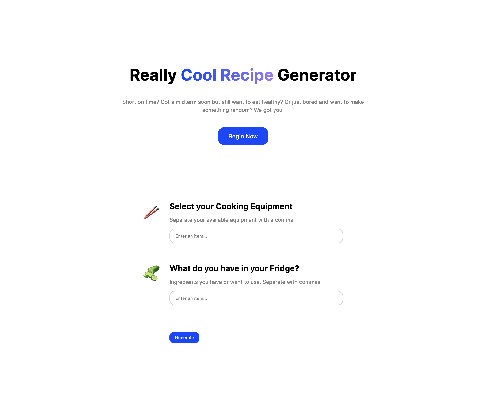

# Zothacks 2023: Intro to Web Dev

```table-of-contents
* [Recording](#recording)
* [Overview](#overview)
* [Web Dev Basics](#web-dev-basics)
* [What are we making?](#what-are-we-making?)
* [Other Resources](#other-resources)
    1. [Workshops](#workshops)
    2. [References](#references)

```

## Recording

```video
https://www.youtube-nocookie.com/embed/KOdc9Bx_cmY
```

## Overview

This is part one of a two part workshop. First, we'll learn some basic HTML and Javascript in the first one, and the second part will focus on general design concepts, and how to implement them with CSS.

You can find a finished version of our codebase here: [Really cool recipe generator source code with just HTML and JS](https://github.com/ryqndev/learn-ryqn-dev/tree/main/src/content/tutorial/webapp-demos/zothacks-web-dev-2023/docs)

After the next workshop, we'll add styling and you can see and advance of that source code here: [Really cool recipe generator with styling source code](https://github.com/ryqndev/learn-ryqn-dev/tree/main/src/content/tutorial/webapp-demos/zothacks-web-design-2023/docs)

### Sneak peek




## Web Dev Basics

First, you're going to want to do a quick skim of this brief overview of [HTML, CSS and JS](../../../article/intro-to-web-dev/).

## Other Resources

### Workshops

These are workshops with recordings attached to them (very similar to this current one) but each one is a different web app idea being executed so essentially these are all variations of this same workshop.

> [Hack at UCI 2023 Workshop](../hack-at-uci-2023)
> This one goes over both frontend and backend, and connecting the two parts of the codebase. By the end of the workshop, we create a webapp that queries the Yelp API to show restaurants within Irvine

> [Design at UCI 2023 Fall Workshop](../design-at-uci-fall-23)
> A more visual based workshop that simply calls `disease.sh` and renders the current active COVID cases in California.

### References

Some quick reference articles if you're just trying to do one thing.

> [Using custom fonts](../../../article/how-to-use-fonts)
> How to find free fonts, import them, and use them in your website

> [Basic Javascript events](../../../tutorial/web-dev/frontend/fundamentals/events)
> Listening to button clicks, getting user text inputs, getting keyboard events

> [Using UI libraries](../../../article/using-web-ui-libraries)
> How to use a UI library so you get pre-designed components out of the box
